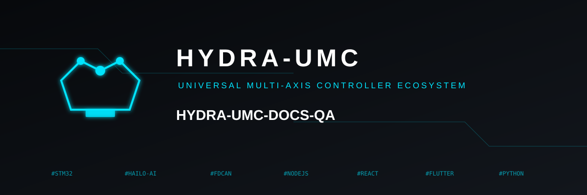
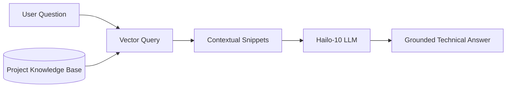

<p align="center">
  
</p>

# 📚 HYDRA-UMC-DOCS-QA

<p align="center">🇺🇸 <b>English</b> | <a href="README_spa.md">🇪🇸 Español</a> | <a href="README_fra.md">🇫🇷 Français</a> | <a href="README_ita.md">🇮🇹 Italiano</a> | <a href="README_deu.md">🇩🇪 Deutsch</a> | <a href="README_zho.md">🇨🇳 简体中文</a> | <a href="README_jpn.md">🇯🇵 日本語</a></p>

### 🤖 RAG-Based AI Assistant for Hardware Maintenance & Documentation

<p align="left">
  
  
  
</p>

---

## 1. 🛠️ TECHNICAL OVERVIEW

**HYDRA-UMC-DOCS-QA** is a specialized Retrieval-Augmented Generation (RAG) assistant designed for on-site technicians and developers. It provides instant, grounded answers to technical questions about the HYDRA-UMC ecosystem.

It has "read" all manuals, schematic documentation, and source code across the ecosystem, allowing it to assist in troubleshooting, pinout queries, and firmware compilation without needing an internet connection.

### Key Features:
* 🔍 **Local Vector Search (v0):** Real, stdlib-only TF-IDF lexical retrieval over local Markdown docs. *(implemented as real lexical search - not yet embedding-based semantic search, and PDF ingestion is still future work; see BUILD & RUN below)*
* 🔒 **Real document allowlist:** only existing `.md`/`.markdown` files are ever ingested and cited - every other `--docs` path (missing, or a disallowed file type) is rejected with a distinct, printed reason instead of being silently skipped or silently read as if it were real documentation. *(implemented)*
* 🔗 **Traceable citations:** every result cites `source#index` - a stable, disambiguating pointer back to the exact ingested passage, deterministically recoverable by re-parsing the same source. *(implemented)*
* 🎯 **Deterministic scoring:** ranking is a pure function of the corpus and query text, independent of the interpreter's per-process hash seed. *(implemented)*
* 🤖 **Grounded Reasoning:** Answers are strictly based on the provided project documentation.
* 🎙️ **Voice Integration:** Integrated with VOICE-UI for hands-free maintenance support.
* 🛠️ **Code Awareness:** Can explain firmware modules and CAN protocol specifics.
* 👨‍👩‍👧 **Cognitive AI Node Child:** Runs as one of four sibling services
  under [HYDRA-UMC-COGNITIVE-NODE](https://github.com/JuanenRac/HYDRA-UMC-COGNITIVE-NODE)
  (alongside VLA-Engine, Voice-UI and Semantic-Planner), sharing its
  parent's HydraOS image and model weights instead of keeping its own
  copies.
* 📦 **Odometer Versioning:** Every real build bumps `pyproject.toml`'s
  own version automatically (`bump_version.py`) - no manual version edits.

---

## 2. 🔄 RAG PIPELINE FLOW



---

## 3. 🧱 ARCHITECTURE & DESIGN DECISIONS

This repository is a **child** of the Cognitive AI Node family - its
parent, [HYDRA-UMC-COGNITIVE-NODE](https://github.com/JuanenRac/HYDRA-UMC-COGNITIVE-NODE),
owns the shared HydraOS image and quantized model weights, and wires this
service into `docker-compose.yml` alongside its three siblings
(VLA-Engine, Voice-UI, Semantic-Planner):

* **Why this child has no hardware/firmware/`os/`/`models/` of its
  own.** It runs entirely on the CM5 + Hailo-10 M.2 module already owned
  by the parent - keeping model weights and the HydraOS image
  centralized in one place avoids four divergent multi-gigabyte copies
  across the family.
* **Why a `src/` layout.** Keeps the installable package
  (`hydra_umc_docs_qa`) separate from repo-root tooling
  (`bump_version.py`), matching the layout used by every other Python
  project across the ecosystem.
* **Why the entry point only prints identity/version/role today.** This
  is the andamiaje (scaffolding) stage: proving the package installs,
  compiles and imports cleanly - on the actual target Python version - is
  a prerequisite for adding real vector-search/RAG ingestion logic later,
  and keeps that later work isolated from packaging concerns.
* **How this fits the rest of the ecosystem.** This assistant grounds
  its answers in the ecosystem's own documentation, giving its sibling
  HYDRA-UMC-SEMANTIC-PLANNER a technical-knowledge source it can query
  during reasoning, and offering on-site technicians hands-free
  troubleshooting support alongside HYDRA-UMC-VOICE-UI.
* **Why `index.py`'s retrieval is real TF-IDF, not an embedding model.**
  Embedding-based semantic search needs a real model dependency (and
  ideally the Hailo-10 this project's own README already targets) - a
  pure-stdlib TF-IDF/cosine-similarity index is real, testable, and
  needs nothing beyond Python itself, giving this project a working
  retrieval kernel today that a future embedding-based index can be
  swapped in behind the same `search()` contract without touching the
  CLI or the ingestion step.
* **Why an unmatched query returns an honest miss, not a fallback
  answer.** v0 has no LLM synthesis step - a question whose words don't
  overlap the ingested corpus gets `No relevant passages found`
  (see `main.py`), never a guessed or hallucinated response dressed up
  as a real retrieval result.
* **Why a disallowed `--docs` path is rejected, not silently skipped or
  silently ingested.** A QA assistant that's supposed to be "grounded in
  the ecosystem's own documentation" must not quietly read and cite
  whatever file a caller happens to point it at - a missing path or a
  non-Markdown file (a stray `.env`, a firmware binary) gets a real,
  distinct `REJECTED ... : <reason>` line (see `ingest.py`'s
  `validate_doc_path`) instead of an aggregate "found nothing" that
  hides *why*.
* **Why cosine similarity sorts the shared terms before summing them.**
  `dict.keys() & dict.keys()` is a set, and CPython's set iteration order
  depends on per-process string hash randomization - summing
  floating-point terms in that order would make a score depend on which
  process happened to run the query, not only on the corpus and query
  text. Sorting first makes the score a pure, reproducible function of
  its real inputs.
* **Why citations carry a `#index`, not just a filename.** A bare
  filename can't disambiguate two sections sharing a heading (or, later,
  two ingested files sharing a name) - `DocChunk.index` is each chunk's
  real ordinal position within its own source, giving every citation a
  stable key a caller can use to deterministically recover the exact
  passage again.

---

## 📂 DIRECTORY STRUCTURE

```text
HYDRA-UMC-DOCS-QA/
├── src/hydra_umc_docs_qa/
│   ├── ingest.py            # Real Markdown ingestion -> heading-scoped DocChunks
│   ├── index.py              # Real stdlib-only TF-IDF index + cosine-similarity search
│   ├── api.py                  # Plain JSON/HTTP surface (stdlib http.server) over the real `query` logic
│   └── main.py                # Entry point + real `query` subcommand
├── tests/                   # Real tests: ingestion, allowlist, ranking, determinism, api, end-to-end CLI
├── docs/                    # Documentation and technical manuals
├── images/                  # Media and diagrams
├── systemd/
│   └── hydra-umc-docs-qa.service # Local CM5 docs-query API systemd unit
├── tools/
│   ├── build_test.py        # Non-versioning build/compile check
│   └── ci_validate.py       # Manifest/CHANGELOG/docs validation used by CI
├── build/                   # Local build output (git-ignored)
├── pyproject.toml           # Package metadata (version odometer-bumped on every real build)
├── bump_version.py          # Odometer-style native version bump (used by build.sh/.bat)
├── bump_manifest_version.py # Syncs hydra-umc.project.json's version to the native one (--sync)
├── build.sh / build.bat     # Create venv, install (with dev extras), verify import, run tests
└── run.sh / run.bat         # Run the entry point (forwards args, e.g. `query`)
```

> **Note:** `hardware/` and `firmware/` were pruned - this node runs on an
> existing CM5 + Hailo-10 M.2 module with no hardware/firmware design of
> its own. `os/` and `models/` were also pruned - the HydraOS image and
> the shared Hailo-10 model weights live in the parent
> `HYDRA-UMC-COGNITIVE-NODE`, which this project attaches to as a
> service (see its `docker-compose.yml`).

---

## ⚙️ BUILD & RUN GUIDE

Requires Python >= 3.10.

```bash
# Linux / macOS / Git Bash
./build.sh   # creates .venv, installs the package (editable), verifies import
./run.sh     # runs the entry point

# Windows (cmd)
build.bat
run.bat
```

`build.sh`/`build.bat` bump the version (odometer-style, see
`bump_version.py`) before every real build, and run the real test suite
(`pytest tests/`). Expected output of a bare `run.sh`:

```text
HYDRA-UMC-DOCS-QA v0.0.7
Docs-QA (Hailo-10) - retrieval-augmented technical assistant grounded in the ecosystem's own documentation.
```

The real `query` subcommand searches ingested Markdown - by default this
repo's own `README.md`/`CHANGELOG.md`, or any real files passed via
`--docs`:

```bash
./run.sh query "CAN bus wiring" --top-k 3
./run.sh query "vector search retrieval" --docs docs/manual.md --docs docs/spec.md

# Windows
run.bat query "CAN bus wiring" --top-k 3
```

A question whose words don't overlap the ingested corpus prints an
honest `No relevant passages found` - v0 is real lexical retrieval, not
a generative answer.

Each result cites `source#index` (e.g. `manual.md#1`) - a stable,
traceable pointer to that exact chunk. A `--docs` path that's missing or
not `.md`/`.markdown` is rejected and reported, not silently ignored:

```text
$ ./run.sh query "firmware flashing" --docs manual.md ghost.md secret.env
REJECTED ghost.md: file not found (no source)
REJECTED secret.env: disallowed extension .env - only .markdown, .md are ingested
Top 1 passage(s) for: "firmware flashing"

1. [0.289] manual.md#1 - Firmware Flashing
   Flash URTC firmware over SWD or JTAG using URTC-FLASHER.
```

### 🩺 Troubleshooting

* **`python: command not found` / build fails at step 1.** Requires
  Python >= 3.10 on `PATH`. On Windows, install from
  [python.org](https://python.org) and make sure "Add to PATH" was
  checked during setup; `python3` is the usual name on Linux/macOS.
* **`build.sh` fails to activate the venv.** `python3 -m venv .venv`
  lays out the activate script differently per platform:
  `.venv/bin/activate` on Linux/macOS, `.venv/Scripts/activate` on
  Windows (also true for a Windows Python venv used from Git Bash).
  `build.sh` already checks both paths - if it still fails, delete
  `.venv/` and re-run `./build.sh` to rebuild it from scratch.
* **`pip install -e .` fails.** Usually a stale `.venv/`. Delete the
  `.venv/` folder and re-run `./build.sh`/`build.bat` to recreate it.
* **`import OK` never prints.** Means `python -c "import
  hydra_umc_docs_qa"` itself failed - re-run with the venv active to
  see the real traceback.

---

## 🚀 ROADMAP
* **Phase 1:** VLA engine deployment and multi-modal input processing on Hailo-10.
* **Phase 2:** Semantic planner integration with swarm behavioral models and long-term memory.
* **Phase 3:** Voice UI low-latency local execution and industrial noise cancellation.
* **Phase 4:** Interactive schematic visualization linked to QA answers and RAG optimization for edge devices.

---

## 🔗 Related Projects

This project is part of the HYDRA-UMC robotics ecosystem by the same author (JuanenRac / Electro Hobby 3D). Worth knowing about, since a request might actually be about one of these rather than this repository.

**Parent Project**
- **[HYDRA-UMC-COGNITIVE-NODE](https://github.com/JuanenRac/HYDRA-UMC-COGNITIVE-NODE)** — integration hub for the Hailo-10 cognitive pipeline (LLM/VLA/voice orchestration); the parent this repo is one specific stage or consumer of, within its own cognitive pipeline.

**Sibling Projects** — the other stages/consumers of HYDRA-UMC-COGNITIVE-NODE's own Hailo-10 cognitive pipeline
- **[HYDRA-UMC-VOICE-UI](https://github.com/JuanenRac/HYDRA-UMC-VOICE-UI)** — real voice front-end (VAD + intent parser) with a bounded, confirmation-gated Watch relay.
- **[HYDRA-UMC-SEMANTIC-PLANNER](https://github.com/JuanenRac/HYDRA-UMC-SEMANTIC-PLANNER)** — real rule-based task decomposition and semantic error recovery over MCU error codes.
- **[HYDRA-UMC-VLA-ENGINE](https://github.com/JuanenRac/HYDRA-UMC-VLA-ENGINE)** — real action-token encoding/decoding and trajectory generation for a Vision-Language-Action model.

**Also Part of the Ecosystem**

*Core Hardware & Platform*
- **[HYDRA-UMC](https://github.com/JuanenRac/HYDRA-UMC)** — the physical robot-arm motherboard: CM5 host + dual-core STM32H745, orchestrating up to 8 tool arms over CAN-OTA/SPI-OTA.
- **[HYDRA-UMC-OS](https://github.com/JuanenRac/HYDRA-UMC-OS)** — reproducible Raspberry Pi OS product layer for the CM5: read-only agent, validated config/profiles, WiFi first-contact provisioning.
- **[HYDRA-UMC-SDK](https://github.com/JuanenRac/HYDRA-UMC-SDK)** — the shared JSON-Schema contract and safety-gate boundary every bridge validates its commands against.

*Core Backend & Clients*
- **[HYDRA-UMC-SERVER](https://github.com/JuanenRac/HYDRA-UMC-SERVER)** — the real headless backend (REST/WebSocket) every control client actually talks to.
- **[HYDRA-UMC-STUDIO](https://github.com/JuanenRac/HYDRA-UMC-STUDIO)** — web control dashboard with real-time multi-robot 3D visualization.
- **[HYDRA-UMC-SUITE](https://github.com/JuanenRac/HYDRA-UMC-SUITE)** — desktop (PySide6) swarm command center for multiple servers at once, packaged as a standalone executable.
- **[HYDRA-UMC-ANDROID-CONTROL](https://github.com/JuanenRac/HYDRA-UMC-ANDROID-CONTROL)** — native Android control app with biometric login and a paired Wear OS companion.
- **[HYDRA-UMC-IOS-CONTROL](https://github.com/JuanenRac/HYDRA-UMC-IOS-CONTROL)** — iOS/iPadOS control app (Flutter) with real-time WebSocket sync.
- **[HYDRA-UMC-DSI](https://github.com/JuanenRac/HYDRA-UMC-DSI)** — native touch UI for the onboard 7" DSI touchscreen, embedded on the CM5 itself.
- **[HYDRA-UMC-EDITOR-URDF](https://github.com/JuanenRac/HYDRA-UMC-EDITOR-URDF)** — desktop graphical URDF creator/editor that pushes finished models into STUDIO's own catalog.
- **[HYDRA-UMC-BRIDGE-AMR](https://github.com/JuanenRac/HYDRA-UMC-BRIDGE-AMR)** — coordination boundary for AGV/AMR fleets via a real VDA 5050 MQTT publisher.
- **[HYDRA-UMC-BRIDGE-CNC](https://github.com/JuanenRac/HYDRA-UMC-BRIDGE-CNC)** — high-level CNC-cell coordinator with real GRBL status/control-byte access.
- **[HYDRA-UMC-BRIDGE-DROIDS](https://github.com/JuanenRac/HYDRA-UMC-BRIDGE-DROIDS)** — coordination boundary for legged/humanoid droids, with a real Boston Dynamics Spot command sender.
- **[HYDRA-UMC-BRIDGE-LASER](https://github.com/JuanenRac/HYDRA-UMC-BRIDGE-LASER)** — laser-cell safety coordinator reading 3 real key/enclosure/interlock GPIO safeguards.
- **[HYDRA-UMC-BRIDGE-OPENPNP](https://github.com/JuanenRac/HYDRA-UMC-BRIDGE-OPENPNP)** — safe high-level board-flow coordinator for OpenPnP pick-and-place.
- **[HYDRA-UMC-BRIDGE-PRINTER3D](https://github.com/JuanenRac/HYDRA-UMC-BRIDGE-PRINTER3D)** — safe coordination boundary for Moonraker/Klipper 3D printers, with real gated job commands.
- **[HYDRA-UMC-BRIDGE-ROS2](https://github.com/JuanenRac/HYDRA-UMC-BRIDGE-ROS2)** — safety coordinator with a real, lazily-imported rclpy ROS 2 transport.
- **[HYDRA-UMC-BRIDGE-UAV](https://github.com/JuanenRac/HYDRA-UMC-BRIDGE-UAV)** — coordination boundary for camera-equipped UAVs, with a real MAVLink command sender.

*URTC Tool Platform*
- **[URTC](https://github.com/JuanenRac/URTC)** — firmware for the physical Universal Robot Tool Controller PCB, 25+ tool profiles over CAN bus.
- **[URTC-FLASHER](https://github.com/JuanenRac/URTC-FLASHER)** — desktop GUI flashing tool for URTC boards, CAN-OTA plus full-chip SWD/JTAG.
- **[URTC-TESTER](https://github.com/JuanenRac/URTC-TESTER)** — desktop live CAN-bus diagnostic tool for URTC boards, one panel per tool profile.
- **[URTC-WEB-STUDIO](https://github.com/JuanenRac/URTC-WEB-STUDIO)** — browser-based alternative to URTC-TESTER via the Web Serial API, no local install needed.

*Vision AI Node (Hailo-8)*
- **[HYDRA-UMC-VISION-NODE](https://github.com/JuanenRac/HYDRA-UMC-VISION-NODE)** — integration hub for the Hailo-8 vision pipeline, with a real per-stage hardware-readiness check.
- **[HYDRA-UMC-DETECTION-HEF](https://github.com/JuanenRac/HYDRA-UMC-DETECTION-HEF)** — real compiled-model registry with Hailo-architecture/checksum safe-load verification.
- **[HYDRA-UMC-VISION-STREAMER](https://github.com/JuanenRac/HYDRA-UMC-VISION-STREAMER)** — real GStreamer pipeline + MediaMTX config generator with a real HailoRT integration boundary.
- **[HYDRA-UMC-VISUAL-SERVOING-API](https://github.com/JuanenRac/HYDRA-UMC-VISUAL-SERVOING-API)** — real Position-Based Visual Servoing correction law, safety-gated on upstream zone state.
- **[HYDRA-UMC-SAFETY-ZONES](https://github.com/JuanenRac/HYDRA-UMC-SAFETY-ZONES)** — real zone-breach checking and E-STOP requesting, with calibration-freshness enforcement.

*Orchestration & Swarm*
- **[HYDRA-UMC-ORCHESTRATOR](https://github.com/JuanenRac/HYDRA-UMC-ORCHESTRATOR)** — integration hub with a real gRPC/Protobuf health-report contract and mission state machine.
- **[HYDRA-UMC-JOB-DISPATCHER](https://github.com/JuanenRac/HYDRA-UMC-JOB-DISPATCHER)** — real priority-based job queue with deduplication, over a real HTTP API.
- **[HYDRA-UMC-NODE-HEALING](https://github.com/JuanenRac/HYDRA-UMC-NODE-HEALING)** — real gRPC-based fleet health watchdog with retry/backoff and identity-mismatch detection.
- **[HYDRA-UMC-PATH-PLANNER-3D](https://github.com/JuanenRac/HYDRA-UMC-PATH-PLANNER-3D)** — real RRT-based 3D path planner with real obstacle/workspace collision validation.
- **[HYDRA-UMC-SWARM-SYNC](https://github.com/JuanenRac/HYDRA-UMC-SWARM-SYNC)** — real CRDT LWW-Element-Map state sync, property-tested for multi-cell convergence.

*Digital Twin & Simulation*
- **[HYDRA-UMC-TWIN](https://github.com/JuanenRac/HYDRA-UMC-TWIN)** — integration hub for the digital-twin engine, with a real version-compatibility sync contract.
- **[HYDRA-UMC-HIL-BRIDGE](https://github.com/JuanenRac/HYDRA-UMC-HIL-BRIDGE)** — real hardware-in-the-loop safety interlock routing commands between simulation and real hardware.
- **[HYDRA-UMC-PHYSICS-REPLICA](https://github.com/JuanenRac/HYDRA-UMC-PHYSICS-REPLICA)** — real forward kinematics and joint-limit validation over a real URDF subset.
- **[HYDRA-UMC-SYNTHETIC-DATA-GEN](https://github.com/JuanenRac/HYDRA-UMC-SYNTHETIC-DATA-GEN)** — real procedural 2D scene generator with YOLO/COCO annotation export.

*Data & Analytics*
- **[HYDRA-UMC-DATALAKE](https://github.com/JuanenRac/HYDRA-UMC-DATALAKE)** — real sqlite3-backed time-series store with a real ingest/query HTTP API.
- **[HYDRA-UMC-ANOMALY-DETECTOR](https://github.com/JuanenRac/HYDRA-UMC-ANOMALY-DETECTOR)** — real FFT + statistical baseline anomaly detector with drift monitoring.
- **[HYDRA-UMC-PRODUCTION-REPORTS](https://github.com/JuanenRac/HYDRA-UMC-PRODUCTION-REPORTS)** — real OEE/availability calculation over DATALAKE history, with reproducible CSV export.
- **[HYDRA-UMC-TELEMETRY-COLLECTOR](https://github.com/JuanenRac/HYDRA-UMC-TELEMETRY-COLLECTOR)** — real CAN/WebSocket ingestion pipeline into DATALAKE, with sequence deduplication.

*Industrial Gateway*
- **[HYDRA-UMC-GATEWAY-INDUSTRIAL](https://github.com/JuanenRac/HYDRA-UMC-GATEWAY-INDUSTRIAL)** — integration hub relaying to industrial protocols, with a real command allowlist/backpressure layer.
- **[HYDRA-UMC-OPCUA-SERVER](https://github.com/JuanenRac/HYDRA-UMC-OPCUA-SERVER)** — real OPC-UA address space, verified with a real binary-protocol client session.
- **[HYDRA-UMC-MQTT-BROKER](https://github.com/JuanenRac/HYDRA-UMC-MQTT-BROKER)** — real MQTT broker with optional per-client authentication and topic ACLs.
- **[HYDRA-UMC-MTCONNECT-ADAPTER](https://github.com/JuanenRac/HYDRA-UMC-MTCONNECT-ADAPTER)** — real MTConnect `/probe` and `/current` XML endpoints with degraded-mode output.

*Complementary Tools & Ecosystem Operations*
- **[HYDRA-UMC-DASHBOARD-AI](https://github.com/JuanenRac/HYDRA-UMC-DASHBOARD-AI)** — Smart Summaries and Anomaly Highlighting panels over DATALAKE/ANOMALY-DETECTOR, with an honest statistical fallback.
- **[HYDRA-UMC-TOOL-CLI](https://github.com/JuanenRac/HYDRA-UMC-TOOL-CLI)** — fleet CLI with a real, stable exit-code contract, a genuine live client of HYDRA-UMC-SERVER's own API.
- **[HYDRA-UMC-WATCH](https://github.com/JuanenRac/HYDRA-UMC-WATCH)** — WearOS companion app with real haptic alerts and a paired-phone voice relay.
- **[URTC-SMART-RACK](https://github.com/JuanenRac/URTC-SMART-RACK)** — firmware for a board-mounting rack with real tool-ID decoding and Smart Idle pre-heating logic.
- **[URTC-VISION-TOOL](https://github.com/JuanenRac/URTC-VISION-TOOL)** — firmware plus a real Python vision companion for a thermal/RGB inspection tool head.
- **[HYDRA-UMC-UPDATER](https://github.com/JuanenRac/HYDRA-UMC-UPDATER)** — administrative desktop tool that discovers, clones and updates every repo in this ecosystem.

---

## 📚 Documentation & Community

- **[CONTRIBUTING.md](CONTRIBUTING.md)** — tech stack and coding guidelines for a pull request.
- **[CODE_OF_CONDUCT.md](CODE_OF_CONDUCT.md)** — the standards of behavior expected in this community.
- **[SECURITY.md](SECURITY.md)** — how to report a vulnerability, and this project's own real security focus areas.
- **[SUPPORT.md](SUPPORT.md)** — where to ask questions and report bugs.
- **[LICENSE.md](LICENSE.md)** — this project's own license.

## 👤 AUTHOR
**JuanenRac** (Electro Hobby 3D)
📧 electrohobby3d@gmail.com
📺 [youtube.com/@electrohobby3d](https://youtube.com/@electrohobby3d)

## 📜 LICENSE
GPL-3.0 - See LICENSE for details.
