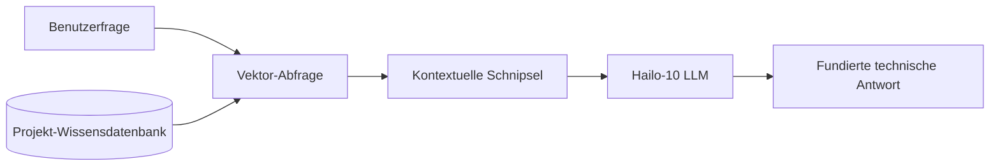

<p align="center">
  
</p>

# 📚 HYDRA-UMC-DOCS-QA

<p align="center"><a href="README.md">🇺🇸 English</a> | <a href="README_spa.md">🇪🇸 Español</a> | <a href="README_fra.md">🇫🇷 Français</a> | <a href="README_ita.md">🇮🇹 Italiano</a> | 🇩🇪 <b>Deutsch</b> | <a href="README_zho.md">🇨🇳 简体中文</a> | <a href="README_jpn.md">🇯🇵 日本語</a></p>

### 🤖 RAG-basierter KI-Assistent für Hardware-Wartung & Dokumentation

<p align="left">
  
  
  
</p>

---

## 1. 🛠️ TECHNISCHER ÜBERBLICK

**HYDRA-UMC-DOCS-QA** ist ein spezialisierter Retrieval-Augmented Generation (RAG) Assistent, der für Techniker und Entwickler vor Ort konzipiert wurde. Er liefert sofortige, fundierte Antworten auf technische Fragen zum HYDRA-UMC-Ökosystem.

Er hat alle Handbücher, Schaltdokumentationen und den Quellcode des gesamten Ökosystems "gelesen", was es ihm ermöglicht, bei der Fehlerbehebung, Pinout-Abfragen und Firmware-Kompilierung zu helfen, ohne eine Internetverbindung zu benötigen.

### Hauptmerkmale:
* 🔍 **Lokale Vektorsuche (v0):** Echtes, stdlib-basiertes TF-IDF-Lexik-Retrieval über lokale Markdown-Dokumente. *(implementiert als echte lexikalische Suche - noch keine embedding-basierte semantische Suche, PDF-Ingestion bleibt zukünftige Arbeit; siehe BUILD UND AUSFÜHRUNG unten)*
* 🔒 **Echte Dokument-Positivliste:** Es werden ausschließlich existierende `.md`/`.markdown`-Dateien eingelesen und zitiert - jeder andere `--docs`-Pfad (fehlend oder ein nicht zulässiger Dateityp) wird mit einem eigenen, ausgegebenen Grund abgelehnt, statt stillschweigend übersprungen oder wie echte Dokumentation gelesen zu werden. *(implementiert)*
* 🔗 **Nachvollziehbare Zitate:** Jedes Ergebnis zitiert `source#index` - einen stabilen, eindeutigen Verweis auf die exakte eingelesene Passage, deterministisch wiederherstellbar durch erneutes Parsen derselben Quelle. *(implementiert)*
* 🎯 **Deterministisches Scoring:** Das Ranking ist eine reine Funktion von Korpus und Anfrage-Text, unabhängig vom Hash-Seed des jeweiligen Interpreter-Prozesses. *(implementiert)*
* 🌐 **Echte JSON/HTTP-API:** Der `serve`-Unterbefehl führt genau dieselbe TF-IDF-Suche als langlebigen lokalen Dienst aus (Standard `127.0.0.1:8110`) über `GET /query?q=...&top_k=N` und `GET /stats` - der Korpus wird nur EINMAL beim Start eingelesen und indiziert, nicht bei jeder Anfrage. Siehe [`docs/CLI_REFERENCE.md`](docs/CLI_REFERENCE.md) für echte, erfasste Beispiele. *(implementiert)*
* 🤖 **Fundiertes Denken:** Antworten basieren strikt auf der bereitgestellten Projektdokumentation.
* 🎙️ **Sprachintegration:** Integriert in VOICE-UI für freihändige Wartungsunterstützung.
* 🛠️ **Code-Bewusstsein:** Kann Firmware-Module und CAN-Protokoll-Spezifikatiön erläutern.
* 👨‍👩‍👧 **Kind des Cognitive AI Node:** Läuft als einer von vier
  Geschwisterdiensten unter [HYDRA-UMC-COGNITIVE-NODE](https://github.com/JuanenRac/HYDRA-UMC-COGNITIVE-NODE)
  (neben VLA-Engine, Voice-UI und Semantic-Planner), teilt sich das
  HydraOS-Image und die Modellgewichte des eigenen Elternprojekts,
  anstatt eigene Kopien zu pflegen.
* 📦 **Kilometerzähler-Versionierung:** Jeder echte Build erhöht
  automatisch die Version von `pyproject.toml` (`bump_version.py`) -
  keine manuellen Versionsänderungen.

---

## 2. 🔄 RAG-PIPELINE-ABLAUF



---

## 3. 🧱 ARCHITEKTUR & DESIGNENTSCHEIDUNGEN

Dieses Repository ist ein **Kind** der Cognitive-AI-Node-Familie - sein
Elternprojekt, [HYDRA-UMC-COGNITIVE-NODE](https://github.com/JuanenRac/HYDRA-UMC-COGNITIVE-NODE),
besitzt das gemeinsam genutzte HydraOS-Image und die quantisierten
Modellgewichte und bindet diesen Dienst in der eigenen
`docker-compose.yml` neben seinen drei Geschwistern (VLA-Engine,
Voice-UI, Semantic-Planner) ein:

* **Warum dieses Kind keine eigene Hardware/Firmware/`os/`/`models/`
  hat.** Es läuft vollständig auf dem bereits vom Elternprojekt
  besessenen CM5 + Hailo-10-M.2-Modul - die Zentralisierung von
  Modellgewichten und HydraOS-Image an einem Ort vermeidet vier
  divergierende, mehrere Gigabyte große Kopien innerhalb der Familie.
* **Warum eine `src/`-Struktur.** Hält das installierbare Paket
  (`hydra_umc_docs_qa`) getrennt vom Tooling im Repo-Root
  (`bump_version.py`), passend zum Layout jedes anderen
  Python-Projekts im Ökosystem.
* **Warum der nackte Aufruf (ohne Unterbefehl) weiterhin nur
  Identität/Version/Rolle ausgibt.** Das war das ursprüngliche
  Andamiaje-Verhalten (Gerüstbau), das nachwies, dass das Paket sich
  korrekt installiert, kompiliert und importiert, bevor überhaupt echte
  Logik existierte - es bleibt heute der Standard als schneller
  "ist das wirklich installiert und funktioniert es"-Check, neben den
  echten Unterbefehlen `query` (TF-IDF-Suche) und `serve`
  (JSON/HTTP-API), für die dieses Gerüst eine Voraussetzung war.
* **Wie sich das ins restliche Ökosystem einfügt.** Dieser Assistent
  fundiert seine Antworten auf der eigenen Dokumentation des
  Ökosystems und gibt seinem Geschwisterprojekt
  HYDRA-UMC-SEMANTIC-PLANNER eine technische Wissensquelle, die es
  während des Reasonings abfragen kann, und bietet Technikern vor Ort
  freihändige Fehlerbehebungsunterstützung neben HYDRA-UMC-VOICE-UI.
* **Warum das Retrieval von `index.py` echtes TF-IDF ist, kein
  Embedding-Modell.** Embedding-basierte semantische Suche benötigt
  eine echte Modellabhängigkeit (idealerweise den eigenen Hailo-10, den
  dieses README bereits erwähnt) - ein reiner stdlib-TF-IDF-/
  Kosinus-Ähnlichkeits-Index ist echt, testbar und braucht nichts
  außer Python selbst, was diesem Projekt schon heute einen
  funktionierenden Retrieval-Kern gibt, den ein künftiger
  embedding-basierter Index hinter demselben `search()`-Vertrag
  ersetzen kann, ohne CLI oder Ingestion-Schritt anzufassen.
* **Warum eine Anfrage ohne Treffer einen ehrlichen Fehlschlag liefert,
  keine Ausweichantwort.** v0 hat keinen LLM-Syntheseschritt - eine
  Frage, deren Wörter sich nicht mit dem eingelesenen Korpus
  überschneiden, erhält `No relevant passages found` (siehe
  `main.py`), niemals eine erfundene oder halluzinierte Antwort,
  getarnt als echtes Retrieval-Ergebnis.
* **Warum ein nicht zulässiger `--docs`-Pfad abgelehnt wird, statt
  stillschweigend übersprungen oder eingelesen zu werden.** Ein
  QA-Assistent, der "auf der eigenen Dokumentation des Ökosystems
  fundiert" sein soll, darf nicht stillschweigend jede Datei lesen und
  zitieren, auf die ein Aufrufer zufällig zeigt - ein fehlender Pfad
  oder eine Nicht-Markdown-Datei (eine verirrte `.env`, eine
  Firmware-Binärdatei) erhält eine echte, eigene
  `REJECTED ... : <Grund>`-Zeile (siehe `validate_doc_path` in
  `ingest.py`) statt eines aggregierten "nichts gefunden", das
  verbirgt, *warum*.
* **Warum die Kosinus-Ähnlichkeit gemeinsame Terme vor der Summierung
  sortiert.** `dict.keys() & dict.keys()` ist ein Set, und die
  Iterationsreihenfolge von Sets in CPython hängt von der
  prozessweiten Zufälligkeit des String-Hashings ab - würde man
  Gleitkomma-Terme in dieser Reihenfolge summieren, hinge ein Score
  davon ab, welcher Prozess die Anfrage zufällig ausgeführt hat, nicht
  nur von Korpus und Anfrage-Text. Vorheriges Sortieren macht den
  Score zu einer reinen, reproduzierbaren Funktion seiner
  tatsächlichen Eingaben.
* **Warum Zitate ein `#index` tragen, nicht nur einen Dateinamen.** Ein
  bloßer Dateiname kann zwei Abschnitte mit gleicher Überschrift nicht
  unterscheiden (oder später zwei eingelesene Dateien mit gleichem
  Namen) - `DocChunk.index` ist die tatsächliche Ordinalposition jedes
  Chunks innerhalb seiner eigenen Quelle und gibt jedem Zitat einen
  stabilen Schlüssel, mit dem ein Aufrufer dieselbe Passage
  deterministisch wiederfinden kann.

---

## 📂 VERZEICHNISSTRUKTUR

```text
HYDRA-UMC-DOCS-QA/
├── src/hydra_umc_docs_qa/
│   ├── ingest.py            # Echte Markdown-Ingestion -> DocChunks pro Überschrift
│   ├── index.py              # Echter TF-IDF-Index (nur stdlib) + Kosinus-Ähnlichkeitssuche
│   ├── api.py                  # Einfache JSON/HTTP-Oberfläche (stdlib http.server) über die echte `query`-Logik
│   └── main.py                # Einstiegspunkt + echte `query`/`serve`-Subcommands
├── tests/                   # Echte Tests: Ingestion, Positivliste, Ranking, Determinismus, api, End-to-End-CLI
├── docs/
│   └── CLI_REFERENCE.md    # Vollständige CLI- + JSON/HTTP-API-Referenz, jedes Beispiel aus einem echten Lauf erfasst
├── images/                  # Medien und Diagramme
├── systemd/
│   └── hydra-umc-docs-qa.service # systemd-Unit der lokalen CM5-Docs-Query-API
├── tools/
│   ├── build_test.py        # Nicht-versionierender Build-Check
│   └── ci_validate.py       # Manifest/CHANGELOG/Docs-Validierung, von CI genutzt
├── build/                   # Lokale Build-Ausgabe (von git ignoriert)
├── pyproject.toml           # Paket-Metadaten (Version per Kilometerzähler-Inkrement)
├── bump_version.py          # Native Versionserhöhung im Kilometerzähler-Stil (von build.sh/.bat verwendet)
├── bump_manifest_version.py # Synchronisiert die Version von hydra-umc.project.json mit der nativen (--sync)
├── build.sh / build.bat     # Erstellt das venv, installiert (mit Dev-Extras), prüft den Import, führt Tests aus
└── run.sh / run.bat         # Führt den Einstiegspunkt aus (leitet Argumente weiter, z. B. `query`)
```

> **Hinweis:** `hardware/` und `firmware/` wurden entfernt - dieser Knoten
> läuft auf einem bereits vorhandenen CM5 + Hailo-10 M.2 Modul ohne
> eigenes Hardware-/Firmware-Design. Auch `os/` und `models/` wurden
> entfernt - das HydraOS-Image und die gemeinsam genutzten
> Hailo-10-Modellgewichte befinden sich im übergeordneten Projekt
> `HYDRA-UMC-COGNITIVE-NODE`, an das dieses Projekt als Dienst angebunden
> wird (siehe dessen `docker-compose.yml`).

---

## ⚙️ BUILD UND AUSFÜHRUNG

Erfordert Python >= 3.10.

```bash
# Linux / macOS / Git Bash
./build.sh   # erstellt .venv, installiert das Paket (editable), prüft den Import
./run.sh     # führt den Einstiegspunkt aus

# Windows (cmd)
build.bat
run.bat
```

`build.sh`/`build.bat` erhöhen die Version (Kilometerzähler-Stil, siehe
`bump_version.py`) vor jedem echten Build und führen die echte Testsuite
aus (`pytest tests/`). Erwartete Ausgabe eines `run.sh` ohne Argumente:

```text
HYDRA-UMC-DOCS-QA v0.0.7
Docs-QA (Hailo-10) - retrieval-augmented technical assistant grounded in the ecosystem's own documentation.
```

Das echte `query`-Subcommand durchsucht eingelesenes Markdown -
standardmäßig die eigenen `README.md`/`CHANGELOG.md` dieses Repos, oder
beliebige echte Dateien, die über `--docs` übergeben werden:

```bash
./run.sh query "CAN-Bus-Verkabelung" --top-k 3
./run.sh query "Vektorsuche Retrieval" --docs docs/manual.md --docs docs/spec.md

# Windows
run.bat query "CAN-Bus-Verkabelung" --top-k 3
```

Eine Frage, deren Wörter sich nicht mit dem eingelesenen Korpus
überschneiden, gibt ein ehrliches `No relevant passages found` aus - v0
ist echtes lexikalisches Retrieval, keine generative Antwort.

Jedes Ergebnis zitiert `source#index` (z. B. `manual.md#1`) - ein
stabiler, nachvollziehbarer Verweis auf genau diesen Chunk. Ein
`--docs`-Pfad, der fehlt oder nicht `.md`/`.markdown` ist, wird
abgelehnt und gemeldet, nicht stillschweigend ignoriert:

```text
$ ./run.sh query "firmware flashing" --docs manual.md ghost.md secret.env
REJECTED ghost.md: file not found (no source)
REJECTED secret.env: disallowed extension .env - only .markdown, .md are ingested
Top 1 passage(s) for: "firmware flashing"

1. [0.289] manual.md#1 - Firmware Flashing
   Flash URTC firmware over SWD or JTAG using URTC-FLASHER.
```

Dieselbe Suche ist auch als langlebige JSON/HTTP-API über `./run.sh serve --docs manual.md` erreichbar (Standard `127.0.0.1:8110`). Siehe [`docs/CLI_REFERENCE.md`](docs/CLI_REFERENCE.md) für die vollständige Befehls- und Endpunkt-Referenz, mit jedem Beispiel aus einem echten Lauf erfasst.

### 🧪 Fehlerbehebung

* **`python: command not found` / Build scheitert bei Schritt 1.** Python
  >= 3.10 muss im `PATH` liegen. Unter Windows von
  [python.org](https://python.org) installieren und während der Einrichtung
  „Add to PATH“ aktivieren; unter Linux/macOS lautet der Befehl meist
  `python3`.
* **`build.sh` kann die virtuelle Umgebung nicht aktivieren.**
  `python3 -m venv .venv` legt das Aktivierungsskript je Plattform anders
  ab: `.venv/bin/activate` unter Linux/macOS und `.venv/Scripts/activate`
  unter Windows. `build.sh` prüft beide Pfade; bei weiterem Fehler `.venv/`
  löschen und `./build.sh` erneut ausführen.
* **`pip install -e .` scheitert.** Meist ist `.venv/` veraltet. Den Ordner
  löschen und `./build.sh` bzw. `build.bat` erneut ausführen.
* **`import OK` erscheint nie.** Dann ist bereits
  `python -c "import hydra_umc_docs_qa"` fehlgeschlagen; mit aktivierter
  virtueller Umgebung erneut ausführen, um den tatsächlichen Traceback zu
  sehen.

---

## 🚀 FAHRPLAN
* **Phase 1:** VLA-Engine-Bereitstellung und multimodale Eingabeverarbeitung auf Hailo-10.
* **Phase 2:** Integration des semantischen Planers mit Schwarmverhaltensmodellen und Langzeitgedächtnis.
* **Phase 3:** Lokale Ausführung der Voice-UI mit niedriger Latenz und industrielle Geräuschunterdrückung.
* **Phase 4:** Interaktive Schaltplanvisualisierung verknüpft mit QA-Antworten und RAG-Optimierung für Edge-Geräte.

---

## 🔗 Verwandte Projekte

Dieses Projekt ist Teil des HYDRA-UMC-Robotik-Ökosystems desselben Autors (JuanenRac / Electro Hobby 3D). Gut zu wissen, da eine Anfrage eigentlich eines dieser Projekte betreffen könnte statt dieses Repositorys.

**Übergeordnetes Projekt**
- **[HYDRA-UMC-COGNITIVE-NODE](https://github.com/JuanenRac/HYDRA-UMC-COGNITIVE-NODE)** — Integrationsknoten für die Hailo-10-Cognitive-Pipeline (LLM-/VLA-/Sprach-Orchestrierung); das übergeordnete Projekt, dessen spezifische Stufe bzw. Verbraucher dieses Repository innerhalb seiner eigenen Cognitive-Pipeline ist.

**Geschwisterprojekte** — die übrigen Stufen/Verbraucher der eigenen Hailo-10-Cognitive-Pipeline von HYDRA-UMC-COGNITIVE-NODE
- **[HYDRA-UMC-VOICE-UI](https://github.com/JuanenRac/HYDRA-UMC-VOICE-UI)** — echtes Sprach-Frontend (VAD + Intent-Parser) mit einem begrenzten, bestätigungsgesicherten Watch-Relay.
- **[HYDRA-UMC-SEMANTIC-PLANNER](https://github.com/JuanenRac/HYDRA-UMC-SEMANTIC-PLANNER)** — echte regelbasierte Aufgabenzerlegung und semantische Fehlerbehebung über MCU-Fehlercodes.
- **[HYDRA-UMC-VLA-ENGINE](https://github.com/JuanenRac/HYDRA-UMC-VLA-ENGINE)** — echte Aktions-Token-Kodierung/-Dekodierung und Trajektoriengenerierung für ein Vision-Language-Action-Modell.

**Ebenfalls Teil des Ökosystems**

*Kern-Hardware & Plattform*
- **[HYDRA-UMC](https://github.com/JuanenRac/HYDRA-UMC)** — das physische Motherboard des Roboterarms: CM5-Host + Dual-Core-STM32H745, koordiniert bis zu 8 Werkzeugarme über CAN-OTA/SPI-OTA.
- **[HYDRA-UMC-OS](https://github.com/JuanenRac/HYDRA-UMC-OS)** — reproduzierbare Raspberry-Pi-OS-Produktschicht für den CM5: schreibgeschützter Agent, validierte Konfiguration/Profile, WiFi-Ersteinrichtung.
- **[HYDRA-UMC-SDK](https://github.com/JuanenRac/HYDRA-UMC-SDK)** — der gemeinsame JSON-Schema-Vertrag und die Sicherheitsschranke, gegen die jede Bridge ihre Befehle validiert.

*Kern-Backend & Clients*
- **[HYDRA-UMC-SERVER](https://github.com/JuanenRac/HYDRA-UMC-SERVER)** — das reale Headless-Backend (REST/WebSocket), mit dem jeder Steuerungsclient tatsächlich spricht.
- **[HYDRA-UMC-STUDIO](https://github.com/JuanenRac/HYDRA-UMC-STUDIO)** — Web-Steuerungs-Dashboard mit Echtzeit-3D-Visualisierung mehrerer Roboter.
- **[HYDRA-UMC-SUITE](https://github.com/JuanenRac/HYDRA-UMC-SUITE)** — Desktop-Schwarmleitstand (PySide6) für mehrere Server gleichzeitig, verpackt als eigenständige ausführbare Datei.
- **[HYDRA-UMC-ANDROID-CONTROL](https://github.com/JuanenRac/HYDRA-UMC-ANDROID-CONTROL)** — native Android-Steuerungs-App mit biometrischem Login und einer gekoppelten Wear-OS-Begleit-App.
- **[HYDRA-UMC-IOS-CONTROL](https://github.com/JuanenRac/HYDRA-UMC-IOS-CONTROL)** — iOS/iPadOS-Steuerungs-App (Flutter) mit Echtzeit-WebSocket-Synchronisierung.
- **[HYDRA-UMC-DSI](https://github.com/JuanenRac/HYDRA-UMC-DSI)** — native Touch-UI für das eingebaute 7"-DSI-Touchscreen, direkt auf dem CM5 eingebettet.
- **[HYDRA-UMC-EDITOR-URDF](https://github.com/JuanenRac/HYDRA-UMC-EDITOR-URDF)** — grafischer Desktop-URDF-Ersteller/-Editor, der fertige Modelle in STUDIOs eigenen Katalog überträgt.
- **[HYDRA-UMC-BRIDGE-AMR](https://github.com/JuanenRac/HYDRA-UMC-BRIDGE-AMR)** — Koordinationsschranke für AGV-/AMR-Flotten über einen echten VDA-5050-MQTT-Publisher.
- **[HYDRA-UMC-BRIDGE-CNC](https://github.com/JuanenRac/HYDRA-UMC-BRIDGE-CNC)** — High-Level-Koordinator für CNC-Zellen mit echtem GRBL-Status-/Steuerbyte-Zugriff.
- **[HYDRA-UMC-BRIDGE-DROIDS](https://github.com/JuanenRac/HYDRA-UMC-BRIDGE-DROIDS)** — Koordinationsschranke für laufende/humanoide Droiden, mit einem echten Boston-Dynamics-Spot-Befehlssender.
- **[HYDRA-UMC-BRIDGE-LASER](https://github.com/JuanenRac/HYDRA-UMC-BRIDGE-LASER)** — Sicherheitskoordinator für Laserzellen, liest 3 echte Schlüssel-/Gehäuse-/Verriegelungs-GPIO-Sicherungen.
- **[HYDRA-UMC-BRIDGE-OPENPNP](https://github.com/JuanenRac/HYDRA-UMC-BRIDGE-OPENPNP)** — sicherer High-Level-Koordinator für den Leiterplattenfluss von OpenPnP Pick-and-Place.
- **[HYDRA-UMC-BRIDGE-PRINTER3D](https://github.com/JuanenRac/HYDRA-UMC-BRIDGE-PRINTER3D)** — sichere Koordinationsschranke für Moonraker/Klipper-3D-Drucker, mit echten gesicherten Job-Befehlen.
- **[HYDRA-UMC-BRIDGE-ROS2](https://github.com/JuanenRac/HYDRA-UMC-BRIDGE-ROS2)** — Sicherheitskoordinator mit einem echten, träge importierten rclpy-ROS-2-Transport.
- **[HYDRA-UMC-BRIDGE-UAV](https://github.com/JuanenRac/HYDRA-UMC-BRIDGE-UAV)** — Koordinationsschranke für kameraausgestattete UAVs, mit einem echten MAVLink-Befehlssender.

*URTC-Werkzeugplattform*
- **[URTC](https://github.com/JuanenRac/URTC)** — Firmware für die physische Universal-Robot-Tool-Controller-Platine, 25+ Werkzeugprofile über CAN-Bus.
- **[URTC-FLASHER](https://github.com/JuanenRac/URTC-FLASHER)** — Desktop-GUI-Flash-Tool für URTC-Platinen, CAN-OTA plus Full-Chip-SWD/JTAG.
- **[URTC-TESTER](https://github.com/JuanenRac/URTC-TESTER)** — Desktop-Live-CAN-Bus-Diagnosetool für URTC-Platinen, ein Panel pro Werkzeugprofil.
- **[URTC-WEB-STUDIO](https://github.com/JuanenRac/URTC-WEB-STUDIO)** — browserbasierte Alternative zu URTC-TESTER über die Web-Serial-API, ohne lokale Installation.

*Vision-KI-Knoten (Hailo-8)*
- **[HYDRA-UMC-VISION-NODE](https://github.com/JuanenRac/HYDRA-UMC-VISION-NODE)** — Integrationsknoten für die Hailo-8-Vision-Pipeline, mit einer echten stufenweisen Hardware-Bereitschaftsprüfung.
- **[HYDRA-UMC-DETECTION-HEF](https://github.com/JuanenRac/HYDRA-UMC-DETECTION-HEF)** — echte Registry für kompilierte Modelle mit Hailo-Architektur-/Prüfsummen-Safe-Load-Verifizierung.
- **[HYDRA-UMC-VISION-STREAMER](https://github.com/JuanenRac/HYDRA-UMC-VISION-STREAMER)** — echter GStreamer-Pipeline- + MediaMTX-Konfigurationsgenerator mit einer echten HailoRT-Integrationsschranke.
- **[HYDRA-UMC-VISUAL-SERVOING-API](https://github.com/JuanenRac/HYDRA-UMC-VISUAL-SERVOING-API)** — echtes Position-Based-Visual-Servoing-Korrekturgesetz, sicherheitsgesteuert nach vorgelagertem Zonenstatus.
- **[HYDRA-UMC-SAFETY-ZONES](https://github.com/JuanenRac/HYDRA-UMC-SAFETY-ZONES)** — echte Zonenverletzungsprüfung und E-STOP-Anforderung, mit erzwungener Kalibrierungsaktualität.

*Orchestrierung & Schwarm*
- **[HYDRA-UMC-ORCHESTRATOR](https://github.com/JuanenRac/HYDRA-UMC-ORCHESTRATOR)** — Integrationsknoten mit einem echten gRPC/Protobuf-Health-Report-Vertrag und einer Missions-Zustandsmaschine.
- **[HYDRA-UMC-JOB-DISPATCHER](https://github.com/JuanenRac/HYDRA-UMC-JOB-DISPATCHER)** — echte prioritätsbasierte Job-Queue mit Deduplizierung, über eine echte HTTP-API.
- **[HYDRA-UMC-NODE-HEALING](https://github.com/JuanenRac/HYDRA-UMC-NODE-HEALING)** — echter gRPC-basierter Flotten-Health-Watchdog mit Retry/Backoff und Identitäts-Mismatch-Erkennung.
- **[HYDRA-UMC-PATH-PLANNER-3D](https://github.com/JuanenRac/HYDRA-UMC-PATH-PLANNER-3D)** — echter RRT-basierter 3D-Pfadplaner mit echter Hindernis-/Arbeitsraum-Kollisionsvalidierung.
- **[HYDRA-UMC-SWARM-SYNC](https://github.com/JuanenRac/HYDRA-UMC-SWARM-SYNC)** — echte CRDT-LWW-Element-Map-Zustandssynchronisation, eigenschaftsgetestet auf Multi-Zellen-Konvergenz.

*Digitaler Zwilling & Simulation*
- **[HYDRA-UMC-TWIN](https://github.com/JuanenRac/HYDRA-UMC-TWIN)** — Integrationsknoten für die Digital-Twin-Engine, mit einem echten Versionskompatibilitäts-Sync-Vertrag.
- **[HYDRA-UMC-HIL-BRIDGE](https://github.com/JuanenRac/HYDRA-UMC-HIL-BRIDGE)** — echte Hardware-in-the-Loop-Sicherheitsverriegelung, die Befehle zwischen Simulation und echter Hardware routet.
- **[HYDRA-UMC-PHYSICS-REPLICA](https://github.com/JuanenRac/HYDRA-UMC-PHYSICS-REPLICA)** — echte Vorwärtskinematik und Gelenkgrenzenvalidierung über eine echte URDF-Teilmenge.
- **[HYDRA-UMC-SYNTHETIC-DATA-GEN](https://github.com/JuanenRac/HYDRA-UMC-SYNTHETIC-DATA-GEN)** — echter prozeduraler 2D-Szenengenerator mit YOLO/COCO-Annotationsexport.

*Daten & Analytik*
- **[HYDRA-UMC-DATALAKE](https://github.com/JuanenRac/HYDRA-UMC-DATALAKE)** — echter sqlite3-gestützter Zeitreihenspeicher mit einer echten Ingest-/Abfrage-HTTP-API.
- **[HYDRA-UMC-ANOMALY-DETECTOR](https://github.com/JuanenRac/HYDRA-UMC-ANOMALY-DETECTOR)** — echter FFT- + statistischer Basislinien-Anomaliedetektor mit Drift-Überwachung.
- **[HYDRA-UMC-PRODUCTION-REPORTS](https://github.com/JuanenRac/HYDRA-UMC-PRODUCTION-REPORTS)** — echte OEE-/Verfügbarkeitsberechnung über den DATALAKE-Verlauf, mit reproduzierbarem CSV-Export.
- **[HYDRA-UMC-TELEMETRY-COLLECTOR](https://github.com/JuanenRac/HYDRA-UMC-TELEMETRY-COLLECTOR)** — echte CAN/WebSocket-Ingestion-Pipeline in DATALAKE, mit Sequenz-Deduplizierung.

*Industrie-Gateway*
- **[HYDRA-UMC-GATEWAY-INDUSTRIAL](https://github.com/JuanenRac/HYDRA-UMC-GATEWAY-INDUSTRIAL)** — Integrationsknoten, der zu Industrieprotokollen weiterleitet, mit einer echten Befehls-Allowlist-/Backpressure-Schicht.
- **[HYDRA-UMC-OPCUA-SERVER](https://github.com/JuanenRac/HYDRA-UMC-OPCUA-SERVER)** — echter OPC-UA-Adressraum, verifiziert mit einer echten Binärprotokoll-Client-Session.
- **[HYDRA-UMC-MQTT-BROKER](https://github.com/JuanenRac/HYDRA-UMC-MQTT-BROKER)** — echter MQTT-Broker mit optionaler Pro-Client-Authentifizierung und Topic-ACLs.
- **[HYDRA-UMC-MTCONNECT-ADAPTER](https://github.com/JuanenRac/HYDRA-UMC-MTCONNECT-ADAPTER)** — echte MTConnect-`/probe`- und `/current`-XML-Endpunkte mit Degraded-Mode-Ausgabe.

*Ergänzende Tools & Ökosystembetrieb*
- **[HYDRA-UMC-DASHBOARD-AI](https://github.com/JuanenRac/HYDRA-UMC-DASHBOARD-AI)** — Smart-Summaries- und Anomaly-Highlighting-Panels über DATALAKE/ANOMALY-DETECTOR, mit einem ehrlichen statistischen Fallback.
- **[HYDRA-UMC-TOOL-CLI](https://github.com/JuanenRac/HYDRA-UMC-TOOL-CLI)** — Flotten-CLI mit einem echten, stabilen Exit-Code-Vertrag, ein echter Live-Client der eigenen API von HYDRA-UMC-SERVER.
- **[HYDRA-UMC-WATCH](https://github.com/JuanenRac/HYDRA-UMC-WATCH)** — WearOS-Begleit-App mit echten haptischen Alarmen und einem Sprach-Relay zum gekoppelten Telefon.
- **[URTC-SMART-RACK](https://github.com/JuanenRac/URTC-SMART-RACK)** — Firmware für ein Platinenmontagegestell mit echter Werkzeug-ID-Dekodierung und Smart-Idle-Vorheizlogik.
- **[URTC-VISION-TOOL](https://github.com/JuanenRac/URTC-VISION-TOOL)** — Firmware plus ein echter Python-Vision-Begleiter für einen Thermal-/RGB-Inspektionswerkzeugkopf.
- **[HYDRA-UMC-UPDATER](https://github.com/JuanenRac/HYDRA-UMC-UPDATER)** — administratives Desktop-Tool, das jedes Repository in diesem Ökosystem entdeckt, klont und aktualisiert.
- **[HYDRA-UMC-OS-REBUILDER](https://github.com/JuanenRac/HYDRA-UMC-OS-REBUILDER)** — Windows/Linux-Desktop-Tool, das ein flashbereites CM5-Image baut, vorgeladen mit den aktuellsten Versionen des Ökosystems, mit Ersteinrichtungs-Konfiguration für WLAN/Benutzer/SSH im Stil von Raspberry Pi Imager.

---

## 📚 Dokumentation & Community

- **[CONTRIBUTING.md](CONTRIBUTING.md)** — Technologie-Stack und Coding-Richtlinien für einen Pull Request.
- **[CODE_OF_CONDUCT.md](CODE_OF_CONDUCT.md)** — die in dieser Community erwarteten Verhaltensstandards.
- **[SECURITY.md](SECURITY.md)** — wie man eine Schwachstelle meldet, und die echten Sicherheitsschwerpunkte dieses Projekts.
- **[SUPPORT.md](SUPPORT.md)** — wo man Fragen stellt und Fehler meldet.
- **[LICENSE.md](LICENSE.md)** — die eigene Lizenz dieses Projekts.

## 👤 AUTOR
**JuanenRac** (Electro Hobby 3D)
📧 electrohobby3d@gmail.com
📺 [youtube.com/@electrohobby3d](https://youtube.com/@electrohobby3d)

## 📜 LIZENZ
GPL-3.0 - Siehe LICENSE für Details.
