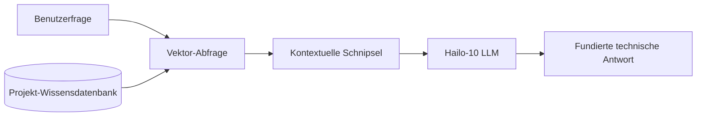

<p align="center">
  
</p>

# 📚 HYDRA-UMC-DOCS-QA

<p align="center"><a href="README.md">🇺🇸 English</a> | <a href="README_spa.md">🇪🇸 Español</a> | <a href="README_fra.md">🇫🇷 Français</a> | <a href="README_ita.md">🇮🇹 Italiano</a> | 🇩🇪 <b>Deutsch</b> | <a href="README_zho.md">🇨🇳 简体中文</a> | <a href="README_jpn.md">🇯🇵 日本語</a></p>

### 🤖 RAG-basierter KI-Assistent für Hardware-Wartung & Dokumentation

<p align="left">
  
  
  
</p>

---

## 1. 🛠️ TECHNISCHER ÜBERBLICK

**HYDRA-UMC-DOCS-QA** ist ein spezialisierter Retrieval-Augmented Generation (RAG) Assistent, der für Techniker und Entwickler vor Ort konzipiert wurde. Er liefert sofortige, fundierte Antworten auf technische Fragen zum HYDRA-UMC-Ökosystem.

Er hat alle Handbücher, Schaltdokumentationen und den Quellcode des gesamten Ökosystems "gelesen", was es ihm ermöglicht, bei der Fehlerbehebung, Pinout-Abfragen und Firmware-Kompilierung zu helfen, ohne eine Internetverbindung zu benötigen.

### Hauptmerkmale:
* 🔍 **Lokale Vektorsuche (v0):** Echtes, stdlib-basiertes TF-IDF-Lexik-Retrieval über lokale Markdown-Dokumente. *(implementiert als echte lexikalische Suche - noch keine embedding-basierte semantische Suche, PDF-Ingestion bleibt zukünftige Arbeit; siehe BUILD UND AUSFÜHRUNG unten)*
* 🔒 **Echte Dokument-Positivliste:** Es werden ausschließlich existierende `.md`/`.markdown`-Dateien eingelesen und zitiert - jeder andere `--docs`-Pfad (fehlend oder ein nicht zulässiger Dateityp) wird mit einem eigenen, ausgegebenen Grund abgelehnt, statt stillschweigend übersprungen oder wie echte Dokumentation gelesen zu werden. *(implementiert)*
* 🔗 **Nachvollziehbare Zitate:** Jedes Ergebnis zitiert `source#index` - einen stabilen, eindeutigen Verweis auf die exakte eingelesene Passage, deterministisch wiederherstellbar durch erneutes Parsen derselben Quelle. *(implementiert)*
* 🎯 **Deterministisches Scoring:** Das Ranking ist eine reine Funktion von Korpus und Anfrage-Text, unabhängig vom Hash-Seed des jeweiligen Interpreter-Prozesses. *(implementiert)*
* 🤖 **Fundiertes Denken:** Antworten basieren strikt auf der bereitgestellten Projektdokumentation.
* 🎙️ **Sprachintegration:** Integriert in VOICE-UI für freihändige Wartungsunterstützung.
* 🛠️ **Code-Bewusstsein:** Kann Firmware-Module und CAN-Protokoll-Spezifikatiön erläutern.
* 👨‍👩‍👧 **Kind des Cognitive AI Node:** Läuft als einer von vier
  Geschwisterdiensten unter [HYDRA-UMC-COGNITIVE-NODE](https://github.com/JuanenRac/HYDRA-UMC-COGNITIVE-NODE)
  (neben VLA-Engine, Voice-UI und Semantic-Planner), teilt sich das
  HydraOS-Image und die Modellgewichte des eigenen Elternprojekts,
  anstatt eigene Kopien zu pflegen.
* 📦 **Kilometerzähler-Versionierung:** Jeder echte Build erhöht
  automatisch die Version von `pyproject.toml` (`bump_version.py`) -
  keine manuellen Versionsänderungen.

---

## 2. 🔄 RAG-PIPELINE-ABLAUF



---

## 3. 🧱 ARCHITEKTUR & DESIGNENTSCHEIDUNGEN

Dieses Repository ist ein **Kind** der Cognitive-AI-Node-Familie - sein
Elternprojekt, [HYDRA-UMC-COGNITIVE-NODE](https://github.com/JuanenRac/HYDRA-UMC-COGNITIVE-NODE),
besitzt das gemeinsam genutzte HydraOS-Image und die quantisierten
Modellgewichte und bindet diesen Dienst in der eigenen
`docker-compose.yml` neben seinen drei Geschwistern (VLA-Engine,
Voice-UI, Semantic-Planner) ein:

* **Warum dieses Kind keine eigene Hardware/Firmware/`os/`/`models/`
  hat.** Es läuft vollständig auf dem bereits vom Elternprojekt
  besessenen CM5 + Hailo-10-M.2-Modul - die Zentralisierung von
  Modellgewichten und HydraOS-Image an einem Ort vermeidet vier
  divergierende, mehrere Gigabyte große Kopien innerhalb der Familie.
* **Warum eine `src/`-Struktur.** Hält das installierbare Paket
  (`hydra_umc_docs_qa`) getrennt vom Tooling im Repo-Root
  (`bump_version.py`), passend zum Layout jedes anderen
  Python-Projekts im Ökosystem.
* **Warum der Einstiegspunkt heute nur Identität/Version/Rolle ausgibt.**
  Dies ist das Andamiaje-Stadium (Gerüstbau): der Nachweis, dass das
  Paket sich korrekt installiert, kompiliert und importiert - auf der
  echten Ziel-Python-Version - ist Voraussetzung, bevor echte
  Vektorsuche-/RAG-Ingestion-Logik hinzugefügt wird, und hält diese
  spätere Arbeit von Packaging-Belangen getrennt.
* **Wie sich das ins restliche Ökosystem einfügt.** Dieser Assistent
  fundiert seine Antworten auf der eigenen Dokumentation des
  Ökosystems und gibt seinem Geschwisterprojekt
  HYDRA-UMC-SEMANTIC-PLANNER eine technische Wissensquelle, die es
  während des Reasonings abfragen kann, und bietet Technikern vor Ort
  freihändige Fehlerbehebungsunterstützung neben HYDRA-UMC-VOICE-UI.
* **Warum das Retrieval von `index.py` echtes TF-IDF ist, kein
  Embedding-Modell.** Embedding-basierte semantische Suche benötigt
  eine echte Modellabhängigkeit (idealerweise den eigenen Hailo-10, den
  dieses README bereits erwähnt) - ein reiner stdlib-TF-IDF-/
  Kosinus-Ähnlichkeits-Index ist echt, testbar und braucht nichts
  außer Python selbst, was diesem Projekt schon heute einen
  funktionierenden Retrieval-Kern gibt, den ein künftiger
  embedding-basierter Index hinter demselben `search()`-Vertrag
  ersetzen kann, ohne CLI oder Ingestion-Schritt anzufassen.
* **Warum eine Anfrage ohne Treffer einen ehrlichen Fehlschlag liefert,
  keine Ausweichantwort.** v0 hat keinen LLM-Syntheseschritt - eine
  Frage, deren Wörter sich nicht mit dem eingelesenen Korpus
  überschneiden, erhält `No relevant passages found` (siehe
  `main.py`), niemals eine erfundene oder halluzinierte Antwort,
  getarnt als echtes Retrieval-Ergebnis.
* **Warum ein nicht zulässiger `--docs`-Pfad abgelehnt wird, statt
  stillschweigend übersprungen oder eingelesen zu werden.** Ein
  QA-Assistent, der "auf der eigenen Dokumentation des Ökosystems
  fundiert" sein soll, darf nicht stillschweigend jede Datei lesen und
  zitieren, auf die ein Aufrufer zufällig zeigt - ein fehlender Pfad
  oder eine Nicht-Markdown-Datei (eine verirrte `.env`, eine
  Firmware-Binärdatei) erhält eine echte, eigene
  `REJECTED ... : <Grund>`-Zeile (siehe `validate_doc_path` in
  `ingest.py`) statt eines aggregierten "nichts gefunden", das
  verbirgt, *warum*.
* **Warum die Kosinus-Ähnlichkeit gemeinsame Terme vor der Summierung
  sortiert.** `dict.keys() & dict.keys()` ist ein Set, und die
  Iterationsreihenfolge von Sets in CPython hängt von der
  prozessweiten Zufälligkeit des String-Hashings ab - würde man
  Gleitkomma-Terme in dieser Reihenfolge summieren, hinge ein Score
  davon ab, welcher Prozess die Anfrage zufällig ausgeführt hat, nicht
  nur von Korpus und Anfrage-Text. Vorheriges Sortieren macht den
  Score zu einer reinen, reproduzierbaren Funktion seiner
  tatsächlichen Eingaben.
* **Warum Zitate ein `#index` tragen, nicht nur einen Dateinamen.** Ein
  bloßer Dateiname kann zwei Abschnitte mit gleicher Überschrift nicht
  unterscheiden (oder später zwei eingelesene Dateien mit gleichem
  Namen) - `DocChunk.index` ist die tatsächliche Ordinalposition jedes
  Chunks innerhalb seiner eigenen Quelle und gibt jedem Zitat einen
  stabilen Schlüssel, mit dem ein Aufrufer dieselbe Passage
  deterministisch wiederfinden kann.

---

## 📂 VERZEICHNISSTRUKTUR

```text
HYDRA-UMC-DOCS-QA/
├── src/hydra_umc_docs_qa/
│   ├── ingest.py            # Echte Markdown-Ingestion -> DocChunks pro Überschrift
│   ├── index.py              # Echter TF-IDF-Index (nur stdlib) + Kosinus-Ähnlichkeitssuche
│   └── main.py                # Einstiegspunkt + echtes `query`-Subcommand
├── tests/                   # Echte Tests: Ingestion, Positivliste, Ranking, Determinismus, End-to-End-CLI
├── docs/                    # Dokumentation und technische Handbücher
├── images/                  # Medien und Diagramme
├── scripts/                 # Utility-Skripte
├── build/                   # Lokale Build-Ausgabe (von git ignoriert)
├── pyproject.toml           # Paket-Metadaten (Version 0.0.4, Kilometerzähler-Inkrement)
├── bump_version.py          # Versionserhöhung im Kilometerzähler-Stil (von build.sh/.bat verwendet)
├── build.sh / build.bat     # Erstellt das venv, installiert (mit Dev-Extras), prüft den Import, führt Tests aus
└── run.sh / run.bat         # Führt den Einstiegspunkt aus (leitet Argumente weiter, z. B. `query`)
```

> **Hinweis:** `hardware/` und `firmware/` wurden entfernt - dieser Knoten
> läuft auf einem bereits vorhandenen CM5 + Hailo-10 M.2 Modul ohne
> eigenes Hardware-/Firmware-Design. Auch `os/` und `models/` wurden
> entfernt - das HydraOS-Image und die gemeinsam genutzten
> Hailo-10-Modellgewichte befinden sich im übergeordneten Projekt
> `HYDRA-UMC-COGNITIVE-NODE`, an das dieses Projekt als Dienst angebunden
> wird (siehe dessen `docker-compose.yml`).

---

## ⚙️ BUILD UND AUSFÜHRUNG

Erfordert Python >= 3.10.

```bash
# Linux / macOS / Git Bash
./build.sh   # erstellt .venv, installiert das Paket (editable), prüft den Import
./run.sh     # führt den Einstiegspunkt aus

# Windows (cmd)
build.bat
run.bat
```

`build.sh`/`build.bat` erhöhen die Version (Kilometerzähler-Stil, siehe
`bump_version.py`) vor jedem echten Build und führen die echte Testsuite
aus (`pytest tests/`). Erwartete Ausgabe eines `run.sh` ohne Argumente:

```text
HYDRA-UMC-DOCS-QA v0.0.4
Docs-QA (Hailo-10) - retrieval-augmented technical assistant grounded in the ecosystem's own documentation.
```

Das echte `query`-Subcommand durchsucht eingelesenes Markdown -
standardmäßig die eigenen `README.md`/`CHANGELOG.md` dieses Repos, oder
beliebige echte Dateien, die über `--docs` übergeben werden:

```bash
./run.sh query "CAN-Bus-Verkabelung" --top-k 3
./run.sh query "Vektorsuche Retrieval" --docs docs/manual.md --docs docs/spec.md

# Windows
run.bat query "CAN-Bus-Verkabelung" --top-k 3
```

Eine Frage, deren Wörter sich nicht mit dem eingelesenen Korpus
überschneiden, gibt ein ehrliches `No relevant passages found` aus - v0
ist echtes lexikalisches Retrieval, keine generative Antwort.

Jedes Ergebnis zitiert `source#index` (z. B. `manual.md#1`) - ein
stabiler, nachvollziehbarer Verweis auf genau diesen Chunk. Ein
`--docs`-Pfad, der fehlt oder nicht `.md`/`.markdown` ist, wird
abgelehnt und gemeldet, nicht stillschweigend ignoriert:

```text
$ ./run.sh query "firmware flashing" --docs manual.md ghost.md secret.env
REJECTED ghost.md: file not found (no source)
REJECTED secret.env: disallowed extension .env - only .markdown, .md are ingested
Top 1 passage(s) for: "firmware flashing"

1. [0.289] manual.md#1 - Firmware Flashing
   Flash URTC firmware over SWD or JTAG using URTC-FLASHER.
```

### 🧪 Fehlerbehebung

* **`python: command not found` / Build scheitert bei Schritt 1.** Python
  >= 3.10 muss im `PATH` liegen. Unter Windows von
  [python.org](https://python.org) installieren und während der Einrichtung
  „Add to PATH“ aktivieren; unter Linux/macOS lautet der Befehl meist
  `python3`.
* **`build.sh` kann die virtuelle Umgebung nicht aktivieren.**
  `python3 -m venv .venv` legt das Aktivierungsskript je Plattform anders
  ab: `.venv/bin/activate` unter Linux/macOS und `.venv/Scripts/activate`
  unter Windows. `build.sh` prüft beide Pfade; bei weiterem Fehler `.venv/`
  löschen und `./build.sh` erneut ausführen.
* **`pip install -e .` scheitert.** Meist ist `.venv/` veraltet. Den Ordner
  löschen und `./build.sh` bzw. `build.bat` erneut ausführen.
* **`import OK` erscheint nie.** Dann ist bereits
  `python -c "import hydra_umc_docs_qa"` fehlgeschlagen; mit aktivierter
  virtueller Umgebung erneut ausführen, um den tatsächlichen Traceback zu
  sehen.

---

## 🚀 ROADMAP
* **Phase 1:** VLA-Engine-Bereitstellung und multimodale Eingabeverarbeitung auf Hailo-10.
* **Phase 2:** Integration des semantischen Planers mit Schwarmverhaltensmodellen und Langzeitgedächtnis.
* **Phase 3:** Lokale Ausführung der Voice-UI mit niedriger Latenz und industrielle Geräuschunterdrückung.
* **Phase 4:** Interaktive Schaltplanvisualisierung verknüpft mit QA-Antworten und RAG-Optimierung für Edge-Geräte.

---

## 🔗 VERWANDTE PROJEKTE

Dieses Projekt gehört zum Robotik-Ökosystem desselben Autors (JuanenRac /
Electro Hobby 3D). Seine direkten Beziehungen zu HYDRA-UMC-COGNITIVE-NODE,
HYDRA-UMC-VLA-ENGINE, HYDRA-UMC-VOICE-UI und HYDRA-UMC-SEMANTIC-PLANNER sind
in der kanonischen Beziehungskarte am Ende dieses Dokuments aufgeführt.

### Rest des Ökosystems

Alle weiteren öffentlichen Repositories sind nach Ökosystemschichten im
[JuanenRac-Ökosystem-Dashboard](https://juanenrac.github.io/JuanenRac/)
gruppiert.

---

## 👤 AUTOR
**JuanenRac** (Electro Hobby 3D)
📧 electrohobby3d@gmail.com

## 📜 LIZENZ
GPL-3.0 - Siehe LICENSE für Details.

## 🛠️ BUILD & RUN

Verwenden Sie den Build-Check ohne Versionierung vor einem Release-Build:

| Aktion | Windows | Linux / macOS |
|---|---|---|
| Build-Check (ohne Änderung von Version oder CHANGELOG) | `build-test.bat` | `./build-test.sh` |
| Ausführung / Entwicklung (falls vorhanden) | `run*.bat` oder `dev*.bat` | `./run*.sh` oder `./dev*.sh` |

`build-test.bat` und `build-test.sh` kompilieren oder validieren den Projekt-Stack, ohne `hydra-umc.project.json` zu erhöhen oder `CHANGELOG.md` zu verändern. Sie dürfen nur normale Compiler-Ausgaben erzeugen. Die vorhandenen Skripte `build*.bat`, `build*.sh`, `run*` und `dev*` behalten ihr projektbezogenes Versions- oder Laufzeitverhalten bei; verwenden Sie sie, wenn dieses Verhalten benötigt wird.