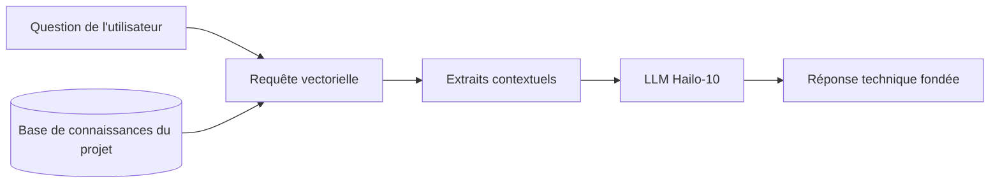

<p align="center">
  
</p>

# 📚 HYDRA-UMC-DOCS-QA

<p align="center"><a href="README.md">🇺🇸 English</a> | <a href="README_spa.md">🇪🇸 Español</a> | 🇫🇷 <b>Français</b> | <a href="README_ita.md">🇮🇹 Italiano</a> | <a href="README_deu.md">🇩🇪 Deutsch</a> | <a href="README_zho.md">🇨🇳 简体中文</a> | <a href="README_jpn.md">🇯🇵 日本語</a></p>

### 🤖 Assistant IA basé sur le RAG pour la maintenance et la documentation du matériel

<p align="left">
  
  
  
</p>

---

## 1. 🛠️ APERÇU TECHNIQUE

**HYDRA-UMC-DOCS-QA** est un assistant spécialisé de génération augmentée par récupération (RAG) conçu pour les techniciens et les développeurs sur site. Il fournit des réponses instantanées et fondées aux questions techniques sur l'écosystème HYDRA-UMC.

Il a « lu » tous les manuels, la documentation des schémas et le code source de l'écosystème, ce qui lui permet d'aider au dépannage, aux demandes de brochage et à la compilation du micrologiciel sans avoir besoin d'une connexion Internet.

### Caractéristiques principales :
* 🔍 **Recherche vectorielle locale (v0) :** Récupération lexicale réelle TF-IDF, stdlib pur, sur des documents Markdown locaux. *(implémenté comme recherche lexicale réelle - pas encore de recherche sémantique par embeddings, et l'ingestion PDF reste un travail futur ; voir BUILD ET EXÉCUTION ci-dessous)*
* 🔒 **Liste blanche réelle des documents :** seuls les fichiers `.md`/`.markdown` réellement existants sont ingérés et cités - tout autre chemin `--docs` (manquant, ou d'un type de fichier non autorisé) est rejeté avec une raison distincte et affichée, au lieu d'être ignoré silencieusement ou lu comme s'il s'agissait de documentation réelle. *(implémenté)*
* 🔗 **Citations traçables :** chaque résultat cite `source#index` - un pointeur stable et non ambigu vers le passage exact ingéré, récupérable de manière déterministe en réanalysant la même source. *(implémenté)*
* 🎯 **Score déterministe :** le classement est une fonction pure du corpus et du texte de la requête, indépendante de la graine de hachage propre au processus de l'interpréteur. *(implémenté)*
* 🤖 **Raisonnement fondé :** Les réponses sont strictement basées sur la documentation du projet fournie.
* 🎙️ **Intégration vocale :** Intégré à VOICE-UI pour un support de maintenance mains libres.
* 🛠️ **Connaissance du code :** Peut expliquer les modules du micrologiciel et les spécificités du protocole CAN.
* 👨‍👩‍👧 **Enfant du Cognitive AI Node :** Fonctionne comme l'un des
  quatre services frères sous [HYDRA-UMC-COGNITIVE-NODE](https://github.com/JuanenRac/HYDRA-UMC-COGNITIVE-NODE)
  (aux côtés de VLA-Engine, Voice-UI et Semantic-Planner), partageant
  l'image HydraOS et les poids de modèles de son parent au lieu de
  conserver ses propres copies.
* 📦 **Versionnage compteur kilométrique :** Chaque build réel incrémente
  automatiquement la version de `pyproject.toml` (`bump_version.py`) - pas
  de modification manuelle de version.

---

## 2. 🔄 FLUX DU PIPELINE RAG



---

## 3. 🧱 ARCHITECTURE & DÉCISIONS DE CONCEPTION

Ce dépôt est un **enfant** de la famille Cognitive AI Node - son parent,
[HYDRA-UMC-COGNITIVE-NODE](https://github.com/JuanenRac/HYDRA-UMC-COGNITIVE-NODE),
détient l'image HydraOS partagée et les poids de modèles quantifiés, et
relie ce service dans son `docker-compose.yml` aux côtés de ses trois
frères (VLA-Engine, Voice-UI, Semantic-Planner) :

* **Pourquoi cet enfant n'a pas de matériel/firmware/`os/`/`models/`
  propres.** Il fonctionne entièrement sur le module CM5 + Hailo-10 M.2
  déjà détenu par le parent - centraliser les poids de modèles et
  l'image HydraOS à un seul endroit évite quatre copies divergentes de
  plusieurs gigaoctets au sein de la famille.
* **Pourquoi une structure `src/`.** Sépare le paquet installable
  (`hydra_umc_docs_qa`) de l'outillage à la racine du dépôt
  (`bump_version.py`), conformément au reste des projets Python de
  l'écosystème.
* **Pourquoi le point d'entrée se contente d'afficher
  identité/version/rôle aujourd'hui.** C'est l'étape d'échafaudage :
  prouver que le paquet s'installe, se compile et s'importe correctement
  - sur la version Python cible réelle - est un prérequis avant d'ajouter
  une vraie logique de recherche vectorielle/RAG, et isole ce travail
  ultérieur des préoccupations d'empaquetage.
* **Comment cela s'intègre dans le reste de l'écosystème.** Cet
  assistant fonde ses réponses sur la documentation propre de
  l'écosystème, donnant à son frère HYDRA-UMC-SEMANTIC-PLANNER une
  source de connaissances techniques qu'il peut consulter pendant son
  raisonnement, et offrant aux techniciens sur site un support mains
  libres aux côtés de HYDRA-UMC-VOICE-UI.
* **Pourquoi la récupération d'`index.py` est du vrai TF-IDF, pas un
  modèle d'embeddings.** La recherche sémantique par embeddings a besoin
  d'une vraie dépendance de modèle (idéalement le Hailo-10 que ce README
  cible déjà) - un index TF-IDF/similarité cosinus pur stdlib est réel,
  testable, et ne nécessite rien au-delà de Python lui-même, donnant à
  ce projet un noyau de récupération fonctionnel dès aujourd'hui qu'un
  futur index à base d'embeddings pourra remplacer derrière le même
  contrat `search()`, sans toucher à la CLI ni à l'étape d'ingestion.
* **Pourquoi une requête sans correspondance renvoie un échec honnête,
  pas une réponse de repli.** v0 n'a pas d'étape de synthèse par LLM -
  une question dont les mots ne recoupent pas le corpus ingéré reçoit
  `No relevant passages found` (voir `main.py`), jamais une réponse
  inventée ou hallucinée déguisée en vrai résultat de récupération.
* **Pourquoi un chemin `--docs` non autorisé est rejeté, et non ignoré
  ou ingéré silencieusement.** Un assistant de QA censé être « fondé
  sur la documentation propre de l'écosystème » ne doit pas lire et
  citer silencieusement n'importe quel fichier pointé par l'appelant -
  un chemin manquant ou un fichier non-Markdown (un `.env` égaré, un
  binaire de firmware) reçoit une ligne réelle et distincte
  `REJECTED ... : <raison>` (voir `validate_doc_path` dans
  `ingest.py`) au lieu d'un « rien trouvé » agrégé qui masque
  *pourquoi*.
* **Pourquoi la similarité cosinus trie les termes partagés avant de
  les additionner.** `dict.keys() & dict.keys()` est un ensemble (set),
  et l'ordre d'itération des sets sous CPython dépend de la
  randomisation du hachage de chaînes par processus - additionner des
  termes en virgule flottante dans cet ordre ferait dépendre un score
  du processus ayant exécuté la requête, et non uniquement du corpus
  et du texte de la requête. Trier d'abord rend le score une fonction
  pure et reproductible de ses véritables entrées.
* **Pourquoi les citations portent un `#index`, pas seulement un nom de
  fichier.** Un simple nom de fichier ne peut pas désambiguïser deux
  sections partageant un titre (ou, plus tard, deux fichiers ingérés
  partageant un nom) - `DocChunk.index` est la position ordinale
  réelle de chaque fragment au sein de sa propre source, donnant à
  chaque citation une clé stable permettant de récupérer de manière
  déterministe le même passage.

---

## 📂 STRUCTURE DES RÉPERTOIRES

```text
HYDRA-UMC-DOCS-QA/
├── src/hydra_umc_docs_qa/
│   ├── ingest.py            # Ingestion Markdown réelle -> DocChunks par titre
│   ├── index.py              # Index TF-IDF réel (stdlib pur) + recherche par similarité cosinus
│   ├── api.py                  # Surface JSON/HTTP simple (http.server de stdlib) sur la vraie logique `query`
│   └── main.py                # Point d'entrée + sous-commande réelle `query`
├── tests/                   # Tests réels : ingestion, liste blanche, classement, déterminisme, api, CLI de bout en bout
├── docs/                    # Documentation et manuels techniques
├── images/                  # Médias et diagrammes
├── systemd/
│   └── hydra-umc-docs-qa.service # Unité systemd de l'API locale de requêtes docs sur la CM5
├── tools/
│   ├── build_test.py        # Vérification de build sans versionnage
│   └── ci_validate.py       # Validation manifeste/CHANGELOG/docs utilisée par CI
├── build/                   # Sortie de build locale (ignorée par git)
├── pyproject.toml           # Métadonnées du paquet (version à incrément type compteur kilométrique)
├── bump_version.py          # Incrément de version native type compteur kilométrique (utilisé par build.sh/.bat)
├── bump_manifest_version.py # Synchronise la version de hydra-umc.project.json avec la version native (--sync)
├── build.sh / build.bat     # Crée le venv, installe (avec extras dev), vérifie l'import, exécute les tests
└── run.sh / run.bat         # Exécute le point d'entrée (transmet les arguments, ex. `query`)
```

> **Remarque :** `hardware/` et `firmware/` ont été supprimés - ce nœud
> fonctionne sur un module CM5 + Hailo-10 M.2 déjà existant, sans
> conception matérielle/firmware propre. `os/` et `models/` ont également
> été supprimés - l'image HydraOS et les poids de modèles Hailo-10
> partagés se trouvent dans le projet parent
> `HYDRA-UMC-COGNITIVE-NODE`, auquel ce projet se rattache en tant que
> service (voir son `docker-compose.yml`).

---

## ⚙️ BUILD ET EXÉCUTION

Nécessite Python >= 3.10.

```bash
# Linux / macOS / Git Bash
./build.sh   # crée .venv, installe le paquet (éditable), vérifie l'import
./run.sh     # exécute le point d'entrée

# Windows (cmd)
build.bat
run.bat
```

`build.sh`/`build.bat` incrémentent la version (type compteur
kilométrique, voir `bump_version.py`) avant chaque build réel, et
exécutent la vraie suite de tests (`pytest tests/`). Sortie attendue d'un
`run.sh` sans argument :

```text
HYDRA-UMC-DOCS-QA v0.0.7
Docs-QA (Hailo-10) - retrieval-augmented technical assistant grounded in the ecosystem's own documentation.
```

La vraie sous-commande `query` recherche dans du Markdown ingéré - par
défaut les propres `README.md`/`CHANGELOG.md` de ce dépôt, ou tout
fichier réel passé via `--docs` :

```bash
./run.sh query "câblage du bus CAN" --top-k 3
./run.sh query "recherche vectorielle récupération" --docs docs/manual.md --docs docs/spec.md

# Windows
run.bat query "câblage du bus CAN" --top-k 3
```

Une question dont les mots ne recoupent pas le corpus ingéré affiche un
`No relevant passages found` honnête - v0 est une récupération lexicale
réelle, pas une réponse générative.

Chaque résultat cite `source#index` (ex. `manual.md#1`) - un pointeur
stable et traçable vers ce fragment exact. Un chemin `--docs` manquant
ou qui n'est pas `.md`/`.markdown` est rejeté et signalé, non ignoré
silencieusement :

```text
$ ./run.sh query "firmware flashing" --docs manual.md ghost.md secret.env
REJECTED ghost.md: file not found (no source)
REJECTED secret.env: disallowed extension .env - only .markdown, .md are ingested
Top 1 passage(s) for: "firmware flashing"

1. [0.289] manual.md#1 - Firmware Flashing
   Flash URTC firmware over SWD or JTAG using URTC-FLASHER.
```

### 🩺 Dépannage

* **`python : commande introuvable` / le build échoue à l'étape 1.**
  Nécessite Python >= 3.10 dans le `PATH`. Sous Windows, installez-le
  depuis [python.org](https://python.org) et cochez "Add to PATH" lors de
  l'installation ; sous Linux/macOS, c'est généralement `python3`.
* **`build.sh` n'arrive pas à activer le venv.** `python3 -m venv .venv`
  place le script d'activation à un emplacement différent selon la
  plateforme : `.venv/bin/activate` sous Linux/macOS,
  `.venv/Scripts/activate` sous Windows (également pour un venv Python
  Windows utilisé depuis Git Bash). `build.sh` vérifie déjà les deux
  chemins - si cela échoue toujours, supprimez `.venv/` et relancez
  `./build.sh` pour le reconstruire entièrement.
* **`pip install -e .` échoue.** Généralement dû à un `.venv/` obsolète.
  Supprimez le dossier `.venv/` et relancez `./build.sh`/`build.bat` pour
  le recréer.
* **`import OK` ne s'affiche jamais.** Signifie que `python -c "import
  hydra_umc_docs_qa"` a lui-même échoué - relancez avec le venv actif
  pour voir la vraie trace d'erreur.

---

## 🚀 FEUILLE DE ROUTE
* **Phase 1 :** Déploiement du moteur VLA et traitement des entrées multimodales sur Hailo-10.
* **Phase 2 :** Intégration du planificateur sémantique avec des modèles de comportement en essaim et une mémoire à long terme.
* **Phase 3 :** Exécution locale à faible latence de l'interface vocale et suppression du bruit industriel.
* **Phase 4 :** Visualisation interactive des schémas liée aux réponses QA et optimisation du RAG pour les appareils de bord.

---

## 🔗 Projets Liés

Ce projet fait partie de l'écosystème robotique HYDRA-UMC du même auteur (JuanenRac / Electro Hobby 3D). Bon à savoir, car une demande pourrait en réalité concerner l'un de ceux-ci plutôt que ce dépôt.

**Projet Parent**
- **[HYDRA-UMC-COGNITIVE-NODE](https://github.com/JuanenRac/HYDRA-UMC-COGNITIVE-NODE)** — hub d'intégration pour le pipeline cognitif Hailo-10 (orchestration LLM/VLA/voix) ; le parent dont ce dépôt est une étape ou un consommateur spécifique, au sein de son propre pipeline cognitif.

**Projets Frères** — les autres étapes/consommateurs du propre pipeline cognitif Hailo-10 de HYDRA-UMC-COGNITIVE-NODE
- **[HYDRA-UMC-VOICE-UI](https://github.com/JuanenRac/HYDRA-UMC-VOICE-UI)** — vrai front-end vocal (VAD + analyseur d'intention) avec un relais Watch borné et soumis à confirmation.
- **[HYDRA-UMC-SEMANTIC-PLANNER](https://github.com/JuanenRac/HYDRA-UMC-SEMANTIC-PLANNER)** — vraie décomposition de tâches basée sur des règles et récupération sémantique d'erreurs sur les codes d'erreur MCU.
- **[HYDRA-UMC-VLA-ENGINE](https://github.com/JuanenRac/HYDRA-UMC-VLA-ENGINE)** — vrai encodage/décodage de jetons d'action et génération de trajectoire pour un modèle Vision-Language-Action.

**Fait Également Partie de l'Écosystème**

*Matériel & Plateforme de Base*
- **[HYDRA-UMC](https://github.com/JuanenRac/HYDRA-UMC)** — la carte mère physique du bras robotique : hôte CM5 + coprocesseur STM32H745 double cœur, coordonnant jusqu'à 8 bras-outils via CAN-OTA/SPI-OTA.
- **[HYDRA-UMC-OS](https://github.com/JuanenRac/HYDRA-UMC-OS)** — couche produit reproductible sur Raspberry Pi OS pour le CM5 : agent en lecture seule, config/profils validés, provisionnement WiFi de premier contact.
- **[HYDRA-UMC-SDK](https://github.com/JuanenRac/HYDRA-UMC-SDK)** — le contrat JSON-Schema partagé et la barrière de sécurité contre laquelle chaque bridge valide ses commandes.

*Backend Central & Clients*
- **[HYDRA-UMC-SERVER](https://github.com/JuanenRac/HYDRA-UMC-SERVER)** — le vrai backend headless (REST/WebSocket) auquel parle réellement chaque client de contrôle.
- **[HYDRA-UMC-STUDIO](https://github.com/JuanenRac/HYDRA-UMC-STUDIO)** — tableau de bord de contrôle web avec visualisation 3D multi-robot en temps réel.
- **[HYDRA-UMC-SUITE](https://github.com/JuanenRac/HYDRA-UMC-SUITE)** — centre de commande d'essaim de bureau (PySide6) pour plusieurs serveurs à la fois, empaqueté en exécutable autonome.
- **[HYDRA-UMC-ANDROID-CONTROL](https://github.com/JuanenRac/HYDRA-UMC-ANDROID-CONTROL)** — application de contrôle Android native avec connexion biométrique et un compagnon Wear OS jumelé.
- **[HYDRA-UMC-IOS-CONTROL](https://github.com/JuanenRac/HYDRA-UMC-IOS-CONTROL)** — application de contrôle iOS/iPadOS (Flutter) avec synchronisation WebSocket en temps réel.
- **[HYDRA-UMC-DSI](https://github.com/JuanenRac/HYDRA-UMC-DSI)** — interface tactile native pour l'écran tactile DSI 7" embarqué, intégrée directement sur le CM5.
- **[HYDRA-UMC-EDITOR-URDF](https://github.com/JuanenRac/HYDRA-UMC-EDITOR-URDF)** — créateur/éditeur graphique de bureau pour URDF qui envoie les modèles terminés vers le propre catalogue de STUDIO.
- **[HYDRA-UMC-BRIDGE-AMR](https://github.com/JuanenRac/HYDRA-UMC-BRIDGE-AMR)** — frontière de coordination pour les flottes AGV/AMR via un éditeur MQTT VDA 5050 réel.
- **[HYDRA-UMC-BRIDGE-CNC](https://github.com/JuanenRac/HYDRA-UMC-BRIDGE-CNC)** — coordinateur haut niveau pour cellules CNC avec accès réel au statut/octets de contrôle GRBL.
- **[HYDRA-UMC-BRIDGE-DROIDS](https://github.com/JuanenRac/HYDRA-UMC-BRIDGE-DROIDS)** — frontière de coordination pour droïdes à pattes/humanoïdes, avec un véritable émetteur de commandes Boston Dynamics Spot.
- **[HYDRA-UMC-BRIDGE-LASER](https://github.com/JuanenRac/HYDRA-UMC-BRIDGE-LASER)** — coordinateur de sécurité pour cellules laser lisant 3 vraies sécurités GPIO de clé/enceinte/verrouillage.
- **[HYDRA-UMC-BRIDGE-OPENPNP](https://github.com/JuanenRac/HYDRA-UMC-BRIDGE-OPENPNP)** — coordinateur haut niveau sûr pour le flux de cartes du pick-and-place OpenPnP.
- **[HYDRA-UMC-BRIDGE-PRINTER3D](https://github.com/JuanenRac/HYDRA-UMC-BRIDGE-PRINTER3D)** — frontière de coordination sûre pour imprimantes 3D Moonraker/Klipper, avec de vraies commandes de tâche contrôlées.
- **[HYDRA-UMC-BRIDGE-ROS2](https://github.com/JuanenRac/HYDRA-UMC-BRIDGE-ROS2)** — coordinateur de sécurité avec un vrai transport ROS 2 rclpy à importation paresseuse.
- **[HYDRA-UMC-BRIDGE-UAV](https://github.com/JuanenRac/HYDRA-UMC-BRIDGE-UAV)** — frontière de coordination pour UAV équipés de caméra, avec un véritable émetteur de commandes MAVLink.

*Plateforme d'Outils URTC*
- **[URTC](https://github.com/JuanenRac/URTC)** — firmware pour la carte physique Universal Robot Tool Controller, plus de 25 profils d'outil sur bus CAN.
- **[URTC-FLASHER](https://github.com/JuanenRac/URTC-FLASHER)** — outil de bureau à interface graphique pour flasher les cartes URTC, CAN-OTA plus SWD/JTAG puce complète.
- **[URTC-TESTER](https://github.com/JuanenRac/URTC-TESTER)** — outil de bureau de diagnostic CAN-bus en direct pour cartes URTC, un panneau par profil d'outil.
- **[URTC-WEB-STUDIO](https://github.com/JuanenRac/URTC-WEB-STUDIO)** — alternative basée navigateur à URTC-TESTER via la Web Serial API, sans installation locale.

*Nœud IA de Vision (Hailo-8)*
- **[HYDRA-UMC-VISION-NODE](https://github.com/JuanenRac/HYDRA-UMC-VISION-NODE)** — hub d'intégration pour le pipeline de vision Hailo-8, avec une vraie vérification de disponibilité matérielle par étape.
- **[HYDRA-UMC-DETECTION-HEF](https://github.com/JuanenRac/HYDRA-UMC-DETECTION-HEF)** — registre réel de modèles compilés avec vérification de chargement sécurisé par architecture Hailo/checksum.
- **[HYDRA-UMC-VISION-STREAMER](https://github.com/JuanenRac/HYDRA-UMC-VISION-STREAMER)** — générateur réel de pipeline GStreamer + config MediaMTX, avec une vraie frontière d'intégration HailoRT.
- **[HYDRA-UMC-VISUAL-SERVOING-API](https://github.com/JuanenRac/HYDRA-UMC-VISUAL-SERVOING-API)** — vraie loi de correction Position-Based Visual Servoing, verrouillée sur l'état de zone en amont.
- **[HYDRA-UMC-SAFETY-ZONES](https://github.com/JuanenRac/HYDRA-UMC-SAFETY-ZONES)** — vraie vérification de violation de zone et demande d'E-STOP, avec application de la fraîcheur de calibration.

*Orchestration & Essaim*
- **[HYDRA-UMC-ORCHESTRATOR](https://github.com/JuanenRac/HYDRA-UMC-ORCHESTRATOR)** — hub d'intégration avec un vrai contrat de rapport de santé gRPC/Protobuf et une machine à états de mission.
- **[HYDRA-UMC-JOB-DISPATCHER](https://github.com/JuanenRac/HYDRA-UMC-JOB-DISPATCHER)** — vraie file de tâches basée sur la priorité avec déduplication, via une vraie API HTTP.
- **[HYDRA-UMC-NODE-HEALING](https://github.com/JuanenRac/HYDRA-UMC-NODE-HEALING)** — vrai chien de garde de santé de flotte basé sur gRPC, avec retry/backoff et détection d'incohérence d'identité.
- **[HYDRA-UMC-PATH-PLANNER-3D](https://github.com/JuanenRac/HYDRA-UMC-PATH-PLANNER-3D)** — vrai planificateur de trajectoire 3D basé sur RRT, avec vraie validation des collisions obstacle/espace de travail.
- **[HYDRA-UMC-SWARM-SYNC](https://github.com/JuanenRac/HYDRA-UMC-SWARM-SYNC)** — vraie synchronisation d'état CRDT LWW-Element-Map, testée par propriétés pour la convergence multi-cellule.

*Jumeau Numérique & Simulation*
- **[HYDRA-UMC-TWIN](https://github.com/JuanenRac/HYDRA-UMC-TWIN)** — hub d'intégration pour le moteur de jumeau numérique, avec un vrai contrat de synchronisation par compatibilité de version.
- **[HYDRA-UMC-HIL-BRIDGE](https://github.com/JuanenRac/HYDRA-UMC-HIL-BRIDGE)** — vrai verrouillage de sécurité hardware-in-the-loop routant les commandes entre simulation et matériel réel.
- **[HYDRA-UMC-PHYSICS-REPLICA](https://github.com/JuanenRac/HYDRA-UMC-PHYSICS-REPLICA)** — vraie cinématique directe et validation des limites articulaires sur un vrai sous-ensemble URDF.
- **[HYDRA-UMC-SYNTHETIC-DATA-GEN](https://github.com/JuanenRac/HYDRA-UMC-SYNTHETIC-DATA-GEN)** — vrai générateur procédural de scènes 2D avec export d'annotations YOLO/COCO.

*Données & Analytique*
- **[HYDRA-UMC-DATALAKE](https://github.com/JuanenRac/HYDRA-UMC-DATALAKE)** — vrai magasin de séries temporelles basé sur sqlite3, avec une vraie API HTTP d'ingestion/requête.
- **[HYDRA-UMC-ANOMALY-DETECTOR](https://github.com/JuanenRac/HYDRA-UMC-ANOMALY-DETECTOR)** — vrai détecteur d'anomalies FFT + ligne de base statistique, avec surveillance de dérive.
- **[HYDRA-UMC-PRODUCTION-REPORTS](https://github.com/JuanenRac/HYDRA-UMC-PRODUCTION-REPORTS)** — vrai calcul OEE/disponibilité sur l'historique de DATALAKE, avec export CSV reproductible.
- **[HYDRA-UMC-TELEMETRY-COLLECTOR](https://github.com/JuanenRac/HYDRA-UMC-TELEMETRY-COLLECTOR)** — vrai pipeline d'ingestion CAN/WebSocket vers DATALAKE, avec déduplication par séquence.

*Passerelle Industrielle*
- **[HYDRA-UMC-GATEWAY-INDUSTRIAL](https://github.com/JuanenRac/HYDRA-UMC-GATEWAY-INDUSTRIAL)** — hub d'intégration relayant vers les protocoles industriels, avec une vraie couche de liste blanche de commandes/contre-pression.
- **[HYDRA-UMC-OPCUA-SERVER](https://github.com/JuanenRac/HYDRA-UMC-OPCUA-SERVER)** — vrai espace d'adressage OPC-UA, vérifié avec une vraie session client du protocole binaire.
- **[HYDRA-UMC-MQTT-BROKER](https://github.com/JuanenRac/HYDRA-UMC-MQTT-BROKER)** — vrai broker MQTT avec authentification par client optionnelle et ACL de sujets.
- **[HYDRA-UMC-MTCONNECT-ADAPTER](https://github.com/JuanenRac/HYDRA-UMC-MTCONNECT-ADAPTER)** — vrais points de terminaison XML MTConnect `/probe` et `/current`, avec sortie en mode dégradé.

*Outils Complémentaires & Opérations de l'Écosystème*
- **[HYDRA-UMC-DASHBOARD-AI](https://github.com/JuanenRac/HYDRA-UMC-DASHBOARD-AI)** — panneaux Smart Summaries et Anomaly Highlighting sur DATALAKE/ANOMALY-DETECTOR, avec un repli statistique honnête.
- **[HYDRA-UMC-TOOL-CLI](https://github.com/JuanenRac/HYDRA-UMC-TOOL-CLI)** — CLI de flotte avec un vrai contrat de codes de sortie stable, un vrai client en direct de la propre API de HYDRA-UMC-SERVER.
- **[HYDRA-UMC-WATCH](https://github.com/JuanenRac/HYDRA-UMC-WATCH)** — application compagnon WearOS avec de vraies alertes haptiques et un relais vocal vers le téléphone jumelé.
- **[URTC-SMART-RACK](https://github.com/JuanenRac/URTC-SMART-RACK)** — firmware pour un rack de montage de cartes avec décodage réel d'ID d'outil et logique de préchauffage Smart Idle.
- **[URTC-VISION-TOOL](https://github.com/JuanenRac/URTC-VISION-TOOL)** — firmware plus un vrai compagnon de vision Python pour une tête d'outil d'inspection thermique/RGB.
- **[HYDRA-UMC-UPDATER](https://github.com/JuanenRac/HYDRA-UMC-UPDATER)** — outil administratif de bureau qui découvre, clone et met à jour chaque dépôt de cet écosystème.

---

## 📚 Documentation & Communauté

- **[CONTRIBUTING.md](CONTRIBUTING.md)** — pile technologique et lignes directrices de codage pour une pull request.
- **[CODE_OF_CONDUCT.md](CODE_OF_CONDUCT.md)** — les normes de comportement attendues dans cette communauté.
- **[SECURITY.md](SECURITY.md)** — comment signaler une vulnérabilité, et les véritables axes de sécurité de ce projet.
- **[SUPPORT.md](SUPPORT.md)** — où poser des questions et signaler des bugs.
- **[LICENSE.md](LICENSE.md)** — la licence propre de ce projet.

## 👤 AUTEUR
**JuanenRac** (Electro Hobby 3D)
📧 electrohobby3d@gmail.com
📺 [youtube.com/@electrohobby3d](https://youtube.com/@electrohobby3d)

## 📜 LICENCE
GPL-3.0 - Voir le fichier LICENSE pour plus de détails.
