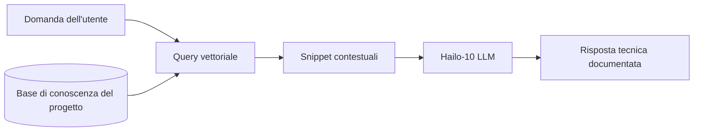

<p align="center">
  
</p>

# 📚 HYDRA-UMC-DOCS-QA

<p align="center"><a href="README.md">🇺🇸 English</a> | <a href="README_spa.md">🇪🇸 Español</a> | <a href="README_fra.md">🇫🇷 Français</a> | 🇮🇹 <b>Italiano</b> | <a href="README_deu.md">🇩🇪 Deutsch</a> | <a href="README_zho.md">🇨🇳 简体中文</a> | <a href="README_jpn.md">🇯🇵 日本語</a></p>

### 🤖 Assistente AI basato su RAG per la manutenzione e la documentazione dell'hardware

<p align="left">
  
  
  
</p>

---

## 1. 🛠️ PANORAMICA TECNICA

**HYDRA-UMC-DOCS-QA** è un assistente specializzato Retrieval-Augmented Generation (RAG) progettato per tecnici e sviluppatori in loco. Fornisce risposte istantanee e documentate a domande tecniche sull'ecosistema HYDRA-UMC.

Ha "letto" tutti i manuali, la documentazione degli schemi e il codice sorgente dell'intero ecosistema, permettendogli di assistere nella risoluzione dei problemi, nelle query di pinout e nella compilazione del firmware senza necessità di una connessione internet.

### Caratteristiche principali:
* 🔍 **Ricerca vettoriale locale (v0):** Vero recupero lessicale TF-IDF, solo stdlib, su documenti Markdown locali. *(implementato come vera ricerca lessicale - non ancora ricerca semantica basata su embedding, e l'ingestione PDF resta lavoro futuro; vedi BUILD ED ESECUZIONE sotto)*
* 🔒 **Vera lista consentiti dei documenti:** vengono ingeriti e citati solo i file `.md`/`.markdown` realmente esistenti - qualsiasi altro percorso `--docs` (mancante, o di un tipo di file non consentito) viene rifiutato con un motivo distinto e stampato, invece di essere ignorato silenziosamente o letto come se fosse documentazione reale. *(implementato)*
* 🔗 **Citazioni tracciabili:** ogni risultato cita `source#index` - un puntatore stabile e univoco al passaggio esatto ingerito, recuperabile in modo deterministico rianalizzando la stessa fonte. *(implementato)*
* 🎯 **Punteggio deterministico:** il ranking è una funzione pura del corpus e del testo della query, indipendente dal seed hash per processo dell'interprete. *(implementato)*
* 🤖 **Ragionamento fondato:** Le risposte si basano rigorosamente sulla documentazione del progetto fornita.
* 🎙️ **Integrazione vocale:** Integrato con VOICE-UI per il supporto alla manutenzione a mani libere.
* 🛠️ **Consapevolezza del codice:** Può spiegare i moduli del firmware e le specifiche del protocollo CAN.
* 👨‍👩‍👧 **Figlio del Cognitive AI Node:** Funziona come uno dei quattro
  servizi fratelli sotto [HYDRA-UMC-COGNITIVE-NODE](https://github.com/JuanenRac/HYDRA-UMC-COGNITIVE-NODE)
  (insieme a VLA-Engine, Voice-UI e Semantic-Planner), condividendo
  l'immagine HydraOS e i pesi dei modelli del proprio genitore invece di
  mantenere copie proprie.
* 📦 **Versionamento stile contachilometri:** Ogni build reale incrementa
  automaticamente la versione di `pyproject.toml` (`bump_version.py`) -
  nessuna modifica manuale della versione.

---

## 2. 🔄 FLUSSO DELLA PIPELINE RAG



---

## 3. 🧱 ARCHITETTURA E DECISIONI DI PROGETTAZIONE

Questo repository è un **figlio** della famiglia Cognitive AI Node - il
suo genitore, [HYDRA-UMC-COGNITIVE-NODE](https://github.com/JuanenRac/HYDRA-UMC-COGNITIVE-NODE),
possiede l'immagine HydraOS condivisa e i pesi dei modelli quantizzati, e
collega questo servizio nel proprio `docker-compose.yml` insieme ai suoi
tre fratelli (VLA-Engine, Voice-UI, Semantic-Planner):

* **Perché questo figlio non ha hardware/firmware/`os/`/`models/`
  propri.** Funziona interamente sul modulo CM5 + Hailo-10 M.2 già
  posseduto dal genitore - centralizzare i pesi dei modelli e l'immagine
  HydraOS in un unico posto evita quattro copie divergenti da svariati
  gigabyte all'interno della famiglia.
* **Perché una struttura `src/`.** Mantiene il pacchetto installabile
  (`hydra_umc_docs_qa`) separato dal tooling nella radice del repo
  (`bump_version.py`), come il resto dei progetti Python
  dell'ecosistema.
* **Perché il punto di ingresso oggi stampa solo identità/versione/ruolo.**
  Questa è la fase di andamiaje: dimostrare che il pacchetto si installa,
  compila e importa correttamente - sulla versione Python reale target -
  è un prerequisito prima di aggiungere la vera logica di
  ricerca-vettoriale/RAG, e mantiene quel lavoro successivo isolato dalle
  preoccupazioni di packaging.
* **Come si inserisce nel resto dell'ecosistema.** Questo assistente
  fonda le proprie risposte sulla documentazione propria
  dell'ecosistema, offrendo al fratello HYDRA-UMC-SEMANTIC-PLANNER una
  fonte di conoscenza tecnica da consultare durante il ragionamento, e
  offrendo ai tecnici in loco supporto di risoluzione dei problemi a
  mani libere insieme a HYDRA-UMC-VOICE-UI.
* **Perché il recupero di `index.py` è vero TF-IDF, non un modello di
  embedding.** La ricerca semantica basata su embedding richiede una
  vera dipendenza da un modello (idealmente lo stesso Hailo-10 che
  questo README già menziona) - un indice TF-IDF/similarità coseno puro
  stdlib è reale, testabile, e non richiede nulla oltre Python stesso,
  dando a questo progetto un nucleo di recupero funzionante oggi che un
  futuro indice basato su embedding potrà sostituire dietro lo stesso
  contratto `search()`, senza toccare la CLI né il passo di ingestione.
* **Perché una query senza corrispondenze restituisce un fallimento
  onesto, non una risposta di ripiego.** v0 non ha un passo di sintesi
  tramite LLM - una domanda le cui parole non si sovrappongono al corpus
  ingerito riceve `No relevant passages found` (vedi `main.py`), mai una
  risposta inventata o allucinata travestita da vero risultato di
  recupero.
* **Perché un percorso `--docs` non consentito viene rifiutato, non
  ignorato o ingerito silenziosamente.** Un assistente QA che dovrebbe
  essere "fondato sulla documentazione propria dell'ecosistema" non
  deve leggere e citare silenziosamente qualsiasi file a cui punti chi
  lo invoca - un percorso mancante o un file non Markdown (un `.env`
  sperduto, un binario di firmware) riceve una riga reale e distinta
  `REJECTED ... : <motivo>` (vedi `validate_doc_path` in `ingest.py`)
  invece di un "nessun risultato trovato" aggregato che nasconde *il
  perché*.
* **Perché la similarità coseno ordina i termini condivisi prima di
  sommarli.** `dict.keys() & dict.keys()` è un set, e l'ordine di
  iterazione dei set in CPython dipende dalla randomizzazione
  dell'hash delle stringhe per processo - sommare termini in virgola
  mobile in quell'ordine farebbe dipendere un punteggio dal processo
  che ha eseguito la query, non solo dal corpus e dal testo della
  query. Ordinare prima rende il punteggio una funzione pura e
  riproducibile dei suoi input reali.
* **Perché le citazioni portano un `#index`, non solo un nome di
  file.** Un semplice nome di file non può disambiguare due sezioni
  che condividono un'intestazione (o, in futuro, due file ingeriti che
  condividono un nome) - `DocChunk.index` è la posizione ordinale
  reale di ciascun frammento all'interno della propria fonte, dando a
  ogni citazione una chiave stabile che chi la usa può sfruttare per
  recuperare di nuovo, in modo deterministico, lo stesso passaggio.

---

## 📂 STRUTTURA DELLE CARTELLE

```text
HYDRA-UMC-DOCS-QA/
├── src/hydra_umc_docs_qa/
│   ├── ingest.py            # Ingestione Markdown reale -> DocChunk per intestazione
│   ├── index.py              # Indice TF-IDF reale (solo stdlib) + ricerca per similarità coseno
│   ├── api.py                  # Superficie JSON/HTTP semplice (http.server di stdlib) sulla vera logica `query`
│   └── main.py                # Punto di ingresso + sottocomando reale `query`
├── tests/                   # Test reali: ingestione, lista consentiti, ranking, determinismo, api, CLI end-to-end
├── docs/                    # Documentazione e manuali tecnici
├── images/                  # Media e diagrammi
├── systemd/
│   └── hydra-umc-docs-qa.service # Unità systemd della API locale di query documenti sulla CM5
├── tools/
│   ├── build_test.py        # Controllo build senza versionamento
│   └── ci_validate.py       # Validazione manifest/CHANGELOG/docs usata dalla CI
├── build/                   # Output di build locale (ignorato da git)
├── pyproject.toml           # Metadati del pacchetto (versione a incremento contachilometri)
├── bump_version.py          # Incremento versione nativa stile contachilometri (usato da build.sh/.bat)
├── bump_manifest_version.py # Sincronizza la versione di hydra-umc.project.json con quella nativa (--sync)
├── build.sh / build.bat     # Crea il venv, installa (con extra dev), verifica l'import, esegue i test
└── run.sh / run.bat         # Esegue il punto di ingresso (inoltra gli argomenti, es. `query`)
```

> **Nota:** `hardware/` e `firmware/` sono stati potati - questo nodo
> funziona su un modulo CM5 + Hailo-10 M.2 già esistente, senza un
> progetto hardware/firmware proprio. Sono stati potati anche `os/` e
> `models/` - l'immagine HydraOS e i pesi dei modelli Hailo-10 condivisi
> risiedono nel progetto padre `HYDRA-UMC-COGNITIVE-NODE`, a cui questo
> progetto si collega come servizio (vedi il suo `docker-compose.yml`).

---

## ⚙️ BUILD ED ESECUZIONE

Richiede Python >= 3.10.

```bash
# Linux / macOS / Git Bash
./build.sh   # crea .venv, installa il pacchetto (editable), verifica l'import
./run.sh     # esegue il punto di ingresso

# Windows (cmd)
build.bat
run.bat
```

`build.sh`/`build.bat` incrementano la versione (stile contachilometri,
vedi `bump_version.py`) prima di ogni build reale, ed eseguono la vera
suite di test (`pytest tests/`). Output atteso di un `run.sh` senza
argomenti:

```text
HYDRA-UMC-DOCS-QA v0.0.7
Docs-QA (Hailo-10) - retrieval-augmented technical assistant grounded in the ecosystem's own documentation.
```

Il vero sottocomando `query` cerca nel Markdown ingerito - per
impostazione predefinita i propri `README.md`/`CHANGELOG.md` di questo
repo, oppure qualsiasi file reale passato con `--docs`:

```bash
./run.sh query "cablaggio bus CAN" --top-k 3
./run.sh query "ricerca vettoriale recupero" --docs docs/manual.md --docs docs/spec.md

# Windows
run.bat query "cablaggio bus CAN" --top-k 3
```

Una domanda le cui parole non si sovrappongono al corpus ingerito
stampa un `No relevant passages found` onesto - v0 è vero recupero
lessicale, non una risposta generativa.

Ogni risultato cita `source#index` (es. `manual.md#1`) - un puntatore
stabile e tracciabile a quel frammento esatto. Un percorso `--docs`
mancante o non `.md`/`.markdown` viene rifiutato e segnalato, non
ignorato silenziosamente:

```text
$ ./run.sh query "firmware flashing" --docs manual.md ghost.md secret.env
REJECTED ghost.md: file not found (no source)
REJECTED secret.env: disallowed extension .env - only .markdown, .md are ingested
Top 1 passage(s) for: "firmware flashing"

1. [0.289] manual.md#1 - Firmware Flashing
   Flash URTC firmware over SWD or JTAG using URTC-FLASHER.
```

### 🧪 Risoluzione dei problemi

* **`python: command not found` / la build fallisce al passaggio 1.** È
  richiesto Python >= 3.10 nel `PATH`. Su Windows installarlo da
  [python.org](https://python.org) e selezionare “Add to PATH”; su
  Linux/macOS il comando è generalmente `python3`.
* **`build.sh` non riesce ad attivare il virtual environment.**
  `python3 -m venv .venv` crea lo script di attivazione in percorsi diversi:
  `.venv/bin/activate` su Linux/macOS e `.venv/Scripts/activate` su
  Windows. `build.sh` verifica entrambi; se fallisce ancora, eliminare
  `.venv/` e rieseguire `./build.sh`.
* **`pip install -e .` fallisce.** Di solito la causa è una `.venv/`
  obsoleta. Eliminare la cartella e rieseguire `./build.sh` o `build.bat`.
* **`import OK` non viene mai stampato.** Significa che
  `python -c "import hydra_umc_docs_qa"` è già fallito; rieseguire con il
  virtual environment attivo per visualizzare il traceback reale.

---

## 🚀 TABELLA DI MARCIA
* **Fase 1:** Distribuzione del motore VLA e elaborazione dell'input multi-modale su Hailo-10.
* **Fase 2:** Integrazione del pianificatore semantico con modelli comportamentali di sciame e memoria a lungo termine.
* **Fase 3:** Esecuzione locale a bassa latenza dell'interfaccia vocale e cancellazione del rumore industriale.
* **Fase 4:** Visualizzazione interattiva degli schemi collegata alle risposte QA e ottimizzazione RAG per dispositivi edge.

---

## 🔗 PROGETTI CORRELATI

Questo progetto fa parte di un ecosistema robotico più ampio dello stesso autore (JuanenRac / Electro Hobby 3D), che copre firmware, software di controllo, nodi AI e strumenti di flotta.

### Famiglia

**Genitore:** **[HYDRA-UMC-COGNITIVE-NODE](https://github.com/JuanenRac/HYDRA-UMC-COGNITIVE-NODE)** — l'Hub di Integrazione che possiede l'immagine/i pesi HydraOS condivisi di questo assistente e lo collega al flusso cognitivo.

**Fratelli:**
- **[HYDRA-UMC-VOICE-UI](https://github.com/JuanenRac/HYDRA-UMC-VOICE-UI)** — gateway STT/TTS per lo stesso planner che questo assistente fonda anch'esso.
- **[HYDRA-UMC-SEMANTIC-PLANNER](https://github.com/JuanenRac/HYDRA-UMC-SEMANTIC-PLANNER)** — il planner LLM alimentato dalle risposte RAG di questo assistente.
- **[HYDRA-UMC-VLA-ENGINE](https://github.com/JuanenRac/HYDRA-UMC-VLA-ENGINE)** — trasforma i dati di visione in token di azione per lo stesso planner.

Questo assistente non ha relazioni al di fuori della propria famiglia oltre a quanto già coperto sopra.

### Resto dell'ecosistema

**Piattaforma HYDRA-UMC** — la micro-fabbrica multi-robot
- **[HYDRA-UMC](https://github.com/JuanenRac/HYDRA-UMC)** — la scheda madre stessa: host Raspberry Pi CM5 + coprocessore real-time STM32H745 dual-core, che orchestra fino a 8 bracci robotici distribuiti via CAN-OTA/SPI-OTA.
- **[HYDRA-UMC SERVER](https://github.com/JuanenRac/HYDRA-UMC-SERVER)** — backend Express/WebSocket headless che possiede lo stato dei robot.
- **[HYDRA-UMC STUDIO](https://github.com/JuanenRac/HYDRA-UMC-STUDIO)** — dashboard di controllo basata sul web.
- **[HYDRA-UMC-ANDROID-CONTROL](https://github.com/JuanenRac/HYDRA-UMC-ANDROID-CONTROL)** — app Android di controllo per HYDRA-UMC.
- **[HYDRA-UMC-IOS-CONTROL](https://github.com/JuanenRac/HYDRA-UMC-IOS-CONTROL)** — app iOS/iPadOS di controllo per HYDRA-UMC.
- **[HYDRA-UMC-SUITE](https://github.com/JuanenRac/HYDRA-UMC-SUITE)** — centro di comando desktop per lo sciame.
- **[HYDRA-UMC-EDITOR-URDF](https://github.com/JuanenRac/HYDRA-UMC-EDITOR-URDF)** — creatore/editor grafico desktop per modelli URDF.
- **[HYDRA-UMC-DSI](https://github.com/JuanenRac/HYDRA-UMC-DSI)** — interfaccia touchscreen nativa per HYDRA-UMC.

**Piattaforma URTC** — il controller della testa utensile che ogni braccio HYDRA-UMC porta
- **[URTC](https://github.com/JuanenRac/URTC)** — Universal Robot Tool Controller, firmware.
- **[URTC Flasher](https://github.com/JuanenRac/URTC-FLASHER)** — strumento desktop di flashing CAN-OTA + SWD/JTAG.
- **[URTC Tester](https://github.com/JuanenRac/URTC-TESTER)** — strumento desktop di diagnostica CAN live.
- **[URTC Web Studio](https://github.com/JuanenRac/URTC-WEB-STUDIO)** — alternativa basata su browser ai 2 strumenti desktop sopra.

**👁️ Nodo di Visione IA (Hailo-8)**
- [HYDRA-UMC-VISION-NODE](https://github.com/JuanenRac/HYDRA-UMC-VISION-NODE)
- [HYDRA-UMC-VISION-STREAMER](https://github.com/JuanenRac/HYDRA-UMC-VISION-STREAMER)
- [HYDRA-UMC-DETECTION-HEF](https://github.com/JuanenRac/HYDRA-UMC-DETECTION-HEF)
- [HYDRA-UMC-SAFETY-ZONES](https://github.com/JuanenRac/HYDRA-UMC-SAFETY-ZONES)
- [HYDRA-UMC-VISUAL-SERVOING-API](https://github.com/JuanenRac/HYDRA-UMC-VISUAL-SERVOING-API)

**🐝 Orchestrazione e Sciame**
- [HYDRA-UMC-ORCHESTRATOR](https://github.com/JuanenRac/HYDRA-UMC-ORCHESTRATOR)
- [HYDRA-UMC-SWARM-SYNC](https://github.com/JuanenRac/HYDRA-UMC-SWARM-SYNC)
- [HYDRA-UMC-PATH-PLANNER-3D](https://github.com/JuanenRac/HYDRA-UMC-PATH-PLANNER-3D)
- [HYDRA-UMC-JOB-DISPATCHER](https://github.com/JuanenRac/HYDRA-UMC-JOB-DISPATCHER)
- [HYDRA-UMC-NODE-HEALING](https://github.com/JuanenRac/HYDRA-UMC-NODE-HEALING)

**🎮 Gemello Digitale e Simulazione**
- [HYDRA-UMC-TWIN](https://github.com/JuanenRac/HYDRA-UMC-TWIN)
- [HYDRA-UMC-PHYSICS-REPLICA](https://github.com/JuanenRac/HYDRA-UMC-PHYSICS-REPLICA)
- [HYDRA-UMC-HIL-BRIDGE](https://github.com/JuanenRac/HYDRA-UMC-HIL-BRIDGE)
- [HYDRA-UMC-SYNTHETIC-DATA-GEN](https://github.com/JuanenRac/HYDRA-UMC-SYNTHETIC-DATA-GEN)

**📊 Dati e Analisi**
- [HYDRA-UMC-DATALAKE](https://github.com/JuanenRac/HYDRA-UMC-DATALAKE)
- [HYDRA-UMC-TELEMETRY-COLLECTOR](https://github.com/JuanenRac/HYDRA-UMC-TELEMETRY-COLLECTOR)
- [HYDRA-UMC-ANOMALY-DETECTOR](https://github.com/JuanenRac/HYDRA-UMC-ANOMALY-DETECTOR)
- [HYDRA-UMC-PRODUCTION-REPORTS](https://github.com/JuanenRac/HYDRA-UMC-PRODUCTION-REPORTS)

**🏭 Gateway Industriale**
- [HYDRA-UMC-GATEWAY-INDUSTRIAL](https://github.com/JuanenRac/HYDRA-UMC-GATEWAY-INDUSTRIAL)
- [HYDRA-UMC-OPCUA-SERVER](https://github.com/JuanenRac/HYDRA-UMC-OPCUA-SERVER)
- [HYDRA-UMC-MQTT-BROKER](https://github.com/JuanenRac/HYDRA-UMC-MQTT-BROKER)
- [HYDRA-UMC-MTCONNECT-ADAPTER](https://github.com/JuanenRac/HYDRA-UMC-MTCONNECT-ADAPTER)

**🛠️ Strumenti Complementari**
- [URTC-SMART-RACK](https://github.com/JuanenRac/URTC-SMART-RACK)
- [URTC-VISION-TOOL](https://github.com/JuanenRac/URTC-VISION-TOOL)
- [HYDRA-UMC-WATCH](https://github.com/JuanenRac/HYDRA-UMC-WATCH)
- [HYDRA-UMC-TOOL-CLI](https://github.com/JuanenRac/HYDRA-UMC-TOOL-CLI)
- [HYDRA-UMC-DASHBOARD-AI](https://github.com/JuanenRac/HYDRA-UMC-DASHBOARD-AI)

---

## 👤 AUTORE
**JuanenRac** (Electro Hobby 3D)
📧 electrohobby3d@gmail.com
📺 [youtube.com/@electrohobby3d](https://youtube.com/@electrohobby3d)

## 📜 LICENZA
GPL-3.0 - Vedere LICENSE per i dettagli.
