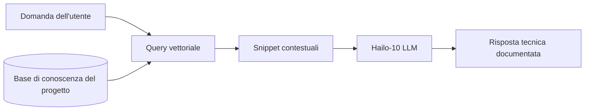

<p align="center">
  
</p>

# 📚 HYDRA-UMC-DOCS-QA

<p align="center"><a href="README.md">🇺🇸 English</a> | <a href="README_spa.md">🇪🇸 Español</a> | <a href="README_fra.md">🇫🇷 Français</a> | 🇮🇹 <b>Italiano</b> | <a href="README_deu.md">🇩🇪 Deutsch</a> | <a href="README_zho.md">🇨🇳 简体中文</a> | <a href="README_jpn.md">🇯🇵 日本語</a></p>

### 🤖 Assistente AI basato su RAG per la manutenzione e la documentazione dell'hardware

<p align="left">
  
  
  
</p>

---

## 1. 🛠️ PANORAMICA TECNICA

**HYDRA-UMC-DOCS-QA** è un assistente specializzato Retrieval-Augmented Generation (RAG) progettato per tecnici e sviluppatori in loco. Fornisce risposte istantanee e documentate a domande tecniche sull'ecosistema HYDRA-UMC.

Ha "letto" tutti i manuali, la documentazione degli schemi e il codice sorgente dell'intero ecosistema, permettendogli di assistere nella risoluzione dei problemi, nelle query di pinout e nella compilazione del firmware senza necessità di una connessione internet.

### Caratteristiche principali:
* 🔍 **Ricerca vettoriale locale (v0):** Vero recupero lessicale TF-IDF, solo stdlib, su documenti Markdown locali. *(implementato come vera ricerca lessicale - non ancora ricerca semantica basata su embedding, e l'ingestione PDF resta lavoro futuro; vedi BUILD ED ESECUZIONE sotto)*
* 🤖 **Ragionamento fondato:** Le risposte si basano rigorosamente sulla documentazione del progetto fornita.
* 🎙️ **Integrazione vocale:** Integrato con VOICE-UI per il supporto alla manutenzione a mani libere.
* 🛠️ **Consapevolezza del codice:** Può spiegare i moduli del firmware e le specifiche del protocollo CAN.
* 👨‍👩‍👧 **Figlio del Cognitive AI Node:** Funziona come uno dei quattro
  servizi fratelli sotto [HYDRA-UMC-COGNITIVE-NODE](https://github.com/JuanenRac/HYDRA-UMC-COGNITIVE-NODE)
  (insieme a VLA-Engine, Voice-UI e Semantic-Planner), condividendo
  l'immagine HydraOS e i pesi dei modelli del proprio genitore invece di
  mantenere copie proprie.
* 📦 **Versionamento stile contachilometri:** Ogni build reale incrementa
  automaticamente la versione di `pyproject.toml` (`bump_version.py`) -
  nessuna modifica manuale della versione.

---

## 2. 🔄 FLUSSO DELLA PIPELINE RAG



---

## 3. 🧱 ARCHITETTURA E DECISIONI DI PROGETTAZIONE

Questo repository è un **figlio** della famiglia Cognitive AI Node - il
suo genitore, [HYDRA-UMC-COGNITIVE-NODE](https://github.com/JuanenRac/HYDRA-UMC-COGNITIVE-NODE),
possiede l'immagine HydraOS condivisa e i pesi dei modelli quantizzati, e
collega questo servizio nel proprio `docker-compose.yml` insieme ai suoi
tre fratelli (VLA-Engine, Voice-UI, Semantic-Planner):

* **Perché questo figlio non ha hardware/firmware/`os/`/`models/`
  propri.** Funziona interamente sul modulo CM5 + Hailo-10 M.2 già
  posseduto dal genitore - centralizzare i pesi dei modelli e l'immagine
  HydraOS in un unico posto evita quattro copie divergenti da svariati
  gigabyte all'interno della famiglia.
* **Perché una struttura `src/`.** Mantiene il pacchetto installabile
  (`hydra_umc_docs_qa`) separato dal tooling nella radice del repo
  (`bump_version.py`), come il resto dei progetti Python
  dell'ecosistema.
* **Perché il punto di ingresso oggi stampa solo identità/versione/ruolo.**
  Questa è la fase di andamiaje: dimostrare che il pacchetto si installa,
  compila e importa correttamente - sulla versione Python reale target -
  è un prerequisito prima di aggiungere la vera logica di
  ricerca-vettoriale/RAG, e mantiene quel lavoro successivo isolato dalle
  preoccupazioni di packaging.
* **Come si inserisce nel resto dell'ecosistema.** Questo assistente
  fonda le proprie risposte sulla documentazione propria
  dell'ecosistema, offrendo al fratello HYDRA-UMC-SEMANTIC-PLANNER una
  fonte di conoscenza tecnica da consultare durante il ragionamento, e
  offrendo ai tecnici in loco supporto di risoluzione dei problemi a
  mani libere insieme a HYDRA-UMC-VOICE-UI.
* **Perché il recupero di `index.py` è vero TF-IDF, non un modello di
  embedding.** La ricerca semantica basata su embedding richiede una
  vera dipendenza da un modello (idealmente lo stesso Hailo-10 che
  questo README già menziona) - un indice TF-IDF/similarità coseno puro
  stdlib è reale, testabile, e non richiede nulla oltre Python stesso,
  dando a questo progetto un nucleo di recupero funzionante oggi che un
  futuro indice basato su embedding potrà sostituire dietro lo stesso
  contratto `search()`, senza toccare la CLI né il passo di ingestione.
* **Perché una query senza corrispondenze restituisce un fallimento
  onesto, non una risposta di ripiego.** v0 non ha un passo di sintesi
  tramite LLM - una domanda le cui parole non si sovrappongono al corpus
  ingerito riceve `No relevant passages found` (vedi `main.py`), mai una
  risposta inventata o allucinata travestita da vero risultato di
  recupero.

---

## 📂 STRUTTURA DELLE CARTELLE

```text
HYDRA-UMC-DOCS-QA/
├── src/hydra_umc_docs_qa/
│   ├── ingest.py            # Ingestione Markdown reale -> DocChunk per intestazione
│   ├── index.py              # Indice TF-IDF reale (solo stdlib) + ricerca per similarità coseno
│   └── main.py                # Punto di ingresso + sottocomando reale `query`
├── tests/                   # Test reali: ingestione, ranking, CLI end-to-end
├── docs/                    # Documentazione e manuali tecnici
├── images/                  # Media e diagrammi
├── scripts/                 # Script di utilità
├── build/                   # Output di build locale (ignorato da git)
├── pyproject.toml           # Metadati del pacchetto (versione 0.0.4, incremento stile contachilometri)
├── bump_version.py          # Incremento versione stile contachilometri (usato da build.sh/.bat)
├── build.sh / build.bat     # Crea il venv, installa (con extra dev), verifica l'import, esegue i test
└── run.sh / run.bat         # Esegue il punto di ingresso (inoltra gli argomenti, es. `query`)
```

> **Nota:** `hardware/` e `firmware/` sono stati potati - questo nodo
> funziona su un modulo CM5 + Hailo-10 M.2 già esistente, senza un
> progetto hardware/firmware proprio. Sono stati potati anche `os/` e
> `models/` - l'immagine HydraOS e i pesi dei modelli Hailo-10 condivisi
> risiedono nel progetto padre `HYDRA-UMC-COGNITIVE-NODE`, a cui questo
> progetto si collega come servizio (vedi il suo `docker-compose.yml`).

---

## ⚙️ BUILD ED ESECUZIONE

Richiede Python >= 3.10.

```bash
# Linux / macOS / Git Bash
./build.sh   # crea .venv, installa il pacchetto (editable), verifica l'import
./run.sh     # esegue il punto di ingresso

# Windows (cmd)
build.bat
run.bat
```

`build.sh`/`build.bat` incrementano la versione (stile contachilometri,
vedi `bump_version.py`) prima di ogni build reale, ed eseguono la vera
suite di test (`pytest tests/`). Output atteso di un `run.sh` senza
argomenti:

```text
HYDRA-UMC-DOCS-QA v0.0.4
Docs-QA (Hailo-10) - retrieval-augmented technical assistant grounded in the ecosystem's own documentation.
```

Il vero sottocomando `query` cerca nel Markdown ingerito - per
impostazione predefinita i propri `README.md`/`CHANGELOG.md` di questo
repo, oppure qualsiasi file reale passato con `--docs`:

```bash
./run.sh query "cablaggio bus CAN" --top-k 3
./run.sh query "ricerca vettoriale recupero" --docs docs/manual.md --docs docs/spec.md

# Windows
run.bat query "cablaggio bus CAN" --top-k 3
```

Una domanda le cui parole non si sovrappongono al corpus ingerito
stampa un `No relevant passages found` onesto - v0 è vero recupero
lessicale, non una risposta generativa.

### 🧪 Risoluzione dei problemi

* **`python: command not found` / la build fallisce al passaggio 1.** È
  richiesto Python >= 3.10 nel `PATH`. Su Windows installarlo da
  [python.org](https://python.org) e selezionare “Add to PATH”; su
  Linux/macOS il comando è generalmente `python3`.
* **`build.sh` non riesce ad attivare il virtual environment.**
  `python3 -m venv .venv` crea lo script di attivazione in percorsi diversi:
  `.venv/bin/activate` su Linux/macOS e `.venv/Scripts/activate` su
  Windows. `build.sh` verifica entrambi; se fallisce ancora, eliminare
  `.venv/` e rieseguire `./build.sh`.
* **`pip install -e .` fallisce.** Di solito la causa è una `.venv/`
  obsoleta. Eliminare la cartella e rieseguire `./build.sh` o `build.bat`.
* **`import OK` non viene mai stampato.** Significa che
  `python -c "import hydra_umc_docs_qa"` è già fallito; rieseguire con il
  virtual environment attivo per visualizzare il traceback reale.

---

## 🚀 ROADMAP
* **Fase 1:** Distribuzione del motore VLA e elaborazione dell'input multi-modale su Hailo-10.
* **Fase 2:** Integrazione del pianificatore semantico con modelli comportamentali di sciame e memoria a lungo termine.
* **Fase 3:** Esecuzione locale a bassa latenza dell'interfaccia vocale e cancellazione del rumore industriale.
* **Fase 4:** Visualizzazione interattiva degli schemi collegata alle risposte QA e ottimizzazione RAG per dispositivi edge.

---

## 🔗 PROGETTI CORRELATI

Questo progetto fa parte dell'ecosistema robotico dello stesso autore
(JuanenRac / Electro Hobby 3D). Le relazioni dirette con
HYDRA-UMC-COGNITIVE-NODE, HYDRA-UMC-VLA-ENGINE, HYDRA-UMC-VOICE-UI e
HYDRA-UMC-SEMANTIC-PLANNER sono riportate nella mappa delle relazioni
canonica alla fine di questo documento.

### Resto dell'ecosistema

Tutti gli altri repository pubblici sono raggruppati per livelli
dell'ecosistema nel
[dashboard dell'ecosistema JuanenRac](https://juanenrac.github.io/JuanenRac/).

---

## 👤 AUTORE
**JuanenRac** (Electro Hobby 3D)
📧 electrohobby3d@gmail.com

## 📜 LICENZA
GPL-3.0 - Vedere LICENSE per i dettagli.

## 🛠️ BUILD & RUN

Usa il controllo di compilazione senza versionamento prima di una compilazione di rilascio:

| Azione | Windows | Linux / macOS |
|---|---|---|
| Controllo di compilazione (senza modificare versione o CHANGELOG) | `build-test.bat` | `./build-test.sh` |
| Esecuzione / sviluppo (se disponibile) | `run*.bat` o `dev*.bat` | `./run*.sh` o `./dev*.sh` |

`build-test.bat` e `build-test.sh` compilano o convalidano lo stack del progetto senza incrementare `hydra-umc.project.json` né modificare `CHANGELOG.md`. Possono creare solo i normali output del compilatore. Gli script esistenti `build*.bat`, `build*.sh`, `run*` e `dev*` mantengono il comportamento specifico di versione o esecuzione; usali quando tale comportamento è necessario.