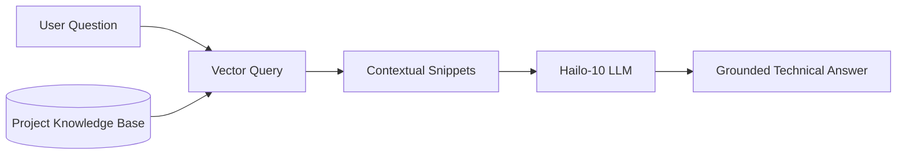

<p align="center">
  
</p>

# 📚 HYDRA-UMC-DOCS-QA

<p align="center"><a href="README.md">🇺🇸 English</a> | <a href="README_spa.md">🇪🇸 Español</a> | <a href="README_fra.md">🇫🇷 Français</a> | <a href="README_ita.md">🇮🇹 Italiano</a> | <a href="README_deu.md">🇩🇪 Deutsch</a> | <a href="README_zho.md">🇨🇳 简体中文</a> | 🇯🇵 <b>日本語</b></p>

### 🤖 ハードウェア保守とドキュメント向け RAG ベース AI アシスタント

<p align="left">
  
  
  
</p>

---

## 1. 🛠️ 技術概要

**HYDRA-UMC-DOCS-QA** は、現場の技術者や開発者向けに設計された専用の
検索拡張生成（RAG）アシスタントです。HYDRA-UMC エコシステムに関する
技術的な質問に対して、即座に、根拠のある回答を提供します。

エコシステム全体のすべてのマニュアル、回路図ドキュメント、ソースコードを
「読み込んで」おり、インターネット接続を必要とせずにトラブルシューティング、
ピン配置の照会、ファームウェアのコンパイルを支援できます。

### 主な機能：
* 🔍 **ローカルベクトル検索（v0）：** ローカルの Markdown ドキュメントに対する、標準ライブラリのみによる実際の TF-IDF 語彙検索。*（実際の語彙検索として実装済み——まだ埋め込みベースの意味検索ではなく、PDF の取り込みは今後の課題です。下記の「ビルドと実行」を参照）*
* 🤖 **根拠に基づく推論：** 回答は提供されたプロジェクトドキュメントに厳密に基づきます。
* 🎙️ **音声統合：** VOICE-UI と統合され、ハンズフリーの保守サポートを実現。
* 🛠️ **コード認識：** ファームウェアモジュールと CAN プロトコルの詳細を説明できます。
* 👨‍👩‍👧 **認知 AI ノードの子プロジェクト：**
  [HYDRA-UMC-COGNITIVE-NODE](https://github.com/JuanenRac/HYDRA-UMC-COGNITIVE-NODE) の下で 4 つの兄弟サービスの 1 つとして動作します（VLA-Engine、Voice-UI、Semantic-Planner と並んで）。独自のコピーを保持するのではなく、親プロジェクトの HydraOS イメージとモデルの重みを共有します。
* 📦 **オドメーター式バージョン管理：** 実際のビルドのたびに
  `pyproject.toml` 自身のバージョンが自動的に増加します
  （`bump_version.py`）——手動でのバージョン編集は不要です。

---

## 2. 🔄 RAG パイプラインフロー



---

## 3. 🧱 アーキテクチャと設計上の決定

本リポジトリは Cognitive AI Node ファミリーの**子プロジェクト**です——
親プロジェクトである [HYDRA-UMC-COGNITIVE-NODE](https://github.com/JuanenRac/HYDRA-UMC-COGNITIVE-NODE) が共有の HydraOS イメージと量子化モデルの重みを保持し、本サービスを他の 3 つの兄弟プロジェクト（VLA-Engine、Voice-UI、Semantic-Planner）とともに `docker-compose.yml` に接続します：

* **本子プロジェクトに独自のハードウェア/ファームウェア/`os/`/`models/` がない理由。** 親プロジェクトが既に保有する CM5 + Hailo-10 M.2 モジュール上で完全に動作します——モデルの重みと HydraOS イメージを 1 か所に集約することで、ファミリー全体で数 GB にも及ぶモデルの重みが 4 つの食い違ったコピーとして存在することを避けられます。
* **`src/` レイアウトを採用した理由。** インストール可能なパッケージ（`hydra_umc_docs_qa`）をリポジトリルートのツール（`bump_version.py`）から分離し、エコシステム内の他のすべての Python プロジェクトで使用されているレイアウトと一致させるためです。
* **エントリポイントが今日は身元/バージョン/役割のみを表示する理由。** これは足場（スキャフォールディング）段階です：実際のターゲット Python バージョン上で、本パッケージが正しくインストール・コンパイルされ、問題なくインポートできることを証明することが、後で実際のベクトル検索/RAG 取り込みロジックを追加するための前提条件であり、その後の作業をパッケージングの懸念から切り離しておきます。
* **エコシステムの他の部分との関係。** 本アシスタントは、その回答をエコシステム自身のドキュメントに基づかせることで、兄弟プロジェクトである HYDRA-UMC-SEMANTIC-PLANNER に、推論中に照会できる技術知識のソースを提供し、HYDRA-UMC-VOICE-UI とともに現場の技術者にハンズフリーのトラブルシューティング支援を提供します。
* **`index.py` の検索がなぜ埋め込みモデルではなく実際の TF-IDF なのか。** 埋め込みベースの意味検索には実際のモデル依存関係が必要です（理想的には本 README がすでに言及している Hailo-10）——標準ライブラリのみの TF-IDF/コサイン類似度インデックスは実際に動作し、テスト可能で、Python 自体以外何も必要としません。これにより本プロジェクトは、CLI や取り込みステップに触れることなく同じ `search()` 契約の背後に将来の埋め込みベースのインデックスを差し替えられる、実際に機能する検索カーネルを今日すでに持っています。
* **一致しないクエリがフォールバック回答ではなく正直な失敗を返す理由。** v0 には LLM による合成ステップがありません——取り込まれたコーパスと単語が重ならない質問には `No relevant passages found`（`main.py` を参照）が返されるだけで、実際の検索結果を装った捏造やハルシネーションによる回答が返されることは決してありません。

---

## 📂 リポジトリ構成

```text
HYDRA-UMC-DOCS-QA/
├── src/hydra_umc_docs_qa/
│   ├── ingest.py            # 実際の Markdown 取り込み -> 見出し単位の DocChunk
│   ├── index.py              # 実際の TF-IDF インデックス（標準ライブラリのみ）+ コサイン類似度検索
│   └── main.py                # エントリポイント + 実際の `query` サブコマンド
├── tests/                   # 実際のテスト：取り込み、ランキング、エンドツーエンド CLI
├── docs/                    # ドキュメントと技術マニュアル
├── images/                  # メディアと図表
├── scripts/                 # ユーティリティスクリプト
├── build/                   # ローカルビルド出力（git 管理外）
├── pyproject.toml           # パッケージメタデータ（バージョン 0.0.4、オドメーター式増加）
├── bump_version.py          # オドメーター式バージョンインクリメント（build.sh/.bat が使用）
├── build.sh / build.bat     # venv 作成、インストール（dev エクストラ付き）、インポート検証、テスト実行
└── run.sh / run.bat         # エントリポイントを実行（引数を転送、例：`query`）
```

> **注：** `hardware/` と `firmware/` は省略されています——本ノードは
> 既存の CM5 + Hailo-10 M.2 モジュール上で動作し、独自のハードウェア/
> ファームウェア設計を持ちません。`os/` と `models/` も省略されています
> ——HydraOS イメージと共有される Hailo-10 モデルの重みは、親プロジェクト
> `HYDRA-UMC-COGNITIVE-NODE` に存在し、本プロジェクトはサービスとして
> それに接続します（その `docker-compose.yml` を参照）。

---

## ⚙️ ビルドと実行

Python >= 3.10 が必要です。

```bash
# Linux / macOS / Git Bash
./build.sh   # .venv を作成し、パッケージを（editable モードで）インストールし、インポートを検証します
./run.sh     # エントリポイントを実行します

# Windows (cmd)
build.bat
run.bat
```

`build.sh`/`build.bat` は、実際の各ビルドの前にバージョンを増加させ
（オドメーター方式、`bump_version.py` を参照）、実際のテストスイートを
実行します（`pytest tests/`）。引数なしの `run.sh` の予期される出力：

```text
HYDRA-UMC-DOCS-QA v0.0.4
Docs-QA (Hailo-10) - retrieval-augmented technical assistant grounded in the ecosystem's own documentation.
```

実際の `query` サブコマンドは取り込まれた Markdown を検索します——
`--docs` が指定されない場合、デフォルトで本リポジトリ自身の
`README.md`/`CHANGELOG.md` を使用し、`--docs` で任意の実際のファイルを
渡すこともできます：

```bash
./run.sh query "CAN バス配線" --top-k 3
./run.sh query "ベクトル検索 リトリーバル" --docs docs/manual.md --docs docs/spec.md

# Windows
run.bat query "CAN バス配線" --top-k 3
```

取り込まれたコーパスと単語が重ならない質問には、正直な
`No relevant passages found` が表示されます——v0 は実際の語彙検索であり、
生成的な回答ではありません。

### 🩺 トラブルシューティング

* **`python: command not found` / ビルドがステップ 1 で失敗する。** `PATH` 上に Python >= 3.10 が必要です。Windows では [python.org](https://python.org) からインストールし、セットアップ中に「Add to PATH」がチェックされていることを確認してください。Linux/macOS では通常 `python3` という名前が使われます。
* **`build.sh` が venv をアクティブ化できない。** `python3 -m venv .venv` は、プラットフォームごとに異なる場所にアクティベートスクリプトを配置します：Linux/macOS では `.venv/bin/activate`、Windows（Git Bash から使用される Windows Python venv でも同様）では `.venv/Scripts/activate`。`build.sh` は既に両方のパスをチェックしています——それでも失敗する場合は、`.venv/` を削除して `./build.sh` を再実行し、ゼロから再構築してください。
* **`pip install -e .` が失敗する。** 通常は `.venv/` が古くなっていることが原因です。`.venv/` フォルダを削除して `./build.sh`/`build.bat` を再実行し、再作成してください。
* **`import OK` が一度も表示されない。** `python -c "import hydra_umc_docs_qa"` 自体が失敗したことを意味します——venv がアクティブな状態で再実行し、実際のトレースバックを確認してください。

---

## 🚀 ロードマップ
* **フェーズ 1：** Hailo-10 上での VLA エンジンのデプロイとマルチモーダル入力処理。
* **フェーズ 2：** 意味プランナーと群行動モデルおよび長期記憶の統合。
* **フェーズ 3：** 音声 UI の低遅延ローカル実行と産業用ノイズキャンセリング。
* **フェーズ 4：** QA の回答に連動したインタラクティブな回路図の可視化、およびエッジデバイス向けの RAG 最適化。

---

## 🔗 関連プロジェクト

本プロジェクトは、同一著者（JuanenRac / Electro Hobby 3D）による、
ファームウェア、制御ソフトウェア、AI ノード、フリート管理ツールにまたがる、
より大きなロボティクスエコシステムの一部です。上記で既に説明した内容を
超えて、本アシスタントは自身のファミリー（親プロジェクト
HYDRA-UMC-COGNITIVE-NODE および兄弟プロジェクトである
HYDRA-UMC-VLA-ENGINE、HYDRA-UMC-VOICE-UI、HYDRA-UMC-SEMANTIC-PLANNER）の
外に他の関連を持ちません。

### エコシステムのその他のプロジェクト

**HYDRA-UMC プラットフォーム** — マルチロボット・マイクロファクトリーセル
- **[HYDRA-UMC](https://github.com/JuanenRac/HYDRA-UMC)** — マザーボード本体：Raspberry Pi CM5 ホスト + デュアルコア STM32H745 リアルタイムコプロセッサ、CAN-OTA/SPI-OTA 経由で最大 8 台の分散ロボットアームを統括。
- **[HYDRA-UMC SERVER](https://github.com/JuanenRac/HYDRA-UMC-SERVER)** — ロボットの状態を保持するヘッドレス Express/WebSocket バックエンド。
- **[HYDRA-UMC STUDIO](https://github.com/JuanenRac/HYDRA-UMC-STUDIO)** — Web ベースの制御ダッシュボード。
- **[HYDRA-UMC-ANDROID-CONTROL](https://github.com/JuanenRac/HYDRA-UMC-ANDROID-CONTROL)** — HYDRA-UMC 向け Android 制御アプリ。
- **[HYDRA-UMC-IOS-CONTROL](https://github.com/JuanenRac/HYDRA-UMC-IOS-CONTROL)** — HYDRA-UMC 向け iOS/iPadOS 制御アプリ。
- **[HYDRA-UMC-SUITE](https://github.com/JuanenRac/HYDRA-UMC-SUITE)** — デスクトップ版群制御コマンドセンター。
- **[HYDRA-UMC-EDITOR-URDF](https://github.com/JuanenRac/HYDRA-UMC-EDITOR-URDF)** — デスクトップ版グラフィカル URDF 作成/編集ツール。
- **[HYDRA-UMC-DSI](https://github.com/JuanenRac/HYDRA-UMC-DSI)** — HYDRA-UMC のネイティブタッチスクリーン UI。

**URTC プラットフォーム** — すべての HYDRA-UMC ロボットアームが搭載するツールヘッドコントローラー
- **[URTC](https://github.com/JuanenRac/URTC)** — Universal Robot Tool Controller、ファームウェア。
- **[URTC Flasher](https://github.com/JuanenRac/URTC-FLASHER)** — デスクトップ版 CAN-OTA + SWD/JTAG フラッシュツール。
- **[URTC Tester](https://github.com/JuanenRac/URTC-TESTER)** — デスクトップ版ライブ CAN バス診断ツール。
- **[URTC Web Studio](https://github.com/JuanenRac/URTC-WEB-STUDIO)** — 上記 2 つのデスクトップツールのブラウザベースの代替版。

**👁️ ビジョン AI ノード（Hailo-8）**
- [HYDRA-UMC-VISION-NODE](https://github.com/JuanenRac/HYDRA-UMC-VISION-NODE)
- [HYDRA-UMC-VISION-STREAMER](https://github.com/JuanenRac/HYDRA-UMC-VISION-STREAMER)
- [HYDRA-UMC-DETECTION-HEF](https://github.com/JuanenRac/HYDRA-UMC-DETECTION-HEF)
- [HYDRA-UMC-SAFETY-ZONES](https://github.com/JuanenRac/HYDRA-UMC-SAFETY-ZONES)
- [HYDRA-UMC-VISUAL-SERVOING-API](https://github.com/JuanenRac/HYDRA-UMC-VISUAL-SERVOING-API)

**🐝 オーケストレーションと群制御**
- [HYDRA-UMC-ORCHESTRATOR](https://github.com/JuanenRac/HYDRA-UMC-ORCHESTRATOR)
- [HYDRA-UMC-SWARM-SYNC](https://github.com/JuanenRac/HYDRA-UMC-SWARM-SYNC)
- [HYDRA-UMC-PATH-PLANNER-3D](https://github.com/JuanenRac/HYDRA-UMC-PATH-PLANNER-3D)
- [HYDRA-UMC-JOB-DISPATCHER](https://github.com/JuanenRac/HYDRA-UMC-JOB-DISPATCHER)
- [HYDRA-UMC-NODE-HEALING](https://github.com/JuanenRac/HYDRA-UMC-NODE-HEALING)

**🎮 デジタルツインとシミュレーション**
- [HYDRA-UMC-TWIN](https://github.com/JuanenRac/HYDRA-UMC-TWIN)
- [HYDRA-UMC-PHYSICS-REPLICA](https://github.com/JuanenRac/HYDRA-UMC-PHYSICS-REPLICA)
- [HYDRA-UMC-HIL-BRIDGE](https://github.com/JuanenRac/HYDRA-UMC-HIL-BRIDGE)
- [HYDRA-UMC-SYNTHETIC-DATA-GEN](https://github.com/JuanenRac/HYDRA-UMC-SYNTHETIC-DATA-GEN)

**📊 データと分析**
- [HYDRA-UMC-DATALAKE](https://github.com/JuanenRac/HYDRA-UMC-DATALAKE)
- [HYDRA-UMC-TELEMETRY-COLLECTOR](https://github.com/JuanenRac/HYDRA-UMC-TELEMETRY-COLLECTOR)
- [HYDRA-UMC-ANOMALY-DETECTOR](https://github.com/JuanenRac/HYDRA-UMC-ANOMALY-DETECTOR)
- [HYDRA-UMC-PRODUCTION-REPORTS](https://github.com/JuanenRac/HYDRA-UMC-PRODUCTION-REPORTS)

**🏭 産業用ゲートウェイ**
- [HYDRA-UMC-GATEWAY-INDUSTRIAL](https://github.com/JuanenRac/HYDRA-UMC-GATEWAY-INDUSTRIAL)
- [HYDRA-UMC-OPCUA-SERVER](https://github.com/JuanenRac/HYDRA-UMC-OPCUA-SERVER)
- [HYDRA-UMC-MQTT-BROKER](https://github.com/JuanenRac/HYDRA-UMC-MQTT-BROKER)
- [HYDRA-UMC-MTCONNECT-ADAPTER](https://github.com/JuanenRac/HYDRA-UMC-MTCONNECT-ADAPTER)

**🛠️ 補完ツール**
- [URTC-SMART-RACK](https://github.com/JuanenRac/URTC-SMART-RACK)
- [URTC-VISION-TOOL](https://github.com/JuanenRac/URTC-VISION-TOOL)
- [HYDRA-UMC-WATCH](https://github.com/JuanenRac/HYDRA-UMC-WATCH)
- [HYDRA-UMC-TOOL-CLI](https://github.com/JuanenRac/HYDRA-UMC-TOOL-CLI)
- [HYDRA-UMC-DASHBOARD-AI](https://github.com/JuanenRac/HYDRA-UMC-DASHBOARD-AI)

---

## 👤 作者
**JuanenRac**（Electro Hobby 3D）
📧 electrohobby3d@gmail.com

## 📜 ライセンス
GPL-3.0 —— 詳細は LICENSE を参照してください。

## 関連プロジェクト

> Canonical public ecosystem relationship map.

**Direct integrations:**
[HYDRA-UMC-OS](https://github.com/JuanenRac/HYDRA-UMC-OS) · [HYDRA-UMC-SDK](https://github.com/JuanenRac/HYDRA-UMC-SDK) · [HYDRA-UMC-SERVER](https://github.com/JuanenRac/HYDRA-UMC-SERVER) · [URTC](https://github.com/JuanenRac/URTC) · [HYDRA-UMC-COGNITIVE-NODE](https://github.com/JuanenRac/HYDRA-UMC-COGNITIVE-NODE) · [HYDRA-UMC-VLA-ENGINE](https://github.com/JuanenRac/HYDRA-UMC-VLA-ENGINE) · [HYDRA-UMC-SEMANTIC-PLANNER](https://github.com/JuanenRac/HYDRA-UMC-SEMANTIC-PLANNER) · [HYDRA-UMC-PATH-PLANNER-3D](https://github.com/JuanenRac/HYDRA-UMC-PATH-PLANNER-3D)

**Platform and contracts:**
[HYDRA-UMC-OS](https://github.com/JuanenRac/HYDRA-UMC-OS) · [HYDRA-UMC-SDK](https://github.com/JuanenRac/HYDRA-UMC-SDK)

**Rest of the ecosystem:**
All remaining public repositories are grouped by the seven ecosystem layers in the [JuanenRac ecosystem dashboard](https://juanenrac.github.io/JuanenRac/).
