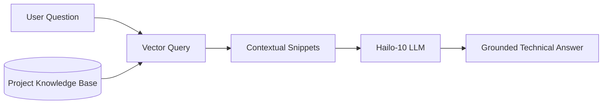

<p align="center">
  
</p>

# 📚 HYDRA-UMC-DOCS-QA

<p align="center"><a href="README.md">🇺🇸 English</a> | <a href="README_spa.md">🇪🇸 Español</a> | <a href="README_fra.md">🇫🇷 Français</a> | <a href="README_ita.md">🇮🇹 Italiano</a> | <a href="README_deu.md">🇩🇪 Deutsch</a> | <a href="README_zho.md">🇨🇳 简体中文</a> | 🇯🇵 <b>日本語</b></p>

### 🤖 ハードウェア保守とドキュメント向け RAG ベース AI アシスタント

<p align="left">
  
  
  
</p>

---

## 1. 🛠️ 技術概要

**HYDRA-UMC-DOCS-QA** は、現場の技術者や開発者向けに設計された専用の
検索拡張生成（RAG）アシスタントです。HYDRA-UMC エコシステムに関する
技術的な質問に対して、即座に、根拠のある回答を提供します。

エコシステム全体のすべてのマニュアル、回路図ドキュメント、ソースコードを
「読み込んで」おり、インターネット接続を必要とせずにトラブルシューティング、
ピン配置の照会、ファームウェアのコンパイルを支援できます。

### 主な機能：
* 🔍 **ローカルベクトル検索（v0）：** ローカルの Markdown ドキュメントに対する、標準ライブラリのみによる実際の TF-IDF 語彙検索。*（実際の語彙検索として実装済み——まだ埋め込みベースの意味検索ではなく、PDF の取り込みは今後の課題です。下記の「ビルドと実行」を参照）*
* 🔒 **実在するドキュメントのアローリスト：** 実際に存在する `.md`/`.markdown` ファイルのみが取り込まれ、引用されます——それ以外の `--docs` パス（存在しない、または許可されていないファイルタイプ）はすべて、明確で個別の理由とともに出力されて拒否され、黙って読み飛ばされたり、実際のドキュメントであるかのように黙って読み込まれたりすることはありません。*（実装済み）*
* 🔗 **追跡可能な引用：** すべての結果は `source#index` を引用します——取り込まれた正確な一節への安定した、曖昧さのないポインタであり、同じソースを再解析することで決定的に復元できます。*（実装済み）*
* 🎯 **決定的なスコアリング：** ランキングはコーパスとクエリテキストのみに基づく純粋な関数であり、インタプリタのプロセスごとのハッシュシードには依存しません。*（実装済み）*
* 🌐 **実際の JSON/HTTP API：** `serve` サブコマンドは、同じ TF-IDF 検索を長時間稼働するローカルサービス（デフォルト `127.0.0.1:8110`）として実行し、`GET /query?q=...&top_k=N` と `GET /stats` を提供します——コーパスは起動時に一度だけ取り込まれてインデックス化され、リクエストごとには行われません。実際にキャプチャされた例は [`docs/CLI_REFERENCE.md`](docs/CLI_REFERENCE.md) を参照してください。*（実装済み）*
* 🤖 **根拠に基づく推論：** 回答は提供されたプロジェクトドキュメントに厳密に基づきます。
* 🎙️ **音声統合：** VOICE-UI と統合され、ハンズフリーの保守サポートを実現。
* 🛠️ **コード認識：** ファームウェアモジュールと CAN プロトコルの詳細を説明できます。
* 👨‍👩‍👧 **認知 AI ノードの子プロジェクト：**
  [HYDRA-UMC-COGNITIVE-NODE](https://github.com/JuanenRac/HYDRA-UMC-COGNITIVE-NODE) の下で 4 つの兄弟サービスの 1 つとして動作します（VLA-Engine、Voice-UI、Semantic-Planner と並んで）。独自のコピーを保持するのではなく、親プロジェクトの HydraOS イメージとモデルの重みを共有します。
* 📦 **オドメーター式バージョン管理：** 実際のビルドのたびに
  `pyproject.toml` 自身のバージョンが自動的に増加します
  （`bump_version.py`）——手動でのバージョン編集は不要です。

---

## 2. 🔄 RAG パイプラインフロー



---

## 3. 🧱 アーキテクチャと設計上の決定

本リポジトリは Cognitive AI Node ファミリーの**子プロジェクト**です——
親プロジェクトである [HYDRA-UMC-COGNITIVE-NODE](https://github.com/JuanenRac/HYDRA-UMC-COGNITIVE-NODE) が共有の HydraOS イメージと量子化モデルの重みを保持し、本サービスを他の 3 つの兄弟プロジェクト（VLA-Engine、Voice-UI、Semantic-Planner）とともに `docker-compose.yml` に接続します：

* **本子プロジェクトに独自のハードウェア/ファームウェア/`os/`/`models/` がない理由。** 親プロジェクトが既に保有する CM5 + Hailo-10 M.2 モジュール上で完全に動作します——モデルの重みと HydraOS イメージを 1 か所に集約することで、ファミリー全体で数 GB にも及ぶモデルの重みが 4 つの食い違ったコピーとして存在することを避けられます。
* **`src/` レイアウトを採用した理由。** インストール可能なパッケージ（`hydra_umc_docs_qa`）をリポジトリルートのツール（`bump_version.py`）から分離し、エコシステム内の他のすべての Python プロジェクトで使用されているレイアウトと一致させるためです。
* **裸の呼び出し（サブコマンドなし）が今も身元/バージョン/役割のみを表示する理由。** これはもともとの足場（スキャフォールディング）段階の動作で、まだ実際のロジックが何も存在しなかった頃に、本パッケージが正しくインストール・コンパイルされ、問題なくインポートできることを証明するものでした——今日でも、実際の `query`（TF-IDF 検索）サブコマンドと `serve`（JSON/HTTP API）サブコマンド（その足場が前提条件だったもの）と並んで、「実際にインストールされていて動くか」を素早く確認するデフォルトの手段として残っています。
* **エコシステムの他の部分との関係。** 本アシスタントは、その回答をエコシステム自身のドキュメントに基づかせることで、兄弟プロジェクトである HYDRA-UMC-SEMANTIC-PLANNER に、推論中に照会できる技術知識のソースを提供し、HYDRA-UMC-VOICE-UI とともに現場の技術者にハンズフリーのトラブルシューティング支援を提供します。
* **`index.py` の検索がなぜ埋め込みモデルではなく実際の TF-IDF なのか。** 埋め込みベースの意味検索には実際のモデル依存関係が必要です（理想的には本 README がすでに言及している Hailo-10）——標準ライブラリのみの TF-IDF/コサイン類似度インデックスは実際に動作し、テスト可能で、Python 自体以外何も必要としません。これにより本プロジェクトは、CLI や取り込みステップに触れることなく同じ `search()` 契約の背後に将来の埋め込みベースのインデックスを差し替えられる、実際に機能する検索カーネルを今日すでに持っています。
* **一致しないクエリがフォールバック回答ではなく正直な失敗を返す理由。** v0 には LLM による合成ステップがありません——取り込まれたコーパスと単語が重ならない質問には `No relevant passages found`（`main.py` を参照）が返されるだけで、実際の検索結果を装った捏造やハルシネーションによる回答が返されることは決してありません。
* **許可されていない `--docs` パスが、黙って読み飛ばされたり黙って取り込まれたりするのではなく、拒否される理由。** 「エコシステム自身のドキュメントに基づく」はずの QA アシスタントは、呼び出し元がたまたま指し示したファイルを黙って読み込んで引用してはいけません——存在しないパスや非 Markdown ファイル（迷い込んだ `.env`、ファームウェアのバイナリ）には、実際の、個別の `REJECTED ... : <理由>` という行が返されます（`ingest.py` の `validate_doc_path` を参照）。これは、*なぜ*見つからなかったのかを隠してしまう、まとめられた「何も見つかりませんでした」の代わりです。
* **コサイン類似度が、共有語を合計する前にソートする理由。** `dict.keys() & dict.keys()` は集合（set）であり、CPython における集合の反復順序はプロセスごとの文字列ハッシュのランダム化に依存します——その順序のまま浮動小数点の項を合計すると、スコアが、コーパスとクエリテキストだけでなく、たまたまどのプロセスがクエリを実行したかにも依存してしまいます。先にソートすることで、スコアは実際の入力のみに基づく純粋で再現可能な関数になります。
* **引用がファイル名だけでなく `#index` を伴う理由。** ファイル名だけでは、同じ見出しを共有する 2 つのセクション（あるいは将来的には、同じ名前を共有する 2 つの取り込まれたファイル）を区別できません——`DocChunk.index` は各チャンクの、その出典内での実際の序数位置であり、すべての引用に安定したキーを与えます。呼び出し元はこのキーを使って、同じ一節を決定的に再び取り出すことができます。

---

## 📂 リポジトリ構成

```text
HYDRA-UMC-DOCS-QA/
├── src/hydra_umc_docs_qa/
│   ├── ingest.py            # 実際の Markdown 取り込み -> 見出し単位の DocChunk
│   ├── index.py              # 実際の TF-IDF インデックス（標準ライブラリのみ）+ コサイン類似度検索
│   ├── api.py                  # シンプルなJSON/HTTPサーフェス(stdlibのhttp.server)。実際の`query`ロジックを橋渡し
│   └── main.py                # エントリポイント + 実際の `query`/`serve` サブコマンド
├── tests/                   # 実際のテスト：取り込み、アローリスト、ランキング、決定性、api、エンドツーエンド CLI
├── docs/
│   └── CLI_REFERENCE.md    # CLI + JSON/HTTP API の完全なリファレンス、各例は実際の実行から取得
├── images/                  # メディアと図表
├── systemd/
│   └── hydra-umc-docs-qa.service # ローカルCM5ドキュメント検索APIのsystemdユニット
├── tools/
│   ├── build_test.py        # バージョンを増やさないビルドチェック
│   └── ci_validate.py       # CI が使用するマニフェスト/CHANGELOG/ドキュメント検証
├── build/                   # ローカルビルド出力（git 管理外）
├── pyproject.toml           # パッケージメタデータ（オドメーター式バージョン増加）
├── bump_version.py          # ネイティブバージョンのオドメーター式インクリメント（build.sh/.bat が使用）
├── bump_manifest_version.py # hydra-umc.project.json のバージョンをネイティブ版と同期(--sync)
├── build.sh / build.bat     # venv 作成、インストール（dev エクストラ付き）、インポート検証、テスト実行
└── run.sh / run.bat         # エントリポイントを実行（引数を転送、例：`query`）
```

> **注：** `hardware/` と `firmware/` は省略されています——本ノードは
> 既存の CM5 + Hailo-10 M.2 モジュール上で動作し、独自のハードウェア/
> ファームウェア設計を持ちません。`os/` と `models/` も省略されています
> ——HydraOS イメージと共有される Hailo-10 モデルの重みは、親プロジェクト
> `HYDRA-UMC-COGNITIVE-NODE` に存在し、本プロジェクトはサービスとして
> それに接続します（その `docker-compose.yml` を参照）。

---

## ⚙️ ビルドと実行

Python >= 3.10 が必要です。

```bash
# Linux / macOS / Git Bash
./build.sh   # .venv を作成し、パッケージを（editable モードで）インストールし、インポートを検証します
./run.sh     # エントリポイントを実行します

# Windows (cmd)
build.bat
run.bat
```

`build.sh`/`build.bat` は、実際の各ビルドの前にバージョンを増加させ
（オドメーター方式、`bump_version.py` を参照）、実際のテストスイートを
実行します（`pytest tests/`）。引数なしの `run.sh` の予期される出力：

```text
HYDRA-UMC-DOCS-QA v0.0.7
Docs-QA (Hailo-10) - retrieval-augmented technical assistant grounded in the ecosystem's own documentation.
```

実際の `query` サブコマンドは取り込まれた Markdown を検索します——
`--docs` が指定されない場合、デフォルトで本リポジトリ自身の
`README.md`/`CHANGELOG.md` を使用し、`--docs` で任意の実際のファイルを
渡すこともできます：

```bash
./run.sh query "CAN バス配線" --top-k 3
./run.sh query "ベクトル検索 リトリーバル" --docs docs/manual.md --docs docs/spec.md

# Windows
run.bat query "CAN バス配線" --top-k 3
```

取り込まれたコーパスと単語が重ならない質問には、正直な
`No relevant passages found` が表示されます——v0 は実際の語彙検索であり、
生成的な回答ではありません。

すべての結果は `source#index`（例：`manual.md#1`）を引用します——その正確なチャンクへの安定した、追跡可能なポインタです。存在しない、または `.md`/`.markdown` ではない `--docs` パスは、黙って無視されるのではなく、拒否されて報告されます：

```text
$ ./run.sh query "firmware flashing" --docs manual.md ghost.md secret.env
REJECTED ghost.md: file not found (no source)
REJECTED secret.env: disallowed extension .env - only .markdown, .md are ingested
Top 1 passage(s) for: "firmware flashing"

1. [0.289] manual.md#1 - Firmware Flashing
   Flash URTC firmware over SWD or JTAG using URTC-FLASHER.
```

同じ検索は、`./run.sh serve --docs manual.md`（デフォルト `127.0.0.1:8110`）を通じて、長時間稼働する JSON/HTTP API としても利用できます。すべてのコマンドとエンドポイントの完全なリファレンス（各例は実際の実行から取得）については [`docs/CLI_REFERENCE.md`](docs/CLI_REFERENCE.md) を参照してください。

### 🩺 トラブルシューティング

* **`python: command not found` / ビルドがステップ 1 で失敗する。** `PATH` 上に Python >= 3.10 が必要です。Windows では [python.org](https://python.org) からインストールし、セットアップ中に「Add to PATH」がチェックされていることを確認してください。Linux/macOS では通常 `python3` という名前が使われます。
* **`build.sh` が venv をアクティブ化できない。** `python3 -m venv .venv` は、プラットフォームごとに異なる場所にアクティベートスクリプトを配置します：Linux/macOS では `.venv/bin/activate`、Windows（Git Bash から使用される Windows Python venv でも同様）では `.venv/Scripts/activate`。`build.sh` は既に両方のパスをチェックしています——それでも失敗する場合は、`.venv/` を削除して `./build.sh` を再実行し、ゼロから再構築してください。
* **`pip install -e .` が失敗する。** 通常は `.venv/` が古くなっていることが原因です。`.venv/` フォルダを削除して `./build.sh`/`build.bat` を再実行し、再作成してください。
* **`import OK` が一度も表示されない。** `python -c "import hydra_umc_docs_qa"` 自体が失敗したことを意味します——venv がアクティブな状態で再実行し、実際のトレースバックを確認してください。

---

## 🚀 ロードマップ
* **フェーズ 1：** Hailo-10 上での VLA エンジンのデプロイとマルチモーダル入力処理。
* **フェーズ 2：** 意味プランナーと群行動モデルおよび長期記憶の統合。
* **フェーズ 3：** 音声 UI の低遅延ローカル実行と産業用ノイズキャンセリング。
* **フェーズ 4：** QA の回答に連動したインタラクティブな回路図の可視化、およびエッジデバイス向けの RAG 最適化。

---

## 🔗 関連プロジェクト

本プロジェクトは、同じ作者(JuanenRac / Electro Hobby 3D)による HYDRA-UMC ロボティクスエコシステムの一部です。リクエストが実はこの中のどれかについてのものである可能性があるため、知っておく価値があります。

**親プロジェクト**
- **[HYDRA-UMC-COGNITIVE-NODE](https://github.com/JuanenRac/HYDRA-UMC-COGNITIVE-NODE)** — Hailo-10 コグニティブパイプライン(LLM/VLA/音声オーケストレーション)の統合ハブ。本リポジトリは、その自身のコグニティブパイプライン内における特定の段階・消費者として、この親の一部を成す。

**兄弟プロジェクト** —— HYDRA-UMC-COGNITIVE-NODE 自身の Hailo-10 コグニティブパイプラインにおける他の段階・消費者
- **[HYDRA-UMC-VOICE-UI](https://github.com/JuanenRac/HYDRA-UMC-VOICE-UI)** — 確認ゲート付きの限定的な Watch リレーを備えた、実際の音声フロントエンド(VAD + 意図解析)。
- **[HYDRA-UMC-SEMANTIC-PLANNER](https://github.com/JuanenRac/HYDRA-UMC-SEMANTIC-PLANNER)** — MCU エラーコードに対する、実際のルールベースのタスク分解と意味的エラー復旧。
- **[HYDRA-UMC-VLA-ENGINE](https://github.com/JuanenRac/HYDRA-UMC-VLA-ENGINE)** — Vision-Language-Action モデル向けの、実際のアクショントークンのエンコード/デコードと軌道生成。

**エコシステムの他のプロジェクト**

*コアハードウェア&プラットフォーム*
- **[HYDRA-UMC](https://github.com/JuanenRac/HYDRA-UMC)** — 実際のロボットアームのマザーボード——CM5 ホスト + デュアルコア STM32H745、CAN-OTA/SPI-OTA 経由で最大 8 本のツールアームを統括。
- **[HYDRA-UMC-OS](https://github.com/JuanenRac/HYDRA-UMC-OS)** — CM5 向けの再現可能な Raspberry Pi OS プロダクト層——読み取り専用エージェント、検証済み設定/プロファイル、WiFi 初回接続プロビジョニング。
- **[HYDRA-UMC-SDK](https://github.com/JuanenRac/HYDRA-UMC-SDK)** — すべてのブリッジが自身のコマンドを検証する共有 JSON-Schema 契約と安全ゲートの境界。

*コアバックエンド&クライアント*
- **[HYDRA-UMC-SERVER](https://github.com/JuanenRac/HYDRA-UMC-SERVER)** — すべての制御クライアントが実際に通信する、本物のヘッドレスバックエンド(REST/WebSocket)。
- **[HYDRA-UMC-STUDIO](https://github.com/JuanenRac/HYDRA-UMC-STUDIO)** — リアルタイムのマルチロボット 3D 可視化を備えたウェブ制御ダッシュボード。
- **[HYDRA-UMC-SUITE](https://github.com/JuanenRac/HYDRA-UMC-SUITE)** — 複数のサーバーを同時に扱えるデスクトップ(PySide6)スウォームコマンドセンター、スタンドアロン実行ファイルとしてパッケージ化。
- **[HYDRA-UMC-ANDROID-CONTROL](https://github.com/JuanenRac/HYDRA-UMC-ANDROID-CONTROL)** — 生体認証ログインとペアリングされた Wear OS コンパニオンを備えたネイティブ Android 制御アプリ。
- **[HYDRA-UMC-IOS-CONTROL](https://github.com/JuanenRac/HYDRA-UMC-IOS-CONTROL)** — リアルタイム WebSocket 同期を備えた iOS/iPadOS 制御アプリ(Flutter)。
- **[HYDRA-UMC-DSI](https://github.com/JuanenRac/HYDRA-UMC-DSI)** — 本体搭載の 7 インチ DSI タッチスクリーン向けネイティブタッチ UI、CM5 自体に組み込み。
- **[HYDRA-UMC-EDITOR-URDF](https://github.com/JuanenRac/HYDRA-UMC-EDITOR-URDF)** — 完成したモデルを STUDIO 自身のカタログへ送信するデスクトップ用グラフィカル URDF 作成/編集ツール。
- **[HYDRA-UMC-BRIDGE-AMR](https://github.com/JuanenRac/HYDRA-UMC-BRIDGE-AMR)** — 実際の VDA 5050 MQTT パブリッシャーによる AGV/AMR フリートの調整境界。
- **[HYDRA-UMC-BRIDGE-CNC](https://github.com/JuanenRac/HYDRA-UMC-BRIDGE-CNC)** — 実際の GRBL ステータス/制御バイトへのアクセスを持つ、CNC セルの高レベルコーディネーター。
- **[HYDRA-UMC-BRIDGE-DROIDS](https://github.com/JuanenRac/HYDRA-UMC-BRIDGE-DROIDS)** — 実際の Boston Dynamics Spot コマンド送信機能を持つ、脚型/ヒューマノイドドロイドの調整境界。
- **[HYDRA-UMC-BRIDGE-LASER](https://github.com/JuanenRac/HYDRA-UMC-BRIDGE-LASER)** — 実際のキー/筐体/インターロック GPIO セーフガード 3 系統を読み取る、レーザーセルの安全コーディネーター。
- **[HYDRA-UMC-BRIDGE-OPENPNP](https://github.com/JuanenRac/HYDRA-UMC-BRIDGE-OPENPNP)** — OpenPnP ピックアンドプレースの基板フローを安全に統括する高レベルコーディネーター。
- **[HYDRA-UMC-BRIDGE-PRINTER3D](https://github.com/JuanenRac/HYDRA-UMC-BRIDGE-PRINTER3D)** — 実際にゲート制御されたジョブコマンドを持つ、Moonraker/Klipper 3D プリンター向けの安全な調整境界。
- **[HYDRA-UMC-BRIDGE-ROS2](https://github.com/JuanenRac/HYDRA-UMC-BRIDGE-ROS2)** — 実際の遅延インポート rclpy ROS 2 トランスポートを持つ安全コーディネーター。
- **[HYDRA-UMC-BRIDGE-UAV](https://github.com/JuanenRac/HYDRA-UMC-BRIDGE-UAV)** — 実際の MAVLink コマンド送信機能を持つ、カメラ搭載 UAV の調整境界。

*URTC ツールプラットフォーム*
- **[URTC](https://github.com/JuanenRac/URTC)** — 物理的な Universal Robot Tool Controller 基板向けファームウェア、CAN バス経由の 25 以上のツールプロファイル。
- **[URTC-FLASHER](https://github.com/JuanenRac/URTC-FLASHER)** — URTC 基板用のデスクトップ GUI 書き込みツール、CAN-OTA およびフルチップ SWD/JTAG。
- **[URTC-TESTER](https://github.com/JuanenRac/URTC-TESTER)** — URTC 基板向けのデスクトップ CAN バスライブ診断ツール、ツールプロファイルごとに 1 パネル。
- **[URTC-WEB-STUDIO](https://github.com/JuanenRac/URTC-WEB-STUDIO)** — Web Serial API を使ったブラウザベースの URTC-TESTER の代替、ローカルインストール不要。

*ビジョン AI ノード(Hailo-8)*
- **[HYDRA-UMC-VISION-NODE](https://github.com/JuanenRac/HYDRA-UMC-VISION-NODE)** — Hailo-8 ビジョンパイプラインの統合ハブ、段階ごとの実際のハードウェア準備状況チェック付き。
- **[HYDRA-UMC-DETECTION-HEF](https://github.com/JuanenRac/HYDRA-UMC-DETECTION-HEF)** — Hailo アーキテクチャ/チェックサムによる安全読み込み検証を備えた、実際のコンパイル済みモデルレジストリ。
- **[HYDRA-UMC-VISION-STREAMER](https://github.com/JuanenRac/HYDRA-UMC-VISION-STREAMER)** — 実際の HailoRT 統合境界を持つ、実際の GStreamer パイプライン + MediaMTX 設定生成器。
- **[HYDRA-UMC-VISUAL-SERVOING-API](https://github.com/JuanenRac/HYDRA-UMC-VISUAL-SERVOING-API)** — 上流のゾーン状態に応じて安全ゲート制御される、実際の Position-Based Visual Servoing 補正則。
- **[HYDRA-UMC-SAFETY-ZONES](https://github.com/JuanenRac/HYDRA-UMC-SAFETY-ZONES)** — キャリブレーションの鮮度を強制する、実際のゾーン侵入チェックと E-STOP 要求。

*オーケストレーション&スウォーム*
- **[HYDRA-UMC-ORCHESTRATOR](https://github.com/JuanenRac/HYDRA-UMC-ORCHESTRATOR)** — 実際の gRPC/Protobuf ヘルスレポート契約とミッションステートマシンを持つ統合ハブ。
- **[HYDRA-UMC-JOB-DISPATCHER](https://github.com/JuanenRac/HYDRA-UMC-JOB-DISPATCHER)** — 実際の HTTP API 上に構築された、優先度ベースの実際のジョブキュー(重複排除付き)。
- **[HYDRA-UMC-NODE-HEALING](https://github.com/JuanenRac/HYDRA-UMC-NODE-HEALING)** — リトライ/バックオフとアイデンティティ不一致検出を備えた、実際の gRPC ベースのフリートヘルスウォッチドッグ。
- **[HYDRA-UMC-PATH-PLANNER-3D](https://github.com/JuanenRac/HYDRA-UMC-PATH-PLANNER-3D)** — 実際の障害物/ワークスペース衝突検証を備えた、実際の RRT ベースの 3D 経路プランナー。
- **[HYDRA-UMC-SWARM-SYNC](https://github.com/JuanenRac/HYDRA-UMC-SWARM-SYNC)** — 複数セルの収束についてプロパティテストされた、実際の CRDT LWW-Element-Map 状態同期。

*デジタルツイン&シミュレーション*
- **[HYDRA-UMC-TWIN](https://github.com/JuanenRac/HYDRA-UMC-TWIN)** — 実際のバージョン互換性同期契約を持つ、デジタルツインエンジンの統合ハブ。
- **[HYDRA-UMC-HIL-BRIDGE](https://github.com/JuanenRac/HYDRA-UMC-HIL-BRIDGE)** — シミュレーションと実際のハードウェアの間でコマンドをルーティングする、実際のハードウェア・イン・ザ・ループ安全インターロック。
- **[HYDRA-UMC-PHYSICS-REPLICA](https://github.com/JuanenRac/HYDRA-UMC-PHYSICS-REPLICA)** — 実際の URDF サブセットに対する、実際の順運動学と関節限界検証。
- **[HYDRA-UMC-SYNTHETIC-DATA-GEN](https://github.com/JuanenRac/HYDRA-UMC-SYNTHETIC-DATA-GEN)** — YOLO/COCO アノテーションのエクスポート機能を持つ、実際のプロシージャル 2D シーンジェネレーター。

*データ&分析*
- **[HYDRA-UMC-DATALAKE](https://github.com/JuanenRac/HYDRA-UMC-DATALAKE)** — 実際の取り込み/クエリ HTTP API を備えた、実際の sqlite3 ベースの時系列ストア。
- **[HYDRA-UMC-ANOMALY-DETECTOR](https://github.com/JuanenRac/HYDRA-UMC-ANOMALY-DETECTOR)** — ドリフト監視を備えた、実際の FFT + 統計ベースラインによる異常検知器。
- **[HYDRA-UMC-PRODUCTION-REPORTS](https://github.com/JuanenRac/HYDRA-UMC-PRODUCTION-REPORTS)** — DATALAKE の履歴に対する実際の OEE/稼働率計算、再現可能な CSV エクスポート付き。
- **[HYDRA-UMC-TELEMETRY-COLLECTOR](https://github.com/JuanenRac/HYDRA-UMC-TELEMETRY-COLLECTOR)** — シーケンス重複排除機能を備えた、DATALAKE への実際の CAN/WebSocket 取り込みパイプライン。

*産業用ゲートウェイ*
- **[HYDRA-UMC-GATEWAY-INDUSTRIAL](https://github.com/JuanenRac/HYDRA-UMC-GATEWAY-INDUSTRIAL)** — 実際のコマンド許可リスト/バックプレッシャー層を持つ、産業用プロトコルへ中継する統合ハブ。
- **[HYDRA-UMC-OPCUA-SERVER](https://github.com/JuanenRac/HYDRA-UMC-OPCUA-SERVER)** — 実際のバイナリプロトコルクライアントセッションで検証された、実際の OPC-UA アドレス空間。
- **[HYDRA-UMC-MQTT-BROKER](https://github.com/JuanenRac/HYDRA-UMC-MQTT-BROKER)** — クライアント単位のオプション認証とトピック ACL を備えた、実際の MQTT ブローカー。
- **[HYDRA-UMC-MTCONNECT-ADAPTER](https://github.com/JuanenRac/HYDRA-UMC-MTCONNECT-ADAPTER)** — 縮退モード出力を備えた、実際の MTConnect `/probe` および `/current` XML エンドポイント。

*補完ツール&エコシステム運用*
- **[HYDRA-UMC-DASHBOARD-AI](https://github.com/JuanenRac/HYDRA-UMC-DASHBOARD-AI)** — 誠実な統計フォールバックを備えた、DATALAKE/ANOMALY-DETECTOR 上のスマートサマリーと異常ハイライトパネル。
- **[HYDRA-UMC-TOOL-CLI](https://github.com/JuanenRac/HYDRA-UMC-TOOL-CLI)** — 実際の安定した終了コード契約を持つフリート CLI、HYDRA-UMC-SERVER 自身の API の本物のライブクライアント。
- **[HYDRA-UMC-WATCH](https://github.com/JuanenRac/HYDRA-UMC-WATCH)** — 実際の触覚アラートとペアリングされたスマートフォンへの音声リレーを備えた WearOS コンパニオンアプリ。
- **[URTC-SMART-RACK](https://github.com/JuanenRac/URTC-SMART-RACK)** — 実際の工具 ID デコードと Smart Idle 予熱ロジックを備えた、基板搭載ラック用ファームウェア。
- **[URTC-VISION-TOOL](https://github.com/JuanenRac/URTC-VISION-TOOL)** — サーマル/RGB 検査ツールヘッド向けの、ファームウェアと実際の Python ビジョンコンパニオン。
- **[HYDRA-UMC-UPDATER](https://github.com/JuanenRac/HYDRA-UMC-UPDATER)** — このエコシステム内のすべてのリポジトリを検出・クローン・更新する、管理用デスクトップツール。
- **[HYDRA-UMC-OS-REBUILDER](https://github.com/JuanenRac/HYDRA-UMC-OS-REBUILDER)** — エコシステムの最新バージョンをプリロードした、書き込み可能なCM5イメージを構築するWindows/Linuxデスクトップツール。Raspberry Pi Imager方式の初回起動Wi-Fi/ユーザー/SSH設定を備える。

---

## 📚 ドキュメント & コミュニティ

- **[CONTRIBUTING.md](CONTRIBUTING.md)** —— プルリクエストのための技術スタックとコーディング指針。
- **[CODE_OF_CONDUCT.md](CODE_OF_CONDUCT.md)** —— このコミュニティで期待される行動規範。
- **[SECURITY.md](SECURITY.md)** —— 脆弱性の報告方法と、このプロジェクトの実際のセキュリティ重点領域。
- **[SUPPORT.md](SUPPORT.md)** —— 質問の投稿先とバグの報告先。
- **[LICENSE.md](LICENSE.md)** —— このプロジェクト自身のライセンス。

## 👤 作者
**JuanenRac** (Electro Hobby 3D)
📧 electrohobby3d@gmail.com
📺 [youtube.com/@electrohobby3d](https://youtube.com/@electrohobby3d)

## 📜 ライセンス
GPL-3.0 —— 詳細は LICENSE を参照してください。
