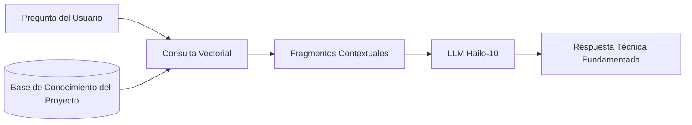

<p align="center">
  
</p>

# 📚 HYDRA-UMC-DOCS-QA

<p align="center"><a href="README.md">🇺🇸 English</a> | 🇪🇸 <b>Español</b> | <a href="README_fra.md">🇫🇷 Français</a> | <a href="README_ita.md">🇮🇹 Italiano</a> | <a href="README_deu.md">🇩🇪 Deutsch</a> | <a href="README_zho.md">🇨🇳 简体中文</a> | <a href="README_jpn.md">🇯🇵 日本語</a></p>

### 🤖 Asistente de IA Basado en RAG para Mantenimiento de Hardware y Documentación

<p align="left">
  
  
  
</p>

---

## 1. 🛠️ VISIÓN GENERAL TÉCNICA

**HYDRA-UMC-DOCS-QA** es un asistente especializado de Generación Aumentada por Recuperación (RAG) diseñado para técnicos y desarrolladores in-situ. Proporciona respuestas instantáneas y fundamentadas a preguntas técnicas sobre el ecosistema HYDRA-UMC.

Ha "leído" todos los manuales, documentación de esquemas y código fuente del ecosistema, lo que le permite asistir en la resolución de problemas, consultas de pinout y compilación de firmware sin necesidad de conexión a internet.

### Características Clave:
* 🔍 **Búsqueda Vectorial Local (v0):** Recuperación léxica real TF-IDF, stdlib puro, sobre documentos Markdown locales. *(implementado como búsqueda léxica real - todavía no búsqueda semántica basada en embeddings, y la ingesta de PDF sigue siendo trabajo futuro; ver BUILD Y EJECUCIÓN abajo)*
* 🔒 **Lista blanca real de documentos:** solo los archivos `.md`/`.markdown` que realmente existen se ingieren y citan - cualquier otra ruta `--docs` (inexistente, o de un tipo de archivo no permitido) se rechaza con un motivo distinto e impreso, en vez de omitirse silenciosamente o leerse como si fuera documentación real. *(implementado)*
* 🔗 **Citas trazables:** cada resultado cita `source#index` - un puntero estable y desambiguador que apunta al pasaje exacto ingerido, recuperable de forma determinista volviendo a analizar la misma fuente. *(implementado)*
* 🎯 **Puntuación determinista:** el ranking es una función pura del corpus y del texto de la consulta, independiente de la semilla de hash por proceso del intérprete. *(implementado)*
* 🤖 **Razonamiento Fundamentado:** Las respuestas se basan estrictamente en la documentación del proyecto proporcionada.
* 🎙️ **Integración de Voz:** Integrado con VOICE-UI para soporte de mantenimiento manos libres.
* 🛠️ **Conocimiento de Código:** Puede explicar módulos de firmware y detalles específicos del protocolo CAN.
* 👨‍👩‍👧 **Hijo del Cognitive AI Node:** Corre como uno de los cuatro
  servicios hermanos bajo [HYDRA-UMC-COGNITIVE-NODE](https://github.com/JuanenRac/HYDRA-UMC-COGNITIVE-NODE)
  (junto a VLA-Engine, Voice-UI y Semantic-Planner), compartiendo la
  imagen HydraOS y los pesos de modelos de su padre en vez de mantener
  copias propias.
* 📦 **Versionado Cuentakilómetros:** Cada build real incrementa
  automáticamente la versión de `pyproject.toml` (`bump_version.py`) - sin
  ediciones manuales de versión.

---

## 2. 🔄 FLUJO DEL PIPELINE RAG



---

## 3. 🧱 ARQUITECTURA Y DECISIONES DE DISEÑO

Este repositorio es un **hijo** de la familia Cognitive AI Node - su
padre, [HYDRA-UMC-COGNITIVE-NODE](https://github.com/JuanenRac/HYDRA-UMC-COGNITIVE-NODE),
posee la imagen HydraOS compartida y los pesos de modelos cuantizados, y
conecta este servicio en su `docker-compose.yml` junto a sus tres
hermanos (VLA-Engine, Voice-UI, Semantic-Planner):

* **Por qué este hijo no tiene hardware/firmware/`os/`/`models/`
  propios.** Corre por completo sobre el módulo CM5 + Hailo-10 M.2 que ya
  posee el padre - centralizar los pesos de modelos y la imagen HydraOS
  en un solo lugar evita cuatro copias divergentes de varios gigabytes
  dentro de la familia.
* **Por qué una estructura `src/`.** Mantiene el paquete instalable
  (`hydra_umc_docs_qa`) separado del tooling en la raíz del repo
  (`bump_version.py`), igual que el resto de proyectos Python del
  ecosistema.
* **Por qué el punto de entrada solo imprime identidad/versión/rol hoy.**
  Esta es la etapa de andamiaje: demostrar que el paquete se instala,
  compila e importa correctamente - en la versión real de Python objetivo
  - es un requisito previo antes de añadir lógica real de
  búsqueda-vectorial/RAG, y mantiene ese trabajo posterior aislado de los
  problemas de empaquetado.
* **Cómo encaja en el resto del ecosistema.** Este asistente fundamenta
  sus respuestas en la documentación propia del ecosistema, dando a su
  hermano HYDRA-UMC-SEMANTIC-PLANNER una fuente de conocimiento técnico
  que puede consultar durante el razonamiento, y ofreciendo a los
  técnicos in-situ soporte manos-libres junto a HYDRA-UMC-VOICE-UI.
* **Por qué la recuperación de `index.py` es TF-IDF real, no un modelo de
  embeddings.** La búsqueda semántica basada en embeddings necesita una
  dependencia real de modelo (idealmente el propio Hailo-10 que ya
  menciona este README) - un índice TF-IDF/similitud coseno puro en
  stdlib es real, testeable, y no necesita nada más allá del propio
  Python, dando a este proyecto un núcleo de recuperación funcional hoy
  que un futuro índice basado en embeddings puede sustituir detrás del
  mismo contrato `search()`, sin tocar la CLI ni el paso de ingesta.
* **Por qué una consulta sin coincidencias devuelve un fallo honesto, no
  una respuesta de respaldo.** v0 no tiene paso de síntesis por LLM - una
  pregunta cuyas palabras no coinciden con el corpus ingerido recibe
  `No relevant passages found` (ver `main.py`), nunca una respuesta
  inventada o alucinada disfrazada de resultado real de recuperación.
* **Por qué una ruta `--docs` no permitida se rechaza, en vez de
  omitirse o ingerirse silenciosamente.** Un asistente de QA que se
  supone "fundamentado en la documentación propia del ecosistema" no
  debe leer y citar en silencio cualquier archivo al que apunte quien lo
  invoque - una ruta inexistente o un archivo que no es Markdown (un
  `.env` suelto, un binario de firmware) recibe una línea real y
  distinta `REJECTED ... : <motivo>` (ver `validate_doc_path` en
  `ingest.py`) en vez de un "no se encontró nada" agregado que oculta
  *por qué*.
* **Por qué la similitud coseno ordena los términos compartidos antes
  de sumarlos.** `dict.keys() & dict.keys()` es un conjunto (set), y el
  orden de iteración de los sets en CPython depende de la
  aleatorización del hash de cadenas por proceso - sumar términos de
  punto flotante en ese orden haría que una puntuación dependiera de
  qué proceso ejecutó la consulta, no solo del corpus y del texto de la
  consulta. Ordenar primero hace que la puntuación sea una función pura
  y reproducible de sus entradas reales.
* **Por qué las citas llevan un `#index`, no solo un nombre de
  archivo.** Un nombre de archivo por sí solo no puede desambiguar dos
  secciones que comparten un encabezado (o, más adelante, dos archivos
  ingeridos que comparten nombre) - `DocChunk.index` es la posición
  ordinal real de cada fragmento dentro de su propia fuente, dando a
  cada cita una clave estable que quien la use puede emplear para
  recuperar de forma determinista el mismo pasaje.

---

## 📂 ESTRUCTURA DE DIRECTORIOS

```text
HYDRA-UMC-DOCS-QA/
├── src/hydra_umc_docs_qa/
│   ├── ingest.py            # Ingesta real de Markdown -> DocChunks por encabezado
│   ├── index.py              # Índice TF-IDF real (stdlib puro) + búsqueda por similitud coseno
│   ├── api.py                  # Superficie JSON/HTTP plana (http.server de stdlib) sobre la lógica real de `query`
│   └── main.py                # Punto de entrada + subcomando real `query`
├── tests/                   # Tests reales: ingesta, lista blanca, ranking, determinismo, api, CLI end-to-end
├── docs/                    # Documentación y manuales técnicos
├── images/                  # Medios y diagramas
├── systemd/
│   └── hydra-umc-docs-qa.service # Unidad systemd de la API local de consultas de docs en la CM5
├── tools/
│   ├── build_test.py        # Comprobación de compilación sin versionado
│   └── ci_validate.py       # Validación de manifiesto/CHANGELOG/docs usada por CI
├── build/                   # Salida de build local (ignorada por git)
├── pyproject.toml           # Metadatos del paquete (versión con incremento cuentakilómetros)
├── bump_version.py          # Incremento de versión nativa estilo cuentakilómetros (usado por build.sh/.bat)
├── bump_manifest_version.py # Sincroniza la versión de hydra-umc.project.json con la nativa (--sync)
├── build.sh / build.bat     # Crea el venv, instala (con extras de dev), verifica la importación, corre tests
└── run.sh / run.bat         # Ejecuta el punto de entrada (reenvia argumentos, ej. `query`)
```

> **Nota:** se podaron `hardware/` y `firmware/` - este nodo corre sobre un
> módulo CM5 + Hailo-10 M.2 ya existente, sin diseño de hardware/firmware
> propio. También se podaron `os/` y `models/` - la imagen HydraOS y los
> pesos de modelos Hailo-10 compartidos viven en el proyecto padre
> `HYDRA-UMC-COGNITIVE-NODE`, al que este proyecto se conecta como
> servicio (ver su `docker-compose.yml`).

---

## ⚙️ BUILD Y EJECUCIÓN

Requiere Python >= 3.10.

```bash
# Linux / macOS / Git Bash
./build.sh   # crea .venv, instala el paquete (editable), verifica la importación
./run.sh     # ejecuta el punto de entrada

# Windows (cmd)
build.bat
run.bat
```

`build.sh`/`build.bat` incrementan la versión (estilo cuentakilómetros, ver
`bump_version.py`) antes de cada build real, y corren la suite de tests
real (`pytest tests/`). Salida esperada de un `run.sh` sin argumentos:

```text
HYDRA-UMC-DOCS-QA v0.0.7
Docs-QA (Hailo-10) - retrieval-augmented technical assistant grounded in the ecosystem's own documentation.
```

El subcomando real `query` busca en Markdown ingerido - por defecto el
propio `README.md`/`CHANGELOG.md` de este repo, o cualquier archivo real
pasado con `--docs`:

```bash
./run.sh query "cableado del bus CAN" --top-k 3
./run.sh query "busqueda vectorial recuperacion" --docs docs/manual.md --docs docs/spec.md

# Windows
run.bat query "cableado del bus CAN" --top-k 3
```

Una pregunta cuyas palabras no coinciden con el corpus ingerido imprime
un `No relevant passages found` honesto - v0 es recuperación léxica real,
no una respuesta generativa.

Cada resultado cita `source#index` (p. ej. `manual.md#1`) - un puntero
estable y trazable a ese fragmento exacto. Una ruta `--docs` inexistente
o que no sea `.md`/`.markdown` se rechaza y se reporta, no se ignora en
silencio:

```text
$ ./run.sh query "firmware flashing" --docs manual.md ghost.md secret.env
REJECTED ghost.md: file not found (no source)
REJECTED secret.env: disallowed extension .env - only .markdown, .md are ingested
Top 1 passage(s) for: "firmware flashing"

1. [0.289] manual.md#1 - Firmware Flashing
   Flash URTC firmware over SWD or JTAG using URTC-FLASHER.
```

### 🩺 Solución de problemas

* **`python: comando no encontrado` / el build falla en el paso 1.**
  Requiere Python >= 3.10 en el `PATH`. En Windows, instálalo desde
  [python.org](https://python.org) y marca "Add to PATH" durante la
  instalación; en Linux/macOS suele llamarse `python3`.
* **`build.sh` no consigue activar el venv.** `python3 -m venv .venv`
  coloca el script de activación en una ruta distinta según la
  plataforma: `.venv/bin/activate` en Linux/macOS, `.venv/Scripts/activate`
  en Windows (también con un venv de Python de Windows usado desde Git
  Bash). `build.sh` ya comprueba ambas rutas - si sigue fallando, borra
  `.venv/` y vuelve a ejecutar `./build.sh` para reconstruirlo desde cero.
* **`pip install -e .` falla.** Normalmente por un `.venv/` obsoleto.
  Borra la carpeta `.venv/` y vuelve a ejecutar `./build.sh`/`build.bat`
  para recrearla.
* **`import OK` nunca se imprime.** Significa que `python -c "import
  hydra_umc_docs_qa"` falló - vuelve a ejecutarlo con el venv activo
  para ver el traceback real.

---

## 🚀 HOJA DE RUTA
* **Fase 1:** Despliegue del motor VLA y procesamiento de entrada multi-modal en Hailo-10.
* **Fase 2:** Integración del planificador semántico con modelos de comportamiento de enjambre y memoria a largo plazo.
* **Fase 3:** Ejecución local de baja latencia de Voice UI y cancelación de ruido industrial.
* **Fase 4:** Visualización de esquemas interactivos vinculada a respuestas de QA y optimización de RAG para dispositivos de borde.

---

## 🔗 PROYECTOS RELACIONADOS

Este proyecto forma parte de un ecosistema de robótica más amplio del mismo autor (JuanenRac / Electro Hobby 3D), que abarca firmware, software de control, nodos de IA y herramientas de flota.

### Familia

**Padre:** **[HYDRA-UMC-COGNITIVE-NODE](https://github.com/JuanenRac/HYDRA-UMC-COGNITIVE-NODE)** — el Hub de Integración que posee la imagen/pesos compartidos de HydraOS de este asistente y lo conecta al flujo cognitivo.

**Hermanos:**
- **[HYDRA-UMC-VOICE-UI](https://github.com/JuanenRac/HYDRA-UMC-VOICE-UI)** — pasarela STT/TTS para el mismo planificador que este asistente también fundamenta.
- **[HYDRA-UMC-SEMANTIC-PLANNER](https://github.com/JuanenRac/HYDRA-UMC-SEMANTIC-PLANNER)** — el planificador LLM al que alimentan las respuestas RAG de este asistente.
- **[HYDRA-UMC-VLA-ENGINE](https://github.com/JuanenRac/HYDRA-UMC-VLA-ENGINE)** — convierte datos de visión en tokens de acción para el mismo planificador.

Este asistente no tiene relaciones fuera de su propia familia más allá de lo ya cubierto arriba.

### Resto del ecosistema

**Plataforma HYDRA-UMC** — la micro-fábrica multi-robot
- **[HYDRA-UMC](https://github.com/JuanenRac/HYDRA-UMC)** — la placa base: host Raspberry Pi CM5 + coprocesador de tiempo real STM32H745 de doble núcleo, orquestando hasta 8 brazos robóticos distribuidos vía CAN-OTA/SPI-OTA.
- **[HYDRA-UMC SERVER](https://github.com/JuanenRac/HYDRA-UMC-SERVER)** — backend Express/WebSocket headless que posee el estado de los robots.
- **[HYDRA-UMC STUDIO](https://github.com/JuanenRac/HYDRA-UMC-STUDIO)** — dashboard de control web.
- **[HYDRA-UMC-ANDROID-CONTROL](https://github.com/JuanenRac/HYDRA-UMC-ANDROID-CONTROL)** — app Android de control para HYDRA-UMC.
- **[HYDRA-UMC-IOS-CONTROL](https://github.com/JuanenRac/HYDRA-UMC-IOS-CONTROL)** — app iOS/iPadOS de control para HYDRA-UMC.
- **[HYDRA-UMC-SUITE](https://github.com/JuanenRac/HYDRA-UMC-SUITE)** — centro de mando de escritorio para el enjambre.
- **[HYDRA-UMC-EDITOR-URDF](https://github.com/JuanenRac/HYDRA-UMC-EDITOR-URDF)** — creador/editor gráfico de escritorio para modelos URDF.
- **[HYDRA-UMC-DSI](https://github.com/JuanenRac/HYDRA-UMC-DSI)** — UI táctil nativa para HYDRA-UMC.

**Plataforma URTC** — el controlador de cabezal de herramienta que lleva cada brazo HYDRA-UMC
- **[URTC](https://github.com/JuanenRac/URTC)** — Universal Robot Tool Controller, firmware.
- **[URTC Flasher](https://github.com/JuanenRac/URTC-FLASHER)** — herramienta de escritorio de flasheo CAN-OTA + SWD/JTAG.
- **[URTC Tester](https://github.com/JuanenRac/URTC-TESTER)** — herramienta de escritorio de diagnóstico CAN en vivo.
- **[URTC Web Studio](https://github.com/JuanenRac/URTC-WEB-STUDIO)** — alternativa basada en navegador a las 2 herramientas de escritorio anteriores.

**👁️ Nodo de IA de Visión (Hailo-8)**
- [HYDRA-UMC-VISION-NODE](https://github.com/JuanenRac/HYDRA-UMC-VISION-NODE)
- [HYDRA-UMC-VISION-STREAMER](https://github.com/JuanenRac/HYDRA-UMC-VISION-STREAMER)
- [HYDRA-UMC-DETECTION-HEF](https://github.com/JuanenRac/HYDRA-UMC-DETECTION-HEF)
- [HYDRA-UMC-SAFETY-ZONES](https://github.com/JuanenRac/HYDRA-UMC-SAFETY-ZONES)
- [HYDRA-UMC-VISUAL-SERVOING-API](https://github.com/JuanenRac/HYDRA-UMC-VISUAL-SERVOING-API)

**🐝 Orquestación y Enjambre**
- [HYDRA-UMC-ORCHESTRATOR](https://github.com/JuanenRac/HYDRA-UMC-ORCHESTRATOR)
- [HYDRA-UMC-SWARM-SYNC](https://github.com/JuanenRac/HYDRA-UMC-SWARM-SYNC)
- [HYDRA-UMC-PATH-PLANNER-3D](https://github.com/JuanenRac/HYDRA-UMC-PATH-PLANNER-3D)
- [HYDRA-UMC-JOB-DISPATCHER](https://github.com/JuanenRac/HYDRA-UMC-JOB-DISPATCHER)
- [HYDRA-UMC-NODE-HEALING](https://github.com/JuanenRac/HYDRA-UMC-NODE-HEALING)

**🎮 Gemelo Digital y Simulación**
- [HYDRA-UMC-TWIN](https://github.com/JuanenRac/HYDRA-UMC-TWIN)
- [HYDRA-UMC-PHYSICS-REPLICA](https://github.com/JuanenRac/HYDRA-UMC-PHYSICS-REPLICA)
- [HYDRA-UMC-HIL-BRIDGE](https://github.com/JuanenRac/HYDRA-UMC-HIL-BRIDGE)
- [HYDRA-UMC-SYNTHETIC-DATA-GEN](https://github.com/JuanenRac/HYDRA-UMC-SYNTHETIC-DATA-GEN)

**📊 Datos y Analítica**
- [HYDRA-UMC-DATALAKE](https://github.com/JuanenRac/HYDRA-UMC-DATALAKE)
- [HYDRA-UMC-TELEMETRY-COLLECTOR](https://github.com/JuanenRac/HYDRA-UMC-TELEMETRY-COLLECTOR)
- [HYDRA-UMC-ANOMALY-DETECTOR](https://github.com/JuanenRac/HYDRA-UMC-ANOMALY-DETECTOR)
- [HYDRA-UMC-PRODUCTION-REPORTS](https://github.com/JuanenRac/HYDRA-UMC-PRODUCTION-REPORTS)

**🏭 Pasarela Industrial**
- [HYDRA-UMC-GATEWAY-INDUSTRIAL](https://github.com/JuanenRac/HYDRA-UMC-GATEWAY-INDUSTRIAL)
- [HYDRA-UMC-OPCUA-SERVER](https://github.com/JuanenRac/HYDRA-UMC-OPCUA-SERVER)
- [HYDRA-UMC-MQTT-BROKER](https://github.com/JuanenRac/HYDRA-UMC-MQTT-BROKER)
- [HYDRA-UMC-MTCONNECT-ADAPTER](https://github.com/JuanenRac/HYDRA-UMC-MTCONNECT-ADAPTER)

**🛠️ Herramientas Complementarias**
- [URTC-SMART-RACK](https://github.com/JuanenRac/URTC-SMART-RACK)
- [URTC-VISION-TOOL](https://github.com/JuanenRac/URTC-VISION-TOOL)
- [HYDRA-UMC-WATCH](https://github.com/JuanenRac/HYDRA-UMC-WATCH)
- [HYDRA-UMC-TOOL-CLI](https://github.com/JuanenRac/HYDRA-UMC-TOOL-CLI)
- [HYDRA-UMC-DASHBOARD-AI](https://github.com/JuanenRac/HYDRA-UMC-DASHBOARD-AI)

---

## 👤 AUTOR
**JuanenRac** (Electro Hobby 3D)
📧 electrohobby3d@gmail.com
📺 [youtube.com/@electrohobby3d](https://youtube.com/@electrohobby3d)

## 📜 LICENCIA
GPL-3.0 - Ver archivo LICENSE para más detalles.
