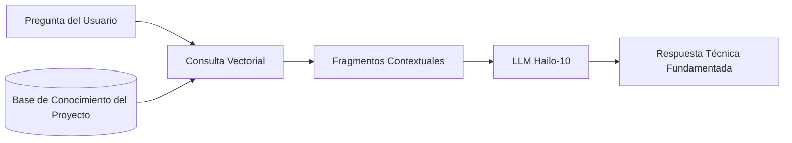

<p align="center">
  
</p>

# 📚 HYDRA-UMC-DOCS-QA

<p align="center"><a href="README.md">🇺🇸 English</a> | 🇪🇸 <b>Español</b> | <a href="README_fra.md">🇫🇷 Français</a> | <a href="README_ita.md">🇮🇹 Italiano</a> | <a href="README_deu.md">🇩🇪 Deutsch</a> | <a href="README_zho.md">🇨🇳 简体中文</a> | <a href="README_jpn.md">🇯🇵 日本語</a></p>

### 🤖 Asistente de IA Basado en RAG para Mantenimiento de Hardware y Documentación

<p align="left">
  
  
  
</p>

---

## 1. 🛠️ VISIÓN GENERAL TÉCNICA

**HYDRA-UMC-DOCS-QA** es un asistente especializado de Generación Aumentada por Recuperación (RAG) diseñado para técnicos y desarrolladores in-situ. Proporciona respuestas instantáneas y fundamentadas a preguntas técnicas sobre el ecosistema HYDRA-UMC.

Ha "leído" todos los manuales, documentación de esquemas y código fuente del ecosistema, lo que le permite asistir en la resolución de problemas, consultas de pinout y compilación de firmware sin necesidad de conexión a internet.

### Características Clave:
* 🔍 **Búsqueda Vectorial Local (v0):** Recuperación léxica real TF-IDF, stdlib puro, sobre documentos Markdown locales. *(implementado como búsqueda léxica real - todavía no búsqueda semántica basada en embeddings, y la ingesta de PDF sigue siendo trabajo futuro; ver BUILD Y EJECUCIÓN abajo)*
* 🔒 **Lista blanca real de documentos:** solo los archivos `.md`/`.markdown` que realmente existen se ingieren y citan - cualquier otra ruta `--docs` (inexistente, o de un tipo de archivo no permitido) se rechaza con un motivo distinto e impreso, en vez de omitirse silenciosamente o leerse como si fuera documentación real. *(implementado)*
* 🔗 **Citas trazables:** cada resultado cita `source#index` - un puntero estable y desambiguador que apunta al pasaje exacto ingerido, recuperable de forma determinista volviendo a analizar la misma fuente. *(implementado)*
* 🎯 **Puntuación determinista:** el ranking es una función pura del corpus y del texto de la consulta, independiente de la semilla de hash por proceso del intérprete. *(implementado)*
* 🤖 **Razonamiento Fundamentado:** Las respuestas se basan estrictamente en la documentación del proyecto proporcionada.
* 🎙️ **Integración de Voz:** Integrado con VOICE-UI para soporte de mantenimiento manos libres.
* 🛠️ **Conocimiento de Código:** Puede explicar módulos de firmware y detalles específicos del protocolo CAN.
* 👨‍👩‍👧 **Hijo del Cognitive AI Node:** Corre como uno de los cuatro
  servicios hermanos bajo [HYDRA-UMC-COGNITIVE-NODE](https://github.com/JuanenRac/HYDRA-UMC-COGNITIVE-NODE)
  (junto a VLA-Engine, Voice-UI y Semantic-Planner), compartiendo la
  imagen HydraOS y los pesos de modelos de su padre en vez de mantener
  copias propias.
* 📦 **Versionado Cuentakilómetros:** Cada build real incrementa
  automáticamente la versión de `pyproject.toml` (`bump_version.py`) - sin
  ediciones manuales de versión.

---

## 2. 🔄 FLUJO DEL PIPELINE RAG



---

## 3. 🧱 ARQUITECTURA Y DECISIONES DE DISEÑO

Este repositorio es un **hijo** de la familia Cognitive AI Node - su
padre, [HYDRA-UMC-COGNITIVE-NODE](https://github.com/JuanenRac/HYDRA-UMC-COGNITIVE-NODE),
posee la imagen HydraOS compartida y los pesos de modelos cuantizados, y
conecta este servicio en su `docker-compose.yml` junto a sus tres
hermanos (VLA-Engine, Voice-UI, Semantic-Planner):

* **Por qué este hijo no tiene hardware/firmware/`os/`/`models/`
  propios.** Corre por completo sobre el módulo CM5 + Hailo-10 M.2 que ya
  posee el padre - centralizar los pesos de modelos y la imagen HydraOS
  en un solo lugar evita cuatro copias divergentes de varios gigabytes
  dentro de la familia.
* **Por qué una estructura `src/`.** Mantiene el paquete instalable
  (`hydra_umc_docs_qa`) separado del tooling en la raíz del repo
  (`bump_version.py`), igual que el resto de proyectos Python del
  ecosistema.
* **Por qué el punto de entrada solo imprime identidad/versión/rol hoy.**
  Esta es la etapa de andamiaje: demostrar que el paquete se instala,
  compila e importa correctamente - en la versión real de Python objetivo
  - es un requisito previo antes de añadir lógica real de
  búsqueda-vectorial/RAG, y mantiene ese trabajo posterior aislado de los
  problemas de empaquetado.
* **Cómo encaja en el resto del ecosistema.** Este asistente fundamenta
  sus respuestas en la documentación propia del ecosistema, dando a su
  hermano HYDRA-UMC-SEMANTIC-PLANNER una fuente de conocimiento técnico
  que puede consultar durante el razonamiento, y ofreciendo a los
  técnicos in-situ soporte manos-libres junto a HYDRA-UMC-VOICE-UI.
* **Por qué la recuperación de `index.py` es TF-IDF real, no un modelo de
  embeddings.** La búsqueda semántica basada en embeddings necesita una
  dependencia real de modelo (idealmente el propio Hailo-10 que ya
  menciona este README) - un índice TF-IDF/similitud coseno puro en
  stdlib es real, testeable, y no necesita nada más allá del propio
  Python, dando a este proyecto un núcleo de recuperación funcional hoy
  que un futuro índice basado en embeddings puede sustituir detrás del
  mismo contrato `search()`, sin tocar la CLI ni el paso de ingesta.
* **Por qué una consulta sin coincidencias devuelve un fallo honesto, no
  una respuesta de respaldo.** v0 no tiene paso de síntesis por LLM - una
  pregunta cuyas palabras no coinciden con el corpus ingerido recibe
  `No relevant passages found` (ver `main.py`), nunca una respuesta
  inventada o alucinada disfrazada de resultado real de recuperación.
* **Por qué una ruta `--docs` no permitida se rechaza, en vez de
  omitirse o ingerirse silenciosamente.** Un asistente de QA que se
  supone "fundamentado en la documentación propia del ecosistema" no
  debe leer y citar en silencio cualquier archivo al que apunte quien lo
  invoque - una ruta inexistente o un archivo que no es Markdown (un
  `.env` suelto, un binario de firmware) recibe una línea real y
  distinta `REJECTED ... : <motivo>` (ver `validate_doc_path` en
  `ingest.py`) en vez de un "no se encontró nada" agregado que oculta
  *por qué*.
* **Por qué la similitud coseno ordena los términos compartidos antes
  de sumarlos.** `dict.keys() & dict.keys()` es un conjunto (set), y el
  orden de iteración de los sets en CPython depende de la
  aleatorización del hash de cadenas por proceso - sumar términos de
  punto flotante en ese orden haría que una puntuación dependiera de
  qué proceso ejecutó la consulta, no solo del corpus y del texto de la
  consulta. Ordenar primero hace que la puntuación sea una función pura
  y reproducible de sus entradas reales.
* **Por qué las citas llevan un `#index`, no solo un nombre de
  archivo.** Un nombre de archivo por sí solo no puede desambiguar dos
  secciones que comparten un encabezado (o, más adelante, dos archivos
  ingeridos que comparten nombre) - `DocChunk.index` es la posición
  ordinal real de cada fragmento dentro de su propia fuente, dando a
  cada cita una clave estable que quien la use puede emplear para
  recuperar de forma determinista el mismo pasaje.

---

## 📂 ESTRUCTURA DE DIRECTORIOS

```text
HYDRA-UMC-DOCS-QA/
├── src/hydra_umc_docs_qa/
│   ├── ingest.py            # Ingesta real de Markdown -> DocChunks por encabezado
│   ├── index.py              # Índice TF-IDF real (stdlib puro) + búsqueda por similitud coseno
│   ├── api.py                  # Superficie JSON/HTTP plana (http.server de stdlib) sobre la lógica real de `query`
│   └── main.py                # Punto de entrada + subcomando real `query`
├── tests/                   # Tests reales: ingesta, lista blanca, ranking, determinismo, api, CLI end-to-end
├── docs/                    # Documentación y manuales técnicos
├── images/                  # Medios y diagramas
├── systemd/
│   └── hydra-umc-docs-qa.service # Unidad systemd de la API local de consultas de docs en la CM5
├── tools/
│   ├── build_test.py        # Comprobación de compilación sin versionado
│   └── ci_validate.py       # Validación de manifiesto/CHANGELOG/docs usada por CI
├── build/                   # Salida de build local (ignorada por git)
├── pyproject.toml           # Metadatos del paquete (versión con incremento cuentakilómetros)
├── bump_version.py          # Incremento de versión nativa estilo cuentakilómetros (usado por build.sh/.bat)
├── bump_manifest_version.py # Sincroniza la versión de hydra-umc.project.json con la nativa (--sync)
├── build.sh / build.bat     # Crea el venv, instala (con extras de dev), verifica la importación, corre tests
└── run.sh / run.bat         # Ejecuta el punto de entrada (reenvia argumentos, ej. `query`)
```

> **Nota:** se podaron `hardware/` y `firmware/` - este nodo corre sobre un
> módulo CM5 + Hailo-10 M.2 ya existente, sin diseño de hardware/firmware
> propio. También se podaron `os/` y `models/` - la imagen HydraOS y los
> pesos de modelos Hailo-10 compartidos viven en el proyecto padre
> `HYDRA-UMC-COGNITIVE-NODE`, al que este proyecto se conecta como
> servicio (ver su `docker-compose.yml`).

---

## ⚙️ BUILD Y EJECUCIÓN

Requiere Python >= 3.10.

```bash
# Linux / macOS / Git Bash
./build.sh   # crea .venv, instala el paquete (editable), verifica la importación
./run.sh     # ejecuta el punto de entrada

# Windows (cmd)
build.bat
run.bat
```

`build.sh`/`build.bat` incrementan la versión (estilo cuentakilómetros, ver
`bump_version.py`) antes de cada build real, y corren la suite de tests
real (`pytest tests/`). Salida esperada de un `run.sh` sin argumentos:

```text
HYDRA-UMC-DOCS-QA v0.0.7
Docs-QA (Hailo-10) - retrieval-augmented technical assistant grounded in the ecosystem's own documentation.
```

El subcomando real `query` busca en Markdown ingerido - por defecto el
propio `README.md`/`CHANGELOG.md` de este repo, o cualquier archivo real
pasado con `--docs`:

```bash
./run.sh query "cableado del bus CAN" --top-k 3
./run.sh query "busqueda vectorial recuperacion" --docs docs/manual.md --docs docs/spec.md

# Windows
run.bat query "cableado del bus CAN" --top-k 3
```

Una pregunta cuyas palabras no coinciden con el corpus ingerido imprime
un `No relevant passages found` honesto - v0 es recuperación léxica real,
no una respuesta generativa.

Cada resultado cita `source#index` (p. ej. `manual.md#1`) - un puntero
estable y trazable a ese fragmento exacto. Una ruta `--docs` inexistente
o que no sea `.md`/`.markdown` se rechaza y se reporta, no se ignora en
silencio:

```text
$ ./run.sh query "firmware flashing" --docs manual.md ghost.md secret.env
REJECTED ghost.md: file not found (no source)
REJECTED secret.env: disallowed extension .env - only .markdown, .md are ingested
Top 1 passage(s) for: "firmware flashing"

1. [0.289] manual.md#1 - Firmware Flashing
   Flash URTC firmware over SWD or JTAG using URTC-FLASHER.
```

### 🩺 Solución de problemas

* **`python: comando no encontrado` / el build falla en el paso 1.**
  Requiere Python >= 3.10 en el `PATH`. En Windows, instálalo desde
  [python.org](https://python.org) y marca "Add to PATH" durante la
  instalación; en Linux/macOS suele llamarse `python3`.
* **`build.sh` no consigue activar el venv.** `python3 -m venv .venv`
  coloca el script de activación en una ruta distinta según la
  plataforma: `.venv/bin/activate` en Linux/macOS, `.venv/Scripts/activate`
  en Windows (también con un venv de Python de Windows usado desde Git
  Bash). `build.sh` ya comprueba ambas rutas - si sigue fallando, borra
  `.venv/` y vuelve a ejecutar `./build.sh` para reconstruirlo desde cero.
* **`pip install -e .` falla.** Normalmente por un `.venv/` obsoleto.
  Borra la carpeta `.venv/` y vuelve a ejecutar `./build.sh`/`build.bat`
  para recrearla.
* **`import OK` nunca se imprime.** Significa que `python -c "import
  hydra_umc_docs_qa"` falló - vuelve a ejecutarlo con el venv activo
  para ver el traceback real.

---

## 🚀 HOJA DE RUTA
* **Fase 1:** Despliegue del motor VLA y procesamiento de entrada multi-modal en Hailo-10.
* **Fase 2:** Integración del planificador semántico con modelos de comportamiento de enjambre y memoria a largo plazo.
* **Fase 3:** Ejecución local de baja latencia de Voice UI y cancelación de ruido industrial.
* **Fase 4:** Visualización de esquemas interactivos vinculada a respuestas de QA y optimización de RAG para dispositivos de borde.

---

## 🔗 Proyectos Relacionados

Este proyecto es parte del ecosistema de robótica HYDRA-UMC del mismo autor (JuanenRac / Electro Hobby 3D). Vale la pena conocerlo, ya que una petición podría en realidad ser sobre alguno de estos en vez de sobre este repositorio.

**Proyecto Padre**
- **[HYDRA-UMC-COGNITIVE-NODE](https://github.com/JuanenRac/HYDRA-UMC-COGNITIVE-NODE)** — nodo de integración para el pipeline cognitivo Hailo-10 (orquestación de LLM/VLA/voz); el padre del que este repositorio es una etapa o consumidor específico, dentro de su propio pipeline cognitivo.

**Proyectos Hermanos** — las demás etapas/consumidores del propio pipeline cognitivo Hailo-10 de HYDRA-UMC-COGNITIVE-NODE
- **[HYDRA-UMC-VOICE-UI](https://github.com/JuanenRac/HYDRA-UMC-VOICE-UI)** — front-end de voz real (VAD + analizador de intención) con un relé a Watch acotado y con confirmación.
- **[HYDRA-UMC-SEMANTIC-PLANNER](https://github.com/JuanenRac/HYDRA-UMC-SEMANTIC-PLANNER)** — descomposición real de tareas basada en reglas y recuperación semántica de errores sobre códigos de error del MCU.
- **[HYDRA-UMC-VLA-ENGINE](https://github.com/JuanenRac/HYDRA-UMC-VLA-ENGINE)** — codificación/decodificación real de tokens de acción y generación de trayectoria para un modelo Vision-Language-Action.

**También Forma Parte del Ecosistema**

*Hardware y Plataforma Base*
- **[HYDRA-UMC](https://github.com/JuanenRac/HYDRA-UMC)** — la placa madre física del brazo robótico: host CM5 + coprocesador STM32H745 de doble núcleo, coordinando hasta 8 brazos herramienta por CAN-OTA/SPI-OTA.
- **[HYDRA-UMC-OS](https://github.com/JuanenRac/HYDRA-UMC-OS)** — capa de producto reproducible sobre Raspberry Pi OS para el CM5: agente de solo lectura, config/perfiles validados, aprovisionamiento WiFi de primer contacto.
- **[HYDRA-UMC-SDK](https://github.com/JuanenRac/HYDRA-UMC-SDK)** — el contrato JSON-Schema compartido y la barrera de seguridad contra la que cada bridge valida sus comandos.

*Backend Central y Clientes*
- **[HYDRA-UMC-SERVER](https://github.com/JuanenRac/HYDRA-UMC-SERVER)** — el backend headless real (REST/WebSocket) con el que habla de verdad cada cliente de control.
- **[HYDRA-UMC-STUDIO](https://github.com/JuanenRac/HYDRA-UMC-STUDIO)** — panel de control web con visualización 3D multi-robot en tiempo real.
- **[HYDRA-UMC-SUITE](https://github.com/JuanenRac/HYDRA-UMC-SUITE)** — centro de mando de enjambre de escritorio (PySide6) para varios servidores a la vez, empaquetado como ejecutable independiente.
- **[HYDRA-UMC-ANDROID-CONTROL](https://github.com/JuanenRac/HYDRA-UMC-ANDROID-CONTROL)** — app nativa de control para Android con inicio de sesión biométrico y un compañero Wear OS emparejado.
- **[HYDRA-UMC-IOS-CONTROL](https://github.com/JuanenRac/HYDRA-UMC-IOS-CONTROL)** — app de control para iOS/iPadOS (Flutter) con sincronización en tiempo real por WebSocket.
- **[HYDRA-UMC-DSI](https://github.com/JuanenRac/HYDRA-UMC-DSI)** — interfaz táctil nativa para la pantalla táctil DSI de 7" a bordo, embebida en el propio CM5.
- **[HYDRA-UMC-EDITOR-URDF](https://github.com/JuanenRac/HYDRA-UMC-EDITOR-URDF)** — creador/editor gráfico de URDF de escritorio que envía los modelos terminados al propio catálogo de STUDIO.
- **[HYDRA-UMC-BRIDGE-AMR](https://github.com/JuanenRac/HYDRA-UMC-BRIDGE-AMR)** — barrera de coordinación para flotas AGV/AMR mediante un publicador MQTT VDA 5050 real.
- **[HYDRA-UMC-BRIDGE-CNC](https://github.com/JuanenRac/HYDRA-UMC-BRIDGE-CNC)** — coordinador de alto nivel para celdas CNC con acceso real a estado/bytes de control GRBL.
- **[HYDRA-UMC-BRIDGE-DROIDS](https://github.com/JuanenRac/HYDRA-UMC-BRIDGE-DROIDS)** — barrera de coordinación para droides con patas/humanoides, con un emisor de comandos real para Boston Dynamics Spot.
- **[HYDRA-UMC-BRIDGE-LASER](https://github.com/JuanenRac/HYDRA-UMC-BRIDGE-LASER)** — coordinador de seguridad para celdas láser que lee 3 salvaguardas GPIO reales de llave/carcasa/enclavamiento.
- **[HYDRA-UMC-BRIDGE-OPENPNP](https://github.com/JuanenRac/HYDRA-UMC-BRIDGE-OPENPNP)** — coordinador de alto nivel seguro para el flujo de placas de pick-and-place OpenPnP.
- **[HYDRA-UMC-BRIDGE-PRINTER3D](https://github.com/JuanenRac/HYDRA-UMC-BRIDGE-PRINTER3D)** — barrera de coordinación segura para impresoras 3D Moonraker/Klipper, con comandos de trabajo reales y controlados.
- **[HYDRA-UMC-BRIDGE-ROS2](https://github.com/JuanenRac/HYDRA-UMC-BRIDGE-ROS2)** — coordinador de seguridad con un transporte ROS 2 rclpy real, importado de forma perezosa.
- **[HYDRA-UMC-BRIDGE-UAV](https://github.com/JuanenRac/HYDRA-UMC-BRIDGE-UAV)** — barrera de coordinación para UAV equipados con cámara, con un emisor de comandos MAVLink real.

*Plataforma de Herramientas URTC*
- **[URTC](https://github.com/JuanenRac/URTC)** — firmware para la placa física del Universal Robot Tool Controller, más de 25 perfiles de herramienta por bus CAN.
- **[URTC-FLASHER](https://github.com/JuanenRac/URTC-FLASHER)** — herramienta de escritorio con GUI para flashear placas URTC, CAN-OTA más SWD/JTAG de chip completo.
- **[URTC-TESTER](https://github.com/JuanenRac/URTC-TESTER)** — herramienta de escritorio de diagnóstico CAN-bus en vivo para placas URTC, un panel por perfil de herramienta.
- **[URTC-WEB-STUDIO](https://github.com/JuanenRac/URTC-WEB-STUDIO)** — alternativa basada en navegador a URTC-TESTER mediante la Web Serial API, sin instalación local.

*Nodo IA de Visión (Hailo-8)*
- **[HYDRA-UMC-VISION-NODE](https://github.com/JuanenRac/HYDRA-UMC-VISION-NODE)** — nodo de integración para el pipeline de visión Hailo-8, con una comprobación real de disponibilidad de hardware por etapa.
- **[HYDRA-UMC-DETECTION-HEF](https://github.com/JuanenRac/HYDRA-UMC-DETECTION-HEF)** — registro real de modelos compilados con verificación de carga segura por arquitectura Hailo/checksum.
- **[HYDRA-UMC-VISION-STREAMER](https://github.com/JuanenRac/HYDRA-UMC-VISION-STREAMER)** — generador real de pipeline GStreamer + config MediaMTX, con una frontera de integración HailoRT real.
- **[HYDRA-UMC-VISUAL-SERVOING-API](https://github.com/JuanenRac/HYDRA-UMC-VISUAL-SERVOING-API)** — ley de corrección real de Position-Based Visual Servoing, con puerta de seguridad según el estado de zona previo.
- **[HYDRA-UMC-SAFETY-ZONES](https://github.com/JuanenRac/HYDRA-UMC-SAFETY-ZONES)** — comprobación real de invasión de zona y solicitud de E-STOP, con exigencia de vigencia de calibración.

*Orquestación y Enjambre*
- **[HYDRA-UMC-ORCHESTRATOR](https://github.com/JuanenRac/HYDRA-UMC-ORCHESTRATOR)** — nodo de integración con un contrato real de informe de salud gRPC/Protobuf y una máquina de estados de misión.
- **[HYDRA-UMC-JOB-DISPATCHER](https://github.com/JuanenRac/HYDRA-UMC-JOB-DISPATCHER)** — cola de trabajos real basada en prioridad con deduplicación, sobre una API HTTP real.
- **[HYDRA-UMC-NODE-HEALING](https://github.com/JuanenRac/HYDRA-UMC-NODE-HEALING)** — watchdog de salud de flota real basado en gRPC, con reintento/backoff y detección de discrepancia de identidad.
- **[HYDRA-UMC-PATH-PLANNER-3D](https://github.com/JuanenRac/HYDRA-UMC-PATH-PLANNER-3D)** — planificador de rutas 3D real basado en RRT, con validación real de colisión de obstáculos/espacio de trabajo.
- **[HYDRA-UMC-SWARM-SYNC](https://github.com/JuanenRac/HYDRA-UMC-SWARM-SYNC)** — sincronización de estado real mediante CRDT LWW-Element-Map, con pruebas de propiedades para convergencia multi-celda.

*Gemelo Digital y Simulación*
- **[HYDRA-UMC-TWIN](https://github.com/JuanenRac/HYDRA-UMC-TWIN)** — nodo de integración para el motor de gemelo digital, con un contrato real de sincronización por compatibilidad de versión.
- **[HYDRA-UMC-HIL-BRIDGE](https://github.com/JuanenRac/HYDRA-UMC-HIL-BRIDGE)** — enclavamiento de seguridad real hardware-in-the-loop que enruta comandos entre simulación y hardware real.
- **[HYDRA-UMC-PHYSICS-REPLICA](https://github.com/JuanenRac/HYDRA-UMC-PHYSICS-REPLICA)** — cinemática directa real y validación de límites articulares sobre un subconjunto real de URDF.
- **[HYDRA-UMC-SYNTHETIC-DATA-GEN](https://github.com/JuanenRac/HYDRA-UMC-SYNTHETIC-DATA-GEN)** — generador real de escenas 2D procedurales con exportación de anotaciones YOLO/COCO.

*Datos y Analítica*
- **[HYDRA-UMC-DATALAKE](https://github.com/JuanenRac/HYDRA-UMC-DATALAKE)** — almacén de series temporales real respaldado por sqlite3, con una API HTTP real de ingesta/consulta.
- **[HYDRA-UMC-ANOMALY-DETECTOR](https://github.com/JuanenRac/HYDRA-UMC-ANOMALY-DETECTOR)** — detector de anomalías real basado en FFT + línea base estadística, con monitorización de deriva.
- **[HYDRA-UMC-PRODUCTION-REPORTS](https://github.com/JuanenRac/HYDRA-UMC-PRODUCTION-REPORTS)** — cálculo real de OEE/disponibilidad sobre el histórico de DATALAKE, con exportación CSV reproducible.
- **[HYDRA-UMC-TELEMETRY-COLLECTOR](https://github.com/JuanenRac/HYDRA-UMC-TELEMETRY-COLLECTOR)** — pipeline real de ingesta CAN/WebSocket hacia DATALAKE, con deduplicación por secuencia.

*Pasarela Industrial*
- **[HYDRA-UMC-GATEWAY-INDUSTRIAL](https://github.com/JuanenRac/HYDRA-UMC-GATEWAY-INDUSTRIAL)** — nodo de integración que retransmite a protocolos industriales, con una capa real de lista blanca de comandos/contrapresión.
- **[HYDRA-UMC-OPCUA-SERVER](https://github.com/JuanenRac/HYDRA-UMC-OPCUA-SERVER)** — espacio de direcciones OPC-UA real, verificado con una sesión de cliente real del protocolo binario.
- **[HYDRA-UMC-MQTT-BROKER](https://github.com/JuanenRac/HYDRA-UMC-MQTT-BROKER)** — broker MQTT real con autenticación por cliente opcional y ACL de tópicos.
- **[HYDRA-UMC-MTCONNECT-ADAPTER](https://github.com/JuanenRac/HYDRA-UMC-MTCONNECT-ADAPTER)** — endpoints XML reales `/probe` y `/current` de MTConnect, con salida en modo degradado.

*Herramientas Complementarias y Operaciones del Ecosistema*
- **[HYDRA-UMC-DASHBOARD-AI](https://github.com/JuanenRac/HYDRA-UMC-DASHBOARD-AI)** — paneles de Resúmenes Inteligentes y Resaltado de Anomalías sobre DATALAKE/ANOMALY-DETECTOR, con un respaldo estadístico honesto.
- **[HYDRA-UMC-TOOL-CLI](https://github.com/JuanenRac/HYDRA-UMC-TOOL-CLI)** — CLI de flota con un contrato real y estable de códigos de salida, cliente real y en vivo de la propia API de HYDRA-UMC-SERVER.
- **[HYDRA-UMC-WATCH](https://github.com/JuanenRac/HYDRA-UMC-WATCH)** — app compañera de WearOS con alertas hápticas reales y un relé de voz al teléfono emparejado.
- **[URTC-SMART-RACK](https://github.com/JuanenRac/URTC-SMART-RACK)** — firmware para un rack de montaje de placas con decodificación real de ID de herramienta y lógica de precalentamiento Smart Idle.
- **[URTC-VISION-TOOL](https://github.com/JuanenRac/URTC-VISION-TOOL)** — firmware más un compañero de visión real en Python para un cabezal de inspección térmica/RGB.
- **[HYDRA-UMC-UPDATER](https://github.com/JuanenRac/HYDRA-UMC-UPDATER)** — herramienta administrativa de escritorio que descubre, clona y actualiza cada repositorio de este ecosistema.

---

## 👤 AUTOR
**JuanenRac** (Electro Hobby 3D)
📧 electrohobby3d@gmail.com
📺 [youtube.com/@electrohobby3d](https://youtube.com/@electrohobby3d)

## 📜 LICENCIA
GPL-3.0 - Ver archivo LICENSE para más detalles.
