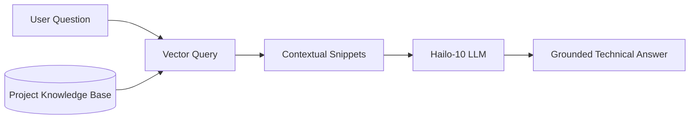

<p align="center">
  
</p>

# 📚 HYDRA-UMC-DOCS-QA

<p align="center"><a href="README.md">🇺🇸 English</a> | <a href="README_spa.md">🇪🇸 Español</a> | <a href="README_fra.md">🇫🇷 Français</a> | <a href="README_ita.md">🇮🇹 Italiano</a> | <a href="README_deu.md">🇩🇪 Deutsch</a> | 🇨🇳 <b>简体中文</b> | <a href="README_jpn.md">🇯🇵 日本語</a></p>

### 🤖 基于 RAG 的硬件维护与文档 AI 助手

<p align="left">
  
  
  
</p>

---

## 1. 🛠️ 技术概述

**HYDRA-UMC-DOCS-QA** 是一款专为现场技术人员和开发者设计的专用检索增强
生成（RAG）助手。它能为关于 HYDRA-UMC 生态系统的技术问题提供即时、有据
可查的答案。

它已经"阅读"了整个生态系统中的所有手册、原理图文档和源代码，使其能够在
无需互联网连接的情况下协助进行故障排查、引脚查询和固件编译。

### 关键特性：
* 🔍 **本地向量搜索（v0）：** 真实的、仅依赖标准库的 TF-IDF 词法检索，作用于本地 Markdown 文档。*（已实现为真实的词法搜索——尚非基于嵌入的语义搜索，PDF 摄取仍是未来的工作；见下方“构建与运行”）*
* 🔒 **真实文档白名单：** 只有真实存在的 `.md`/`.markdown` 文件才会被摄取和引用——任何其他 `--docs` 路径（缺失，或文件类型不被允许）都会被拒绝，并打印出明确、独立的原因，而不是被静默跳过或被当作真实文档静默读取。*（已实现）*
* 🔗 **可追溯的引用：** 每条结果都会引用 `source#index`——一个稳定的、可消歧的指针，指回被摄取的确切段落，可通过重新解析同一来源以确定的方式复原。*（已实现）*
* 🎯 **确定性评分：** 排序是语料库和查询文本的纯函数，与解释器逐进程的哈希种子无关。*（已实现）*
* 🤖 **有据可查的推理：** 答案严格基于所提供的项目文档。
* 🎙️ **语音集成：** 与 VOICE-UI 集成，实现免提维护支持。
* 🛠️ **代码感知：** 能够解释固件模块和 CAN 协议细节。
* 👨‍👩‍👧 **认知 AI 节点子项目：** 作为
  [HYDRA-UMC-COGNITIVE-NODE](https://github.com/JuanenRac/HYDRA-UMC-COGNITIVE-NODE) 下 4 个同级服务之一运行（与 VLA-Engine、Voice-UI 和 Semantic-Planner 并列），共享父项目的 HydraOS 镜像和模型权重，而非各自保留独立副本。
* 📦 **里程表式版本管理：** 每次真实构建都会自动递增 `pyproject.toml`
  自身的版本号（`bump_version.py`）——无需手动编辑版本号。

---

## 2. 🔄 RAG 流水线流程



---

## 3. 🧱 架构与设计决策

本仓库是 Cognitive AI Node 系列的**子项目**——其父项目
[HYDRA-UMC-COGNITIVE-NODE](https://github.com/JuanenRac/HYDRA-UMC-COGNITIVE-NODE) 拥有共享的 HydraOS 镜像和量化模型权重，并将本服务与其另外 3 个同级项目（VLA-Engine、Voice-UI、Semantic-Planner）一同接入 `docker-compose.yml`：

* **为何本子项目没有自己的硬件/固件/`os/`/`models/`。** 它完全运行在父项目已拥有的 CM5 + Hailo-10 M.2 模块上——将模型权重和 HydraOS 镜像集中保存在一处，可避免整个项目族中出现四份互不一致的、动辄数 GB 的副本。
* **为何采用 `src/` 布局。** 使可安装的包（`hydra_umc_docs_qa`）与仓库根目录的工具（`bump_version.py`）分离，与生态系统中其他每个 Python 项目所使用的布局保持一致。
* **为何入口点今天只打印身份/版本/角色。** 这是脚手架（scaffolding）阶段：证明该包在实际目标 Python 版本上能够正确安装、编译并被导入，是后续添加真正的向量搜索/RAG 摄取逻辑的前提条件，并使那部分后续工作与打包相关的问题相互隔离。
* **这如何融入生态系统的其余部分。** 本助手将其答案建立在生态系统自身的文档基础上，为其同级项目 HYDRA-UMC-SEMANTIC-PLANNER 提供了一个可在推理过程中查询的技术知识来源，并与 HYDRA-UMC-VOICE-UI 一同为现场技术人员提供免提故障排查支持。
* **为何 `index.py` 的检索是真实的 TF-IDF，而非嵌入模型。** 基于嵌入的语义搜索需要一个真实的模型依赖（理想情况下是本 README 已经提到的 Hailo-10）——一个纯标准库实现的 TF-IDF/余弦相似度索引是真实的、可测试的，除 Python 本身外不需要任何依赖，让本项目今天就拥有一个可工作的检索内核，未来基于嵌入的索引可以在不改动 CLI 或摄取步骤的前提下，替换到同一个 `search()` 契约背后。
* **为何一次没有匹配结果的查询会返回一个诚实的未命中，而非一个兜底答案。** v0 没有 LLM 合成步骤——一个词语与已摄取语料库没有重叠的问题会得到 `No relevant passages found`（见 `main.py`），而绝不会得到一个伪装成真实检索结果的编造或幻觉答案。
* **为何一个不被允许的 `--docs` 路径会被拒绝，而不是被静默跳过或静默摄取。** 一个本应“以生态系统自身文档为依据”的问答助手，绝不能悄悄读取并引用调用者随手指向的任意文件——一个缺失的路径，或一个非 Markdown 文件（一个散落的 `.env`、一个固件二进制文件），都会得到一行真实的、独立的 `REJECTED ... : <原因>`（见 `ingest.py` 的 `validate_doc_path`），而不是一个隐藏了“为何”的笼统“未找到任何内容”。
* **为何余弦相似度在求和之前会先对共享词项排序。** `dict.keys() & dict.keys()` 是一个集合（set），而 CPython 中集合的迭代顺序取决于逐进程的字符串哈希随机化——如果按该顺序对浮点词项求和，得分就会取决于恰好是哪个进程运行了本次查询，而不仅仅取决于语料库和查询文本本身。先排序能让得分成为其真实输入的一个纯粹、可复现的函数。
* **为何引用要带上 `#index`，而不只是文件名。** 单靠文件名无法区分两个共享同一标题的章节（或者，将来两个共享同一文件名的被摄取文件）——`DocChunk.index` 是每个分块在其自身来源中的真实序号位置，为每条引用赋予了一个稳定的键，调用者可据此以确定的方式再次找回同一段落。

---

## 📂 目录结构

```text
HYDRA-UMC-DOCS-QA/
├── src/hydra_umc_docs_qa/
│   ├── ingest.py            # 真实的 Markdown 摄取 -> 按标题划分的 DocChunk
│   ├── index.py              # 真实的 TF-IDF 索引（仅标准库）+ 余弦相似度搜索
│   └── main.py                # 入口点 + 真实的 `query` 子命令
├── tests/                   # 真实测试：摄取、白名单、排序、确定性、端到端 CLI
├── docs/                    # 文档与技术手册
├── images/                  # 媒体与图表
├── scripts/                 # 实用脚本
├── build/                   # 本地构建输出（已被 git 忽略）
├── pyproject.toml           # 包元数据（版本 0.0.4，里程表式递增）
├── bump_version.py          # 里程表式版本递增（由 build.sh/.bat 使用）
├── build.sh / build.bat     # 创建 venv、安装（含 dev 附加依赖）、验证导入、运行测试
└── run.sh / run.bat         # 运行入口点（转发参数，例如 `query`）
```

> **注意：** `hardware/` 和 `firmware/` 已被省略——本节点运行在现成的
> CM5 + Hailo-10 M.2 模块上，没有自己的硬件/固件设计。`os/` 和
> `models/` 也已被省略——HydraOS 镜像和共享的 Hailo-10 模型权重存放在
> 父项目 `HYDRA-UMC-COGNITIVE-NODE` 中，本项目作为一项服务接入其中
> （见其 `docker-compose.yml`）。

---

## ⚙️ 构建与运行

需要 Python >= 3.10。

```bash
# Linux / macOS / Git Bash
./build.sh   # 创建 .venv，安装该包（可编辑模式），验证导入
./run.sh     # 运行入口点

# Windows (cmd)
build.bat
run.bat
```

`build.sh`/`build.bat` 会在每次真实构建之前递增版本号（里程表式，见
`bump_version.py`），并运行真实的测试套件（`pytest tests/`）。不带参数的
`run.sh` 的预期输出：

```text
HYDRA-UMC-DOCS-QA v0.0.4
Docs-QA (Hailo-10) - retrieval-augmented technical assistant grounded in the ecosystem's own documentation.
```

真实的 `query` 子命令会在已摄取的 Markdown 中搜索——默认使用本仓库自身的
`README.md`/`CHANGELOG.md`，或通过 `--docs` 传入的任意真实文件：

```bash
./run.sh query "CAN 总线接线" --top-k 3
./run.sh query "向量搜索 检索" --docs docs/manual.md --docs docs/spec.md

# Windows
run.bat query "CAN 总线接线" --top-k 3
```

一个词语与已摄取语料库没有重叠的问题会打印一个诚实的
`No relevant passages found`——v0 是真实的词法检索，而非生成式回答。

每条结果都会引用 `source#index`（例如 `manual.md#1`）——一个指向该确切分块的稳定、可追溯的指针。一个缺失或不是 `.md`/`.markdown` 的 `--docs` 路径会被拒绝并报告，而不是被静默忽略：

```text
$ ./run.sh query "firmware flashing" --docs manual.md ghost.md secret.env
REJECTED ghost.md: file not found (no source)
REJECTED secret.env: disallowed extension .env - only .markdown, .md are ingested
Top 1 passage(s) for: "firmware flashing"

1. [0.289] manual.md#1 - Firmware Flashing
   Flash URTC firmware over SWD or JTAG using URTC-FLASHER.
```

### 🩺 故障排查

* **`python: command not found` / 构建在第 1 步失败。** 需要 `PATH` 中存在 Python >= 3.10。在 Windows 上，从 [python.org](https://python.org) 安装，并确保安装过程中勾选了"Add to PATH"；`python3` 是 Linux/macOS 上的常见命令名。
* **`build.sh` 无法激活 venv。** `python3 -m venv .venv` 在不同平台上生成的激活脚本路径不同：Linux/macOS 上是 `.venv/bin/activate`，Windows（从 Git Bash 使用的 Windows Python venv 也是如此）上是 `.venv/Scripts/activate`。`build.sh` 已经检查了这两个路径——如果仍然失败，删除 `.venv/` 并重新运行 `./build.sh` 从头重建。
* **`pip install -e .` 失败。** 通常是 `.venv/` 已过期。删除 `.venv/` 文件夹并重新运行 `./build.sh`/`build.bat` 重新创建它。
* **`import OK` 从未打印。** 意味着 `python -c "import hydra_umc_docs_qa"` 本身失败了——在激活 venv 的情况下重新运行以查看真实的回溯信息。

---

## 🚀 路线图
* **第一阶段：** 在 Hailo-10 上部署 VLA 引擎并进行多模态输入处理。
* **第二阶段：** 语义规划器与集群行为模型及长期记忆的集成。
* **第三阶段：** 语音 UI 的低延迟本地执行以及工业噪声消除。
* **第四阶段：** 与问答结果关联的交互式原理图可视化，以及针对边缘设备的 RAG 优化。

---

## 🔗 相关项目

本项目是同一作者（JuanenRac / Electro Hobby 3D）打造的更大规模机器人生态
系统的一部分，涵盖固件、控制软件、AI 节点和车队工具。

### 家族

**父级：** **[HYDRA-UMC-COGNITIVE-NODE](https://github.com/JuanenRac/HYDRA-UMC-COGNITIVE-NODE)** —— 拥有该助手共享的 HydraOS 镜像/权重并将其接入认知工作流的集成中心。

**兄弟服务：**
- **[HYDRA-UMC-VOICE-UI](https://github.com/JuanenRac/HYDRA-UMC-VOICE-UI)** —— 该助手同样为其提供依据的同一规划器所使用的 STT/TTS 网关。
- **[HYDRA-UMC-SEMANTIC-PLANNER](https://github.com/JuanenRac/HYDRA-UMC-SEMANTIC-PLANNER)** —— 该助手的 RAG 回答所馈送的 LLM 规划器。
- **[HYDRA-UMC-VLA-ENGINE](https://github.com/JuanenRac/HYDRA-UMC-VLA-ENGINE)** —— 将视觉数据转换为同一规划器所需的动作令牌。

除了上文已经说明的自身家族之外，本助手没有其他关联。

### 生态系统的其余部分

**HYDRA-UMC 平台** —— 多机器人微工厂单元
- **[HYDRA-UMC](https://github.com/JuanenRac/HYDRA-UMC)** —— 主板本身：Raspberry Pi CM5 主机 + 双核 STM32H745 实时协处理器，通过 CAN-OTA/SPI-OTA 协调最多 8 条分布式机械臂。
- **[HYDRA-UMC SERVER](https://github.com/JuanenRac/HYDRA-UMC-SERVER)** —— 拥有机器人状态的无头 Express/WebSocket 后端。
- **[HYDRA-UMC STUDIO](https://github.com/JuanenRac/HYDRA-UMC-STUDIO)** —— 基于 Web 的控制仪表盘。
- **[HYDRA-UMC-ANDROID-CONTROL](https://github.com/JuanenRac/HYDRA-UMC-ANDROID-CONTROL)** —— HYDRA-UMC 的 Android 控制应用。
- **[HYDRA-UMC-IOS-CONTROL](https://github.com/JuanenRac/HYDRA-UMC-IOS-CONTROL)** —— HYDRA-UMC 的 iOS/iPadOS 控制应用。
- **[HYDRA-UMC-SUITE](https://github.com/JuanenRac/HYDRA-UMC-SUITE)** —— 桌面端集群指挥中心。
- **[HYDRA-UMC-EDITOR-URDF](https://github.com/JuanenRac/HYDRA-UMC-EDITOR-URDF)** —— 桌面端图形化 URDF 创建/编辑器。
- **[HYDRA-UMC-DSI](https://github.com/JuanenRac/HYDRA-UMC-DSI)** —— HYDRA-UMC 的原生触摸屏 UI。

**URTC 平台** —— 每台 HYDRA-UMC 机械臂搭载的工具头控制器
- **[URTC](https://github.com/JuanenRac/URTC)** —— Universal Robot Tool Controller，固件。
- **[URTC Flasher](https://github.com/JuanenRac/URTC-FLASHER)** —— 桌面端 CAN-OTA + SWD/JTAG 刷写工具。
- **[URTC Tester](https://github.com/JuanenRac/URTC-TESTER)** —— 桌面端实时 CAN 总线诊断工具。
- **[URTC Web Studio](https://github.com/JuanenRac/URTC-WEB-STUDIO)** —— 上述两款桌面工具的浏览器端替代方案。

**👁️ 视觉 AI 节点（Hailo-8）**
- [HYDRA-UMC-VISION-NODE](https://github.com/JuanenRac/HYDRA-UMC-VISION-NODE)
- [HYDRA-UMC-VISION-STREAMER](https://github.com/JuanenRac/HYDRA-UMC-VISION-STREAMER)
- [HYDRA-UMC-DETECTION-HEF](https://github.com/JuanenRac/HYDRA-UMC-DETECTION-HEF)
- [HYDRA-UMC-SAFETY-ZONES](https://github.com/JuanenRac/HYDRA-UMC-SAFETY-ZONES)
- [HYDRA-UMC-VISUAL-SERVOING-API](https://github.com/JuanenRac/HYDRA-UMC-VISUAL-SERVOING-API)

**🐝 编排与集群**
- [HYDRA-UMC-ORCHESTRATOR](https://github.com/JuanenRac/HYDRA-UMC-ORCHESTRATOR)
- [HYDRA-UMC-SWARM-SYNC](https://github.com/JuanenRac/HYDRA-UMC-SWARM-SYNC)
- [HYDRA-UMC-PATH-PLANNER-3D](https://github.com/JuanenRac/HYDRA-UMC-PATH-PLANNER-3D)
- [HYDRA-UMC-JOB-DISPATCHER](https://github.com/JuanenRac/HYDRA-UMC-JOB-DISPATCHER)
- [HYDRA-UMC-NODE-HEALING](https://github.com/JuanenRac/HYDRA-UMC-NODE-HEALING)

**🎮 数字孪生与仿真**
- [HYDRA-UMC-TWIN](https://github.com/JuanenRac/HYDRA-UMC-TWIN)
- [HYDRA-UMC-PHYSICS-REPLICA](https://github.com/JuanenRac/HYDRA-UMC-PHYSICS-REPLICA)
- [HYDRA-UMC-HIL-BRIDGE](https://github.com/JuanenRac/HYDRA-UMC-HIL-BRIDGE)
- [HYDRA-UMC-SYNTHETIC-DATA-GEN](https://github.com/JuanenRac/HYDRA-UMC-SYNTHETIC-DATA-GEN)

**📊 数据与分析**
- [HYDRA-UMC-DATALAKE](https://github.com/JuanenRac/HYDRA-UMC-DATALAKE)
- [HYDRA-UMC-TELEMETRY-COLLECTOR](https://github.com/JuanenRac/HYDRA-UMC-TELEMETRY-COLLECTOR)
- [HYDRA-UMC-ANOMALY-DETECTOR](https://github.com/JuanenRac/HYDRA-UMC-ANOMALY-DETECTOR)
- [HYDRA-UMC-PRODUCTION-REPORTS](https://github.com/JuanenRac/HYDRA-UMC-PRODUCTION-REPORTS)

**🏭 工业网关**
- [HYDRA-UMC-GATEWAY-INDUSTRIAL](https://github.com/JuanenRac/HYDRA-UMC-GATEWAY-INDUSTRIAL)
- [HYDRA-UMC-OPCUA-SERVER](https://github.com/JuanenRac/HYDRA-UMC-OPCUA-SERVER)
- [HYDRA-UMC-MQTT-BROKER](https://github.com/JuanenRac/HYDRA-UMC-MQTT-BROKER)
- [HYDRA-UMC-MTCONNECT-ADAPTER](https://github.com/JuanenRac/HYDRA-UMC-MTCONNECT-ADAPTER)

**🛠️ 配套工具**
- [URTC-SMART-RACK](https://github.com/JuanenRac/URTC-SMART-RACK)
- [URTC-VISION-TOOL](https://github.com/JuanenRac/URTC-VISION-TOOL)
- [HYDRA-UMC-WATCH](https://github.com/JuanenRac/HYDRA-UMC-WATCH)
- [HYDRA-UMC-TOOL-CLI](https://github.com/JuanenRac/HYDRA-UMC-TOOL-CLI)
- [HYDRA-UMC-DASHBOARD-AI](https://github.com/JuanenRac/HYDRA-UMC-DASHBOARD-AI)

---

## 👤 作者
**JuanenRac**（Electro Hobby 3D）
📧 electrohobby3d@gmail.com

## 📜 许可证
GPL-3.0 —— 详见 LICENSE。
